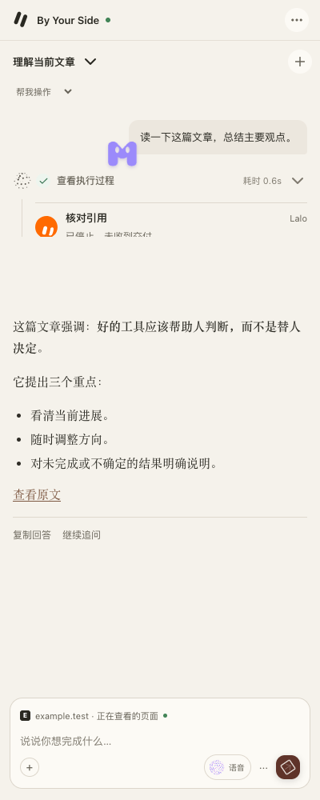
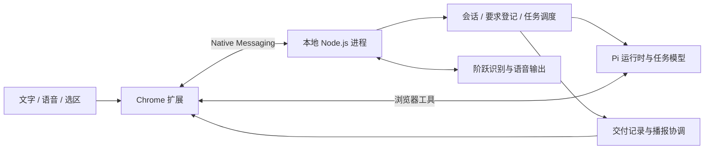

# By Your Side

在 Chrome 里读页面、处理任务，随时用文字或语音补充要求。

By Your Side 是一个 Chrome 侧栏助手。它复用你当前浏览器的登录状态，能查看网页、查找资料、操作表单，也能在你阅读时解释选中的文字、翻译整页。任务运行时，你可以继续提问、修改要求或接管页面。

**当前为开发预览版**，通过源码加载使用。安装流程目前面向 macOS + Chrome，需要自行配置模型服务；语音另需阶跃星辰服务。

[安装](#安装) · [语音](#语音交互) · [架构](docs/architecture.md) · [当前进度与验收](docs/STATUS.md)

<p align="center">
  
</p>

<p align="center"><sub>真实侧栏界面，截图中的对话使用演示内容。</sub></p>

## 可以做什么

| 场景 | 你可以这样说 | 当前能力 |
|---|---|---|
| 理解网页 | “读一下这篇文章，总结主要观点。” | 读取页面、整理回答，按需展开执行过程 |
| 阅读时追问 | 选中文字后按 `⌘J` | 在页面内解释、翻译和连续追问；可转入侧栏继续 |
| 整页翻译 | “把这页翻译成中文，只保留译文。” | 双语或仅译文，切换显示、字体与恢复原文 |
| 操作浏览器 | “把这几条结果的标题和链接整理给我。” | 导航、搜索、点击、填写、截图及多步网页操作 |
| 修改执行中的要求 | “预算改成六百，其他条件不变。” | 将修改送到原任务，保留页面与任务归属 |
| 增加独立任务 | “同时在新标签页打开另一个网站。” | 登记独立要求，安排执行，并把结果送回当前语音 |
| 记住明确偏好 | “请记住，我希望先看中文摘要。” | 保存、修改和忘记显式记忆，支持网站范围 |

页面内阅读问答有独立的上下文，不会把每一次阅读追问都当作对后台任务的修改。整页翻译目前面向可访问的网页 DOM，不覆盖图片 OCR、PDF 或跨域 iframe。

## 语音交互

点击输入区的“语音”，首次使用时允许麦克风访问。文字输入仍然可用。

- **补充原任务**：普通修改直接送达，任务保持原有身份。
- **提出独立要求**：当前采用最多 2 个根任务执行、8 个独立要求等待的准入限制。使用同一来源页面的要求会等待，名额满时有明确反馈。
- **停止播报**：“别说了”控制声音，不等于取消网页任务。
- **控制指定任务**：可以按明确任务名称查询、修改或取消；页面接管与任务控制另有执行回执。
- **接收多个结果**：关联任务的结果回到原语音，按各自任务身份校验、排队播报。尚未听到首声的结果不会因为下一次插话而丢失。

识别与语音输出使用阶跃星辰；意图判断和网页执行使用当前配置的任务模型。项目没有接入 GPT Live 或 Gemini Live。

目前的验证覆盖了分段输入、任务插入、同页等待和多结果播报。真人设备上的收音、回声和接话自然度仍在持续验证；已听到一半的精确续播、全部任务统一控制、稳定的“第二项”编号指代仍是后续工作。重启会保留待办记录，但不会自动重跑旧页面动作。

详见[语音架构](docs/voice-architecture.md)和[多任务验收](docs/evals/20260916-voice-multi-request.md)。

## 安装

### 1. 准备环境

- macOS、Google Chrome。
- Node.js **22.19 或更高版本**、npm、Git。
- 一个 Pi 支持且已配置凭据的模型服务。模型用量由对应服务计费。

```bash
git clone https://github.com/yishu-ziyu/By-Your-Side.git
cd By-Your-Side
npm ci
npm run build
npm run install:host
```

`build` 生成 `extension/dist/`；`install:host` 安装 Chrome Native Messaging 清单与本地启动脚本。仓库移动位置或更换 Node 路径后，重新运行安装命令。

### 2. 配置任务模型

本地进程使用 Pi 的模型配置与凭据，通常位于 `~/.pi/agent/`。尚未配置时，可以运行：

```bash
npx @earendil-works/pi-coding-agent
```

在 Pi 中完成对应服务的登录或凭据设置，再选择模型。也可以通过 `~/.sideagent/config.json` 指定任务模型，例如：

```json
{
  "model": "kimi-coding/kimi-for-coding"
}
```

这是模型标识示例，需要对应账号具备访问权限。省略 `model` 时沿用 Pi 的首选配置。需要网络代理时，可在同一文件增加 `proxy`，值为可用代理 URL；不要把账号密钥写入这个文件。配置变更后重载扩展。

### 3. 加载扩展

1. 打开 `chrome://extensions`，开启“开发者模式”。
2. 点击“加载已解压的扩展程序”，选择本仓库的 `extension/dist/`。
3. 点击工具栏的 **By Your Side** 图标，打开侧栏。

Chrome 会自动启动本地伴随进程。正常使用不需要手动启动服务或粘贴连接 token。默认扩展 ID 与 Native Messaging 白名单由仓库 manifest 对应生成。

### 4. 可选：启用语音

将自己的阶跃语音服务 Key 写入本机文件 `~/.sideagent/step-plan.key`，并限制其权限：

```bash
chmod 600 ~/.sideagent/step-plan.key
```

文件只保存 Key 本身，不加 JSON 包装。也支持 `SIDEAGENT_STEP_PLAN_KEY` 环境变量，但它必须对 Chrome 启动的伴随进程可见。当前代码使用 `stepaudio-2.5-realtime` 与 `stepaudio-2.5-tts`，需要账号能够访问这些服务。未配置语音 Key 不影响文字功能。

## 会话、页面和记忆

**会话与任务。** 多个会话分别保存聊天、目标、草稿与附件。切换侧栏会话不会取消后台任务；关闭语音也不会停止网页执行。结束浏览器或本地进程后，不会自动恢复旧动作。

**页面归属。** 网页操作携带会话、任务与控制版本。同页共享或移交通过已有协调机制处理，不能仅凭一个 `tabId` 绕过页面归属。你可以接管页面，再交还给助手。

**显式记忆。** 明确说“请记住……”保存偏好，可在记忆管理中查看、修改或忘记。网站范围内的记忆只用于相关站点；忘记会停止后续检索和注入，不删除既有聊天记录。

**经历积累。** 仓库包含可选的 [EverOS 桥接](scripts/everos/README.md)，需要单独部署。它可以整理已完成任务的经历，生成的内容目前不直接注入日常执行，也不会覆盖显式记忆。普通安装不会自动启用该服务。

回答正文支持宋体、黑体、系统字体及字号设置，详见[阅读外观](docs/reading-appearance.md)。

## 数据和权限

扩展需要页面访问、标签页、脚本执行、调试和 Native Messaging 等权限，以完成观察与操作。使用 `chrome.debugger` 时，Chrome 可能显示正在调试的提示条。

任务所需的文字、页面内容或截图会发送给你配置的模型服务；语音输入会发送给阶跃服务。**本地伴随进程不意味着模型推理离线。**

会话、任务回执、记忆和日志主要保存在 `~/.sideagent/`；模型凭据由对应配置管理。提交、发布、删除等行为受任务指令、授权与接管流程约束，具体执行边界见[协议](docs/protocol.md)和[人机协作约定](docs/human-ai-contract.md)。

## 实现结构



| 目录 | 职责 |
|---|---|
| `extension/` | 侧栏、页面内阅读、收音播放、浏览器工具与页面控制 |
| `agent/` | 本地进程、Pi 会话、任务调度、语音协调与记忆 |
| `shared/` | 两端共享的消息、任务、阅读与翻译契约 |
| `scripts/acceptance/` | 隔离浏览器和真实服务验收入口 |
| `docs/evals/` | 完成标准、失败复现与验收证据 |

模块边界见[架构与维护](docs/architecture.md)，资料入口见[文档导航](docs/README.md)。

## 开发与验证

```bash
npm run build                # 构建扩展
npm run typecheck            # 前后端类型检查
npm run test:unit            # 普通测试
npm run test:scale           # 规模测试
npm run check:architecture   # 模块依赖边界
npm run check                # 边界、类型、全部测试、构建
```

网页和语音改动还应验证实际使用路径。仓库已有[连续纠正](docs/evals/20260915-continuous-steering.md)、[阅读问答](docs/evals/20260916-selection-reading.md)、[页面翻译](docs/evals/20260916-page-translation-failure.md)及[语音多任务](docs/evals/20260916-voice-multi-request.md)的专项记录。自动化与真实服务探针不替代真人麦克风和听感验收。

需要调试传输时：

```bash
npm run dev:agent            # WebSocket 调试模式，默认监听 127.0.0.1:7758
```

该模式打印连接 token，扩展在 Native Messaging 不可用时可回退连接。Native 模式日志位于 `~/.sideagent/agent.log` 和 `~/.sideagent/wrapper-err.log`。`npm run reload:ext` 需要 Chrome 开启远程调试端口，不是普通安装的前置条件。

当前状态、已知问题和下一步统一维护在 [STATUS](docs/STATUS.md)。
