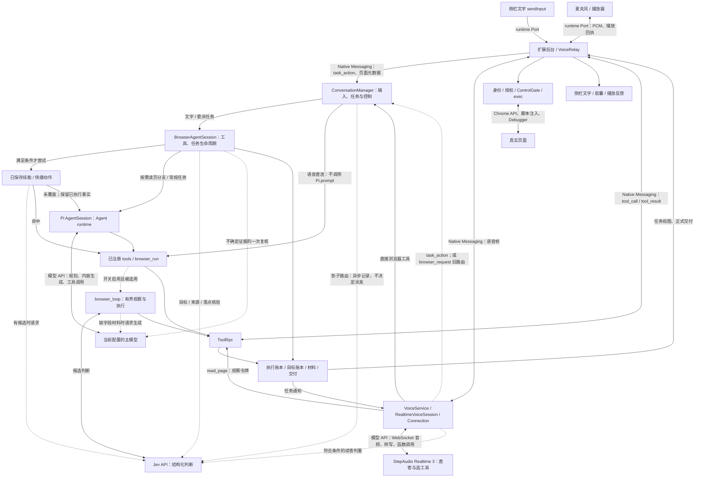

# 当前主链路与一项简化提案

## 扩展宿主边界（2026-09-24）

无本机伴随进程时，background 仍负责页面执行、身份与权限闸门；offscreen 经公开的 `@sideagent/agent/browser-core` 入口装配 `ConversationManager`、`BrowserAgentSession`、`ToolRpc` 与 `VoiceService`。本机入口与扩展入口共用任务和回执逻辑，分别提供传输、模型凭据与语音 WebSocket。扩展先收到并载入配置，再建会话：配置到达前侧栏发来的新建会话先记下，核心启动后补处理；新会话按建立时的设置取模型。诊断记录与语音日常记录都与本机同一套行格式（`shared/run-trace-core.ts`、`shared/voice-capture-core.ts`），本机写文件、扩展写 IndexedDB。AX ref 按标签页登记：动作落到的标签页不是该 ref 的来源页时直接拒绝并指明来源 tabId，不再误报「ref 已失效」。当前页、任务 ID 和 `executionFact` 仍由协议传递，不由模型叙述补造。Jev 不可用时，目标审核改用当前任务模型对同一份要求和宿主观察做有界复核；未获得有效复核仍保持未完成。实际完成状态见[STATUS](STATUS.md)和[迁移工作流](work/20260924-core-into-extension.md)。

下文是 2026-09-22 的主链路快照与简化提案，不能替代以上新入口的验收结论。

2026-09-22，依据 `main@94b1782` 的**当前工作树，含未提交改动**。本轮只读源码与七个测试文件，未执行测试、浏览器、模型请求、构建或重载。图描述源码能力，不代表日常已加载。

[配置源码](../agent/src/config.ts#L27)的通用循环、显示快路与影子路由均缺省关闭；本机 `~/.sideagent/config.json` 四项开关目前均为 true，模型为 `minimax-cn/MiniMax-M3`。会话保存的模型可覆盖全局配置（[装配](../agent/src/main.ts#L153)）。[STATUS](STATUS.md)含旧加载记录，本轮未核对日常进程。新 A 保留“实现方报告通过，最新独立 review 待完成”。

## 一、当前主链路图

实线为调用/数据方向，虚线为条件路径；并非每次输入都会经过所有节点。节点实现见下表。

**普通问答。** 语音由 Realtime 直接回答；扩展先取得页面标题/URL和观察令牌，未因此读取正文；模型调用 `read_page` 才读可见文字。侧栏文字统一发 `task_action`，后台补页面元数据；默认任务入口通常预读 snapshot，可能先走快捷候选判断，未命中再由 Pi 的主模型回答。`pageObservation:on-demand` 已存在，但不是普通侧栏文字的默认入口。[文字入口](../extension/src/sidepanel/main.ts#L3455)、[元数据](../extension/src/background/index.ts#L1346)、[按需分支](../agent/src/session.ts#L1184)。

**明确填写。** 文字路径可精确复用已有技能；普通 fill 不是快捷选择器的通用分支，未匹配技能时由 Pi 主模型选工具。语音由 Realtime 观察、选 fill，宿主调用同一已注册工具，不增加 Pi 推理；歧义时才选 `judge_browser_action`。执行、结果登记和反馈归不同代码层；“不保存/提交”仍须贯穿要求、工具选择与权限检查，不能仅凭一句提示词证明。[快捷候选](../agent/src/fast-task.ts#L127)、[直连](../agent/src/session.ts#L998)。

**复杂任务。** 文字进入 Pi；语音经 `task_action` 委派，源码将其暴露与 `generalBrowserLoop` 开关联动，关闭时仍有 `browser_request` 旧分类入口。主模型提出目标、研究和生成内容；宿主校验目标覆盖、保存原文、核验落点。可选 Fleet、QuickJS `browser_run` 或有界 Jev 循环；技能复用已有程序，材料复用已捕获文本，均走现有工具闸门。[装配](../agent/src/main.ts#L163)、[旧分类](../agent/src/conversation-manager.ts#L492)。

串行等待包括文字预观察→快捷判断→Pi、直接工具队列→整批结果及生成结束→Realtime续答、目标读回→Jev→必要时主模型复核。影子路由不被主调用等待；续答判重的 200ms 是扣音预算。端到端耗时及各分支使用频率**待验证**，不按模块数估算。[工具队列/回传](../agent/src/realtime-voice-connection.ts#L798)、[核验](../agent/src/goal-reasoning-review.ts#L30)。

## 二、职责与事实归属

| 职责 / 类型 | 产生、保存 → 消费；必要边界 | 源码与本轮抽查测试 |
|---|---|---|
| 理解与决策 | Realtime API处理语音、回答和函数选择；主模型API处理Pi任务的规划/生成；Jev API返回候选或概率，普通代码决定是否采用。Pi是运行时，不是第三个模型。 | [`RealtimeVoiceSession.start`](../agent/src/realtime-voice-session.ts#L48)、[`BrowserAgentSession.create`](../agent/src/session.ts#L734)、[`decideBrowserCandidate`](../agent/src/browser-decision-model.ts#L12)；Jev接口含义核对[官方说明](https://docs.typesafe.ai/concepts/system-one.md)。 |
| 输入与派发：`TaskActionRequest`、`TaskReceipt` | 文字/语音生成请求，manager校验输入、run和控制版本；dispatcher按requestId串行、去重并落盘；queue保存排队要求。accepted/applied只说明接收或控制应用，不说明网页目标完成。旧browser_request另有VoicePlanStore和分类请求。 | [`dispatchTaskAction`](../agent/src/conversation-manager.ts#L696)、[`TaskDispatcher.dispatch`](../agent/src/task-dispatcher.ts#L166)。测试① [`conversation-manager`](../agent/test/conversation-manager.test.ts#L321)保护旧计划重放不重复分类/执行，属于仍可达兼容路径。 |
| 派发与实际执行：`tool_call`、参数、调用身份 | Realtime/Pi只提出调用；BrowserAgentSession和tools检查任务/模式/授权，ToolRpc发出；扩展核对run、epoch、页面归属、decisionGuard和ControlGate后执行。动作包括tabs、navigate、click、fill、type_text、press_key、scroll、hover、mark、page_translation（mark 的 `through` 把同一行的名称和数值圈成一个框，见[协议](protocol.md)）；Pi另有组合程序、fetch/js和协作工具。 | [`createBrowserTools`](../agent/src/tools.ts#L80)、[`invokeDisplayTool`](../agent/src/session.ts#L2017)、[`executeToolCall`](../extension/src/background/index.ts#L984)。测试② [`realtime-direct-tools`](../agent/test/realtime-direct-tools.test.ts#L57)保护原话/页面传递、无Pi派发、旧话轮排队写入取消；不是实测模型理解。 |
| 浏览器观察：snapshot/AX、DOM字段、标签、`BrowserObservation` | 扩展读浏览器事实并登记有时效的候选身份；宿主/model消费。`decisionGuard`是采用该观察的约束，不是执行结果。语音令牌仅授权读当前页，`read_page`正文不覆盖全页或图片。 | [`snapshot`](../extension/src/background/exec/snapshot.ts#L25)、[`BrowserObservationRegistry.issue/consume`](../extension/src/background/browser-observation.ts#L141)、[`VoiceObservation.issue/capture`](../extension/src/background/voice-observation.ts#L10)、[`readVoicePage`](../agent/src/voice-page-reader.ts#L5)。 |
| 真实执行：`tool_result.executionFact` | 扩展产生executed/not_executed/unknown；RPC关联传输ID与宿主调用ID，超时/断连保守保留未知；宿主工具事件和Realtime结果消费。RPC在途表与持久执行账本是不同寿命的记录，不是两个独立判决器。 | [`ToolRpc`](../agent/src/rpc.ts#L106)、[`executeToolCall`](../extension/src/background/index.ts#L1000)。不能把ok、reject或模型叙述单独当执行事实。连续失败保护按「工具＋参数＋错误」计数：同一操作三次相同错误才停；并行读三个不同页面各失败一次不算重试（[`RepeatedToolFailurePolicy`](../agent/src/tool-failure-policy.ts)）。 |
| 执行账本：`TaskResultItem`、`executionState` | TaskProgress消费真实tool_start/end/late_result，TaskResultBook自动建项、保存执行证据及写前基线；Pi私有会话文件保存可恢复快照。模型另可手工注册pending槽位，register需吸收自动项，resolveStartItem需改绑——这是独立维护同一执行条目的复杂度候选。 | [`TaskProgress.observe`](../agent/src/task-progress.ts#L284)、[`register`](../agent/src/task-results.ts#L81)、[`resolveStartItem`](../agent/src/task-results.ts#L192)、[`persistTaskResults`](../agent/src/session.ts#L563)。测试③ [`task-result-turn-economy`](../agent/test/task-result-turn-economy.test.ts#L40)保护零预登记自动记账/未知写锁，后半是历史调用序列反事实；④ [`task-results`](../agent/test/task-results.test.ts#L80)保护登记接口不能伪造完成及旧槽位兼容。 |
| 动作核验：`read_element.check`、`BrowserStepReceipt` | 扩展检查具体字段条件；browser_loop把执行调用、核验调用和观察ID关联成逐步回执，由工具输出/宿主事件消费。verification只证明该动作的指定后置条件，不能代替完整用户目标。 | [`read_element`契约](../agent/src/tools.ts#L270)、[`BrowserStepReceipt`](../shared/browser-decision.ts#L94)、[`runBrowserDecisionLoop`](../agent/src/browser-decision-loop.ts#L264)。 |
| 用户目标：`TaskGoalPlan`、`resultState` | 主模型提出目标与条件；TaskGoalBook检查覆盖、版本并保存转移；具体核验先做身份/字面检查，再用Jev，特定不确定结果允许一次主模型复核；复核期间只发带 `progress` 的进度提示，侧栏把它放进过程行标题，不留在对话里。TaskProgress据此投影目标进度，unknown写入约束优先。 | [`executeGoalOperation`](../agent/src/task-goal-tool.ts#L27)、[`TaskGoalBook.verify`](../agent/src/task-goals.ts#L89)、[`decideTaskNextStep`](../shared/task-next-step.ts#L41)。测试⑤ [`task-goal-tool`](../agent/test/task-goal-tool.test.ts#L25)保护原文取得≠目标完成、错误字段不通过、改口后旧计划失效。 |
| 原文与证据：`TaskObservation`、`ObservedMaterial`、来源核验证书 | BrowserAgentSession采集实际读数，TaskEvidence按run/revision保存观察；capture复制指定片段而非让模型重写；inspect 对小观察（≤24 个片段、≤2000 字）直接附片段编号与原文，片段编号或 verify 的 goalId 用错时错误信息列出可用编号，不放松复核与精确比对。原文/证书写入Pi私有日志，可供恢复、填写和核验复用；新的页面操作仍需新鲜节点身份。 | [`TaskEvidence`](../agent/src/task-evidence.ts#L19)、[`goalToolHost`](../agent/src/session.ts#L326)、[`capture`](../agent/src/task-goal-tool.ts#L54)、[`readPersistedTaskResults`](../agent/src/session.ts#L571)。这些正文与TaskResultBook的执行/写前基线用途不同，不能直接合并。 |
| 横跨三路：输入、取消、插话、改口、接管 | 语音speechSeq/browserAbort撤销旧直接工具；任务改口先登记未消费补充并关旧写入口；session.controlEpoch与run/revision作废旧结果；manager.controlVersion使旧控制/授权失效；扩展generation在异步边界再检查。任务原要求、未知执行、已接受未消费补充须保留。停声/关通话不等于撤销后台任务。 | [`steerCurrentTask`](../agent/src/session.ts#L2468)、[`holdForUser`](../agent/src/session.ts#L2676)、[`dispatchTask`](../agent/src/realtime-voice-session.ts#L118)、[`disconnect`](../agent/src/conversation-manager.ts#L1545)。测试⑥ [`task-recovery-matrix`](../agent/test/task-recovery-matrix.test.ts#L59)保护断连未决写、迟到事件、慢恢复期间取消和不自动重放。 |
| 文字、界面与语音：`UserDelivery`、`ExecutionFeedback`、`TaskView` | send_user_message形成正式交付，TaskProgress内的UserDeliveryLedger保存交付/播放事实；宿主反馈分类决定胶囊，扩展/侧栏呈现；VoiceService通知Realtime生成音频。response.done是生成完成，playback_done才是播放回执。TaskView、summary、侧栏缓存是投影；不能只因同名状态就删掉。模型交付 partial 时可附 `unfinished`（按用户原话写的未完成项）；它只是模型自述，不进宿主事实链，也不能把结果升级为完成。 | [`交付装配`](../agent/src/session.ts#L832)、[`projectTaskView`](../shared/task-view.ts#L83)、[`反馈分类`](../shared/execution-feedback.ts#L100)、[`VoiceService.observe`](../agent/src/voice-service.ts#L205)、[`maybeFlush`](../agent/src/realtime-voice-connection.ts#L928)。测试⑦ [`task-view-ui`](../extension/test/task-view-ui.test.ts#L272)保护“请求停止≠已经停手”；原源码分支形状检查已删除，只保留对外状态与交互行为。 |
| 复用与可选路径 | 技能保存程序、输入模板和结果检查；精确命中可免推理，语义候选才问Jev；browser_run的QuickJS子步骤复用同一RPC。显式记忆本地选取进入Pi上下文；经历/技能学习另有有界模型处理，不能自行授权动作。影子Jev只记录，不参与路由。 | [`trySkillFastLoop`](../agent/src/skill-fast-loop.ts#L68)、[`browser_run`](../agent/src/tools.ts#L306)、[`MemoryRuntime.recall`](../agent/src/memory-runtime.ts#L66)、[`经历装配`](../agent/src/session.ts#L887)、[`RouteShadow.observe`](../agent/src/route-shadow.ts#L127)。 |

## 三、Issue：新任务只保留目标计划和自动执行记账

2026-09-22 已完成工具面与提示的最小实现，未提交/重载；[验收](evals/20260922-automatic-result-registration.md)。实际 Pi＋本地脚本模型验证新任务隐藏登记入口、自动结果 ID 回到下一轮工具调用；真实模型任务质量与提速未测。下述主链路不新增模块，旧记录和恢复工具保留。

**问题。** `record_task_results`与自动登记共同维护执行条目；模型还须在换对象/方法时同步旧槽位。它和`task_goals`并非同义，但新任务已有目标计划后，再让模型维护预执行清单收益不明。另一处复杂度是文字问答与语音直答入口不对称；处理它需要路由质量证据，本次不选。

1. **范围与效果**：仅Pi新任务的工具表/提示；覆盖文字动作和复杂研究填写。移除可选的手工记账回合，不改变实际执行器，语音直接工具照旧。
2. **已实现的最小改动**：有runId/goalPlan、非restartRecovery且无既有非自动编号pending/blocked槽位时，Pi输入前收起`record_task_results`；复用`applyActiveTools`，不加Router或持久状态。无计划、重启恢复或仍有旧槽位的任务保留原入口，不迁移历史项。不能仅靠有goalPlan就误判为全新任务。
3. **文件与迁移**：`session.ts`在新任务prompt前应用可见工具过滤，恢复/模式/团队工具重挂载仍遵守该规则；`product-context.ts`只在旧入口可用时说明手工登记；`task-results.ts`将未知结果工具的ID指引改为现有宿主results投影，保留登记实现供旧路径使用。[挂载](../agent/src/session.ts#L933)、[新run/恢复标记](../agent/src/task-progress.ts#L190)、[现有投影](../agent/src/product-context.ts#L13)。
4. **不变量**：TaskResultBook、TaskGoalBook、动作核验和交付各自保留；真实回执自动登记、unknown写锁、禁止保存/提交、取消/接管、原要求及已接受补充均不削弱。不得把执行成功、目标满足、生成结束合并。
5. **复用测试**：上表③④⑤⑥为核心，先按[测试约定](../AGENTS.md#测试约定)筛：结果向的保留，实现向的显式化为对外契约或删除，不再笼统“不删任何测试”。登记接口测试继续保护旧检查点；历史调用序列反事实按同一标准处置，不得冒充当前性能实测。
6. **最少补验**：现有测试内验证新任务看不到登记工具仍能“资料→草稿、不提交”，换方法不漏目标；恢复旧pending/unknown仍可处理且不重放；切模式/挂团队不重新暴露新任务已隐藏工具。机器检查事实，人审最终草稿；再取最小实际路径确认模型能从results找到ID。
7. **收益/风险/假设**：减少一种模型职责及新槽位同步机会；能省多少回合、是否提速待测。隐藏提示、模式/团队、旧任务兼容和自动结果ID路径已离线验证，复杂资料→草稿的真实模型验收未跑。另有三项自动记账旧回归在本轮入场代码中已失败，原断言保留，详见验收；不把工程现状写成全绿。回退只恢复工具可见性与提示，无存储迁移。
