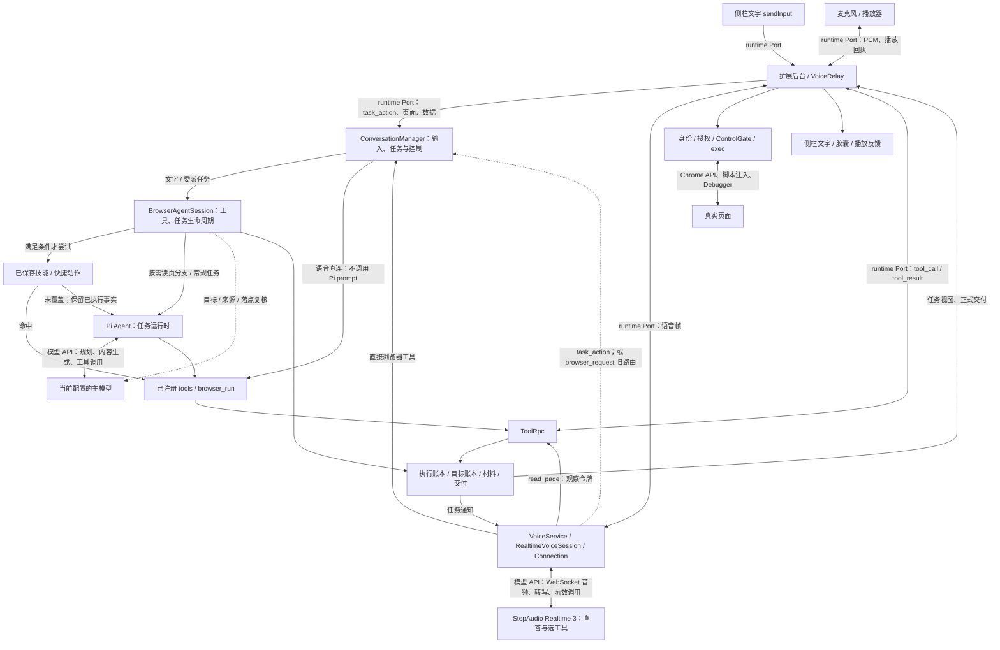

# 当前主链路与一项简化提案

## 扩展宿主边界（2026-09-24）

产品只有扩展形态；本机伴随进程入口、Native Messaging 与 Jev 已于 10-01 删除，Node 会话循环（`agent/src/node-agent-loop.ts`）和扩展的 WebSocket 调试回退只留给在 Node 里托管会话的检查，改到扩展里测后删除（[退役验收](evals/20261001-retire-native-and-dead-code.md)）。background 仍负责页面执行、身份与权限闸门；offscreen 经公开的 `@sideagent/agent/browser-core` 入口装配 `ConversationManager`、`BrowserAgentSession`、`ToolRpc` 与 `VoiceService`。这些检查与扩展入口共用任务和回执逻辑，只是传输、模型凭据不同。扩展先收到并载入配置，再建会话：配置到达前侧栏发来的新建会话先记下，核心启动后补处理；新会话按建立时的设置取模型。会话目录经 `ConversationPersistence` 存盘（扩展写 IndexedDB），offscreen 重启后按它重建；扩展的模型消息只在内存。诊断记录与语音日常记录的行格式见 `shared/run-trace-core.ts`、`shared/voice-capture-core.ts`，扩展写 IndexedDB（Node 托管的检查写文件）。扩展内循环每次调模型前写 `model_request`（系统提示词、工具说明的 sha256 与字数，本次宿主插入的上下文消息，图片原始字节的 sha256/类型/字节数），某 sha256 在会话里首次出现时分段写 `system_prompt` / `tools_manifest` 全文，可离线重放那一步（[`ModelRequestTrace`](../agent/src/model-request-trace.ts)）。AX ref 按标签页登记：动作落到的标签页不是该 ref 的来源页时直接拒绝并指明来源 tabId，不再误报「ref 已失效」。当前页、任务 ID 和 `executionFact` 仍由协议传递，不由模型叙述补造。目标审核由当前任务模型对同一份要求和宿主观察做有界复核；未获得有效复核仍保持未完成。模型能力（思考档、能否看图）只登记在 `shared/model-capabilities.ts`；所有后台判断走同一入口，主任务每次调用按信号取档，见[模型与思考档](model-effort.md)。实际完成状态见[STATUS](STATUS.md)和[迁移工作流](work/20260924-core-into-extension.md)。

目标核对除结果是否出现外，还对照本任务工具结果和文本文件内容检查答复的数字、日期、来源与明确要求；输入预算与纠错续做规则只在[目标核对](goal-check.md)维护。

下文是 2026-09-22 的主链路快照与简化提案，不能替代以上新入口的验收结论。

2026-09-22，依据 `main@94b1782` 的**当前工作树，含未提交改动**。本轮只读源码与七个测试文件，未执行测试、浏览器、模型请求、构建或重载。图描述源码能力，不代表日常已加载。

原快照里的通用循环、显示快路、影子路由与播报闸门开关已随 Jev 于 10-01 删除，下图与下表已去掉这些分支。会话保存的模型可覆盖全局配置（[装配](../extension/src/inproc/browser-host.ts#L71)）。[STATUS](STATUS.md)含旧加载记录，本轮未核对日常进程。新 A 保留“实现方报告通过，最新独立 review 待完成”。

## 一、当前主链路图

实线为调用/数据方向，虚线为条件路径；并非每次输入都会经过所有节点。节点实现见下表。

```mermaid
flowchart TD
  Text[侧栏文字 sendInput] -->|runtime Port| BG[扩展后台 / VoiceRelay]
  Audio[麦克风 / 播放器] <-->|runtime Port：PCM、播放回执| BG
  BG -->|runtime Port：task_action、页面元数据| CM[ConversationManager：输入、任务与控制]
  BG <-->|runtime Port：语音帧| VS[VoiceService / RealtimeVoiceSession / Connection]
  VS <-->|模型 API：WebSocket 音频、转写、函数调用| RT[StepAudio Realtime 3：直答与选工具]
  VS -->|直接浏览器工具| CM
  VS -.->|task_action；或 browser_request 旧路由| CM
  CM -->|文字 / 委派任务| Session[BrowserAgentSession：工具、任务生命周期]
  Session -->|满足条件才尝试| Fast[已保存技能 / 快捷动作]
  Fast -->|命中| Tools[已注册 tools / browser_run]
  Fast -->|未覆盖；保留已执行事实| Pi[Pi Agent：任务运行时]
  Session -->|按需读页分支 / 常规任务| Pi
  Pi <-->|模型 API：规划、内容生成、工具调用| LLM[当前配置的主模型]
  Pi --> Tools
  CM -->|语音直连：不调用 Pi.prompt| Tools
  VS -->|read_page：观察令牌| RPC[ToolRpc]
  Tools --> RPC
  RPC <-->|runtime Port：tool_call / tool_result| BG
  BG --> Gate[身份 / 授权 / ControlGate / exec]
  Gate <-->|Chrome API、脚本注入、Debugger| Page[真实页面]
  Session -.->|目标 / 来源 / 落点复核| LLM
  RPC --> Facts[执行账本 / 目标账本 / 材料 / 交付]
  Session --> Facts
  Facts -->|任务视图、正式交付| BG
  Facts -->|任务通知| VS
  BG --> UI[侧栏文字 / 胶囊 / 播放反馈]
```

**普通问答。** 语音由 Realtime 直接回答；扩展先取得页面标题/URL和观察令牌，未因此读取正文；模型调用 `read_page` 才读可见文字。侧栏文字统一发 `task_action`，后台补页面元数据；默认任务入口通常预读 snapshot，可能先走快捷候选判断，未命中再由 Pi 的主模型回答。`pageObservation:on-demand` 已存在，但不是普通侧栏文字的默认入口。[文字入口](../extension/src/sidepanel/main.ts#L3455)、[元数据](../extension/src/background/index.ts#L1346)、[按需分支](../agent/src/session.ts#L1184)。

**明确填写。** 文字路径可精确复用已有技能；普通 fill 不是快捷选择器的通用分支，未匹配技能时由 Pi 主模型选工具。语音由 Realtime 观察、选 fill，宿主调用同一已注册工具，不增加 Pi 推理。执行、结果登记和反馈归不同代码层；“不保存/提交”仍须贯穿要求、工具选择与权限检查，不能仅凭一句提示词证明。[技能快捷路径](../agent/src/skill-fast-loop.ts)、[直连](../agent/src/session.ts#L998)。

**复杂任务。** 文字进入 Pi；语音经 `task_action` 委派（扩展入口始终装配），另有 `browser_request` 旧分类入口。主模型提出目标、研究和生成内容；宿主校验目标覆盖、保存原文、核验落点。可选 Fleet 或 QuickJS `browser_run`；技能复用已有程序，材料复用已捕获文本，均走现有工具闸门。[装配](../extension/src/inproc/browser-host.ts#L71)、[旧分类](../agent/src/conversation-manager.ts#L492)。

串行等待包括文字预观察→技能精确匹配→Pi、直接工具队列→整批结果及生成结束→Realtime续答、目标读回→主模型复核。端到端耗时及各分支使用频率**待验证**，不按模块数估算。[工具队列/回传](../agent/src/realtime-voice-connection.ts#L798)、[核验](../agent/src/goal-reasoning-review.ts#L30)。

## 二、职责与事实归属

| 职责 / 类型 | 产生、保存 → 消费；必要边界 | 源码与本轮抽查测试 |
|---|---|---|
| 理解与决策 | Realtime API处理语音、回答和函数选择；主模型API处理Pi任务的规划/生成与目标复核。Pi是运行时，不是另一个模型。 | [`RealtimeVoiceSession.start`](../agent/src/realtime-voice-session.ts#L48)、[`BrowserAgentSession.create`](../agent/src/session.ts#L734)。 |
| 输入与派发：`TaskActionRequest`、`TaskReceipt` | 文字/语音生成请求，manager校验输入、run和控制版本；dispatcher按requestId串行、去重并落盘；queue保存排队要求。accepted/applied只说明接收或控制应用，不说明网页目标完成。旧browser_request另有VoicePlanStore和分类请求。 | [`dispatchTaskAction`](../agent/src/conversation-manager.ts#L696)、[`TaskDispatcher.dispatch`](../agent/src/task-dispatcher.ts#L166)。测试① [`conversation-manager`](../agent/test/conversation-manager.test.ts#L321)保护旧计划重放不重复分类/执行，属于仍可达兼容路径。 |
| 派发与实际执行：`tool_call`、参数、调用身份 | Realtime/Pi只提出调用；BrowserAgentSession和tools检查任务/模式/授权，ToolRpc发出；扩展核对run、epoch、页面归属、decisionGuard和ControlGate后执行。动作包括tabs、navigate、click、fill、type_text、press_key、scroll、hover、mark、[page_translation](page-translation.md)（mark 的 `through` 把同一行的名称和数值圈成一个框，见[协议](protocol.md)）；Pi另有组合程序、fetch/js和协作工具。 | [`createBrowserTools`](../agent/src/tools.ts#L150)、[`invokeDisplayTool`](../agent/src/session.ts#L2017)、[`executeToolCall`](../extension/src/background/index.ts#L984)。测试② [`realtime-direct-tools`](../agent/test/realtime-direct-tools.test.ts#L57)保护原话/页面传递、无Pi派发、旧话轮排队写入取消；不是实测模型理解。 |
| 浏览器观察：snapshot/AX、DOM字段、标签、`BrowserObservation` | 扩展读浏览器事实并登记有时效的候选身份；宿主/model消费。`decisionGuard`是采用该观察的约束，不是执行结果。语音令牌仅授权读当前页，`read_page`正文不覆盖全页或图片。`read_elements` 的每个命中带只指向它的 `target`，可直接交给 click/mark（见[协议](protocol.md)）；语音直接工具因用户接着说话而作废时，如实返回「没执行、合起来重新调用」；能直接操作页面时 `read_page` 结果附「要操作就调用 snapshot」；供应商会话挂住时连接层约 22 秒发现并断开，侧栏重连后请用户重说（均见[语音架构](voice-architecture.md)）。 | [`snapshot`](../extension/src/background/exec/snapshot.ts#L25)、[`BrowserObservationRegistry.issue/consume`](../extension/src/background/browser-observation.ts#L141)、[`VoiceObservation.issue/capture`](../extension/src/background/voice-observation.ts#L10)、[`readVoicePage`](../agent/src/voice-page-reader.ts#L5)。 |
| 真实执行：`tool_result.executionFact` | 扩展产生executed/not_executed/unknown；RPC关联传输ID与宿主调用ID，超时/断连保守保留未知；宿主工具事件和Realtime结果消费。RPC在途表与持久执行账本是不同寿命的记录，不是两个独立判决器。 | [`ToolRpc`](../agent/src/rpc.ts#L106)、[`executeToolCall`](../extension/src/background/index.ts#L1000)。不能把ok、reject或模型叙述单独当执行事实。连续失败保护按「工具＋参数＋错误」计数：同一操作三次相同错误才停；并行读三个不同页面各失败一次不算重试（[`RepeatedToolFailurePolicy`](../agent/src/tool-failure-policy.ts)）。原地转圈另按结果判断：一次任务里连续 6 步没有新内容（新片段不足 2%、易变编号与时间不算）、没有真实动作、交付或存文件、或重复已见过的错误（等待后读到同样内容记半步），就停下本轮，一段话说卡在哪一步、已有哪些文件、最近一次目标核对说还差什么；未核对的计划目标只说「没确认」（[`NoProgressPolicy`](../agent/src/no-progress-policy.ts)，门槛依据见[验收](evals/20261001-data-to-file.md)）。 |
| 执行账本：`TaskResultItem`、`executionState` | TaskProgress消费真实tool_start/end/late_result，TaskResultBook自动建项、保存执行证据及写前基线；扩展检查点写入Pi原生会话存储，恢复边界见[协议](protocol.md)。模型另可手工注册pending槽位，register需吸收自动项，resolveStartItem需改绑——这是独立维护同一执行条目的复杂度候选。 | [`TaskProgress.observe`](../agent/src/task-progress.ts#L284)、[`register`](../agent/src/task-results.ts#L81)、[`resolveStartItem`](../agent/src/task-results.ts#L192)、[`persistTaskResults`](../agent/src/session.ts#L563)。测试③ [`task-result-turn-economy`](../agent/test/task-result-turn-economy.test.ts#L40)保护零预登记自动记账/未知写锁，后半是历史调用序列反事实；④ [`task-results`](../agent/test/task-results.test.ts#L80)保护登记接口不能伪造完成及旧槽位兼容。 |
| 动作核验：`read_element.check` | 扩展检查具体字段条件。verification只证明该动作的指定后置条件，不能代替完整用户目标。页面下载的完成事实只来自 `chrome.downloads`：扩展按 URL 把它接到已 arm 标签页的下载上，`wait_event` 回执在 Chrome 报 complete 前不写已保存（见[协议](protocol.md)）。 | [`read_element`契约](../agent/src/tools.ts#L270)。 |
| 用户目标：`TaskGoalPlan`、`resultState` | 主模型提出目标与条件；TaskGoalBook检查覆盖、版本并保存转移；具体核验先做身份/字面检查，再由当前任务模型做一次有界复核；复核期间只发带 `progress` 的进度提示，侧栏把它放进过程行标题，不留在对话里。TaskProgress据此投影目标进度，unknown写入约束优先。 | [`executeGoalOperation`](../agent/src/task-goal-tool.ts#L27)、[`TaskGoalBook.verify`](../agent/src/task-goals.ts#L89)、[`decideTaskNextStep`](../shared/task-next-step.ts#L41)。测试⑤ [`task-goal-tool`](../agent/test/task-goal-tool.test.ts#L25)保护原文取得≠目标完成、错误字段不通过、改口后旧计划失效。 |
| 原文与证据：`TaskObservation`、`ObservedMaterial`、来源核验证书 | BrowserAgentSession采集实际读数，TaskEvidence按run/revision保存观察；capture复制指定片段而非让模型重写；inspect 对小观察（≤24 个片段、≤2000 字）直接附片段编号与原文，片段编号或 verify 的 goalId 用错时错误信息列出可用编号，不放松复核与精确比对。原文/证书在当前会话复用，扩展重启持久化边界见[协议](protocol.md)；新的页面操作仍需新鲜节点身份。 | [`TaskEvidence`](../agent/src/task-evidence.ts#L19)、[`goalToolHost`](../agent/src/session.ts#L326)、[`capture`](../agent/src/task-goal-tool.ts#L54)、[`readPersistedTaskResults`](../agent/src/session.ts#L571)。这些正文与TaskResultBook的执行/写前基线用途不同，不能直接合并。 |
| 横跨三路：输入、取消、插话、改口、接管 | 语音speechSeq/browserAbort撤销旧直接工具；任务改口先登记未消费补充并关旧写入口；session.controlEpoch与run/revision作废旧结果；manager.controlVersion使旧控制/授权失效；扩展generation在异步边界再检查。任务原要求、未知执行、已接受未消费补充须保留。停声/关通话不等于撤销后台任务。 | [`steerCurrentTask`](../agent/src/session.ts#L2468)、[`holdForUser`](../agent/src/session.ts#L2676)、[`dispatchTask`](../agent/src/realtime-voice-session.ts#L118)、[`disconnect`](../agent/src/conversation-manager.ts#L1545)。测试⑥ [`task-recovery-matrix`](../agent/test/task-recovery-matrix.test.ts#L59)保护断连未决写、迟到事件、慢恢复期间取消和不自动重放。 |
| 文字、界面与语音：`UserDelivery`、`ExecutionFeedback`、`TaskView` | send_user_message形成正式交付，TaskProgress内的UserDeliveryLedger保存交付/播放事实；宿主反馈分类决定胶囊，扩展/侧栏呈现；VoiceService通知Realtime生成音频。response.done是生成完成，playback_done才是播放回执。TaskView、summary、侧栏缓存是投影；不能只因同名状态就删掉。模型交付 partial 时可附 `unfinished`（按用户原话写的未完成项）；它只是模型自述，不进宿主事实链，也不能把结果升级为完成。模型报完成、而本轮改页面的尝试一次都没生效（工具出错、`browser_run` 0 步）时，宿主照常交付、记为 partial，并在正文后补「页面没有变化：本轮 N 次改动页面的尝试都没有生效。」；计数只看工具结果，不看正文。「先保存原文、填写须逐字一致」这套流程（`task_goals` 的 material/field 目标与填写前原文核对）只在用户原话明确要求照原文搬运时启用，判断在 [`shared/copy-request.ts`](../shared/copy-request.ts)；导出文件、整理、调研、改错字不登记这两类目标，也就不会被误报未完成。账本、核验和工具的原文（工具名、元素编号、状态码、原始 JSON、Chrome 错误码）只留在记录和模型上下文里；侧栏、页面浮层、语音与补在回答后的那句话都经 [`shared/user-facing.ts`](../shared/user-facing.ts) 翻成人话，翻不出就说笼统但真实的话，不回退原文。目标核对判「受阻」（网站连不上等）时，侧栏那一行的原因也由宿主按类别写成人话，不用核对模型的原话（见[目标核对](goal-check.md)）。用户在授权卡上点「拒绝」按用户的选择记：`tool_end.declined`，不算失败、不留待办；被拦下等页面确认的点击记 `awaitingConfirmation`，侧栏说「等你在页面上确认」，也不再算占着页面（见[协议](protocol.md)）。 | [`交付装配`](../agent/src/session.ts#L832)、[`projectTaskView`](../shared/task-view.ts#L83)、[`反馈分类`](../shared/execution-feedback.ts#L100)、[`VoiceService.observe`](../agent/src/voice-service.ts#L205)、[`maybeFlush`](../agent/src/realtime-voice-connection.ts#L928)。测试⑦ [`task-view-ui`](../extension/test/task-view-ui.test.ts#L272)保护“请求停止≠已经停手”；原源码分支形状检查已删除，只保留对外状态与交互行为。 |
| 复用与可选路径 | 技能保存程序、输入模板和结果检查；精确/模板命中可免推理（语义匹配原靠 Jev，已退役）；browser_run的QuickJS子步骤复用同一RPC。记忆分「关于你 / 做过的事 / 做事的方法」三种：用户亲口说的由快速模型只答窄问题（长期事实？哪天？只对这次？），代码按记忆模型的顺序落位（[`placeMemory`](../agent/src/memory-decision.ts)）；缺失分类拒绝写入；纠正做法先确认，见[记忆模型](memory-model.md)。每轮带哪些由纯代码规则决定（[`selectMemoryContext`](../agent/src/memory-context.ts)：总是带 / 有效期内 / 按网站，各有上限），两处各写一条决定记录进诊断记录；存储经 `DocumentPersistence`（扩展 IndexedDB；Node 托管的检查用文件）。经历/技能学习另有有界模型处理，不能自行授权动作；学习资格的覆盖判断原靠 Jev，现在没有默认判断，一律不生成可自动复用的候选。宿主在 `hello_ok.features` 里报有没有记忆、技能存储；只装扩展时有记忆、没有技能，侧栏只给「记忆」入口，不给「示范给 AI」。 | [`trySkillFastLoop`](../agent/src/skill-fast-loop.ts#L68)、[`browser_run`](../agent/src/tools.ts#L306)、[`MemoryRuntime`](../agent/src/memory-runtime.ts)、[`TaskHistoryStore`](../agent/src/task-history.ts)、[`经历装配`](../agent/src/session.ts#L887)。 |

## 三、Issue：新任务只保留目标计划和自动执行记账

2026-09-22 的提案与最小实现记录已拆到[单独一页](architecture-task-results-proposal.md)。

### 阅读失败与恢复

扩展内没有本机文件系统：`fetch` 成功响应采用有界内联，不走伴随进程落盘。GET 出错或超时只是取数失败，不制造未知写入；POST 与可能重复造成后果的操作仍保留未决保护，未决期间被拦的范围与「只核查一次」见[协议](unknown-results.md)。历史未知记录不会因用户说“继续”被清除；接管、取消、重启检查点与原未知动作的重放保护不变。实现验收见 [MDN 阅读恢复](evals/20260930-mdn-reading-recovery.md)。依赖本机伴随进程的工具（`download_save_as`、`upload_file`、`file_chooser_set_files`、`paste`，及 `browser_run` 里对应的 helper 与别名）在扩展里不注册、不列给模型；主会话在扩展里没有可交给助手的模型运行时，`spawn_worker` 也不注册，系统提示词的「Parallel workers」分派段随之去掉（`leadSystemPrompt({workers})`），在扩展里实现助手是另排的想法；判据是扩展构建的 `dataDir` 垫片为空（[`runtime-capabilities.ts`](../agent/src/runtime-capabilities.ts)），Node 托管的检查照常提供。它们缺席不算「写能力不完整」，通用页面 JS 不因此关闭。工具拿到的大段数据由程序里的 `browser.saveFile` 写进 `artifacts` 的同一个会话文件区，不经模型重打（[验收](evals/20261001-data-to-file.md)）。截图默认只进模型上下文；只有 `screenshot` 带 `forUser:true` 的那张由宿主存进同一个文件区、在回答下显示成图片（[规则](artifacts.md#截图哪些给用户看)）。
