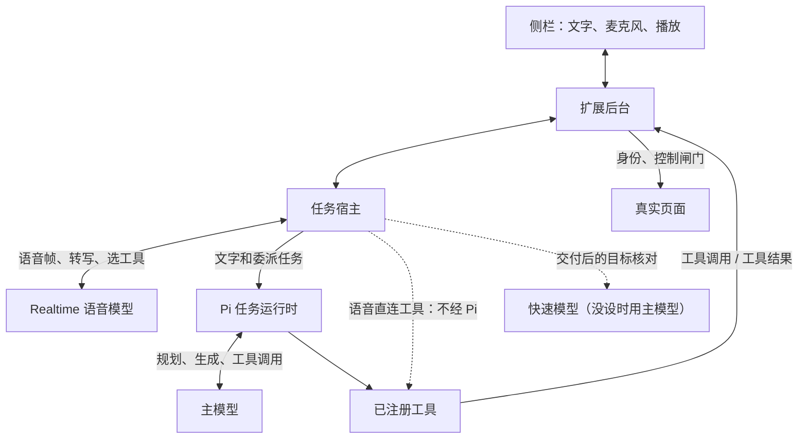

# 架构

[文档导航](README.md) · [协议](protocol.md) · [当前状态](STATUS.md)

本页只写结构为什么这样分、哪些边界是规则。接口、常量与流程以代码为准。

## 扩展宿主边界

- 产品只有扩展形态。本机模式与 Jev 已退役，见[路线](ROADMAP.md)。会话循环只有扩展内的 Pi 一种。
- 扩展后台负责页面执行、身份检查与控制闸门。任务宿主（offscreen 文档）运行任务核心。
- 当前页面、任务 ID 和执行事实由协议传递，不由模型叙述补造。
- 模型能力只登记在一处，见[模型与思考档](model-effort.md)。
- 排查时可离线重放某一步模型请求，见 [`model-request-trace.ts`](../agent/src/model-request-trace.ts)。
- 目标核对在回答交付之后运行，见[目标核对](goal-check.md)。

## 主链路图

实线是调用或数据方向，虚线是条件路径。不是每次输入都经过所有节点。

```mermaid
flowchart TD
  UI[侧栏：文字、麦克风、播放] <--> BG[扩展后台]
  BG <--> Host[任务宿主]
  Host <-->|语音帧、转写、选工具| RT[Realtime 语音模型]
  Host -->|文字和委派任务| Pi[Pi 任务运行时]
  Pi <-->|规划、生成、工具调用| LLM[主模型]
  Host -.->|语音直连工具：不经 Pi| Tools[已注册工具]
  Pi --> Tools
  Tools -->|工具调用 / 工具结果| BG
  BG -->|身份、控制闸门| Page[真实页面]
  Host -.->|交付后的目标核对| Fast["快速模型（没设时用主模型）"]
```

- **普通问答。** 语音路径先只拿页面标题、URL 和观察令牌；模型读页后才拿可见文字。侧栏文字路径先读一次当前页面，再交给主模型。两条路径都不设快捷路径或意图预判。
- **明确填写。** 语音路径由 Realtime 选工具，任务宿主调用同一个已注册工具，不增加 Pi 推理。
  「不保存/提交」要贯穿要求、工具选择与权限检查，不只靠一句提示词。
- **复杂任务。** 文字和语音委派都进 Pi。组合执行的步骤走同一控制闸门，见[组合执行](browser-program.md)。
- 端到端耗时与各分支使用频率**待验证**，不按模块数估算。

## 职责与事实边界

- Pi 是运行时，不是另一个模型。理解与决策只在 Realtime 与主模型两处。
- Realtime 与 Pi 只提出工具调用。扩展确认任务、页面归属和控制闸门后才执行。
- 回执只说明请求去向，不说明网页目标完成，见[任务调度](voice-dispatch.md#回执)。
- 动作附带的观察凭据只证明这个决定基于一次有效的页面观察，不证明动作已执行。语音观察令牌只授权读当前页面；读页不覆盖全页或图片。
- 执行事实只由扩展产生。超时或断连时，程序保守记为结果未知，见[结果未知的边界](unknown-results.md)。单独的成功返回、拒绝或模型叙述都不能当执行事实。
- 连续失败与原地打转的停止门槛以代码为准，依据见[验收](evals/20261001-data-to-file.md)。
- 动作核验只证明该动作的后置条件，不能代替完整用户目标。下载是否完成见[下载](downloads.md)。
- 中止、插话、改口、接管时，任务原要求、结果未知项和已接受未消费的插话都保留。停声与中止的区别见[语音架构](voice-architecture.md#停声不等于中止任务)。
- 语音回答生成完成不等于播放完成。任务视图、摘要与侧栏缓存都是同一份事实的不同投影，所以不能因为状态同名就把它们合并删掉。
- 模型交付时附的「未完成」只是模型自述，不进任务宿主的事实链，也不把结果升级为完成。
- 模型报完成、但本轮改页面的尝试都没生效时，任务宿主记为部分完成并补一句说明。计数只看工具结果。
- 工具名、元素编号、原始 JSON、Chrome 错误码等原文只留在记录和模型上下文。
  用户看到的文字都经 [`shared/user-facing.ts`](../shared/user-facing.ts) 翻成人话。翻不出时说笼统但真实的话，不回退原文。
- 记忆见[记忆模型](memory-model.md)。

## 新任务不让模型手工记账

- 执行条目由真实回执自动登记。
- 新任务已有目标计划时，程序不再给模型手工登记执行条目的工具，免得模型与自动登记同时维护同一条目（[验收](evals/20260922-automatic-result-registration.md)）。
- 重启恢复的任务或仍有旧槽位的任务保留原入口，不迁移历史项。

## 阅读失败与恢复

- `fetch` 的读取规则见[协议](protocol.md#fetch-读取与未知结果边界)。
- GET 取数出错只是取数失败。结果未知的规则见[结果未知的边界](unknown-results.md)。
- 本机文件、上传、剪贴板、原始 CDP 等低频工具已删去（[删减验收](evals/20261004-cut-unused.md)）。控制闸门只看仍注册的写工具。
- 大段数据由程序直接存进会话文件区，不经模型重打（[验收](evals/20261001-data-to-file.md)）。
- 截图默认只进模型上下文。给用户看的规则见[文件卡片与截图](artifacts.md#截图哪些给用户看)。
