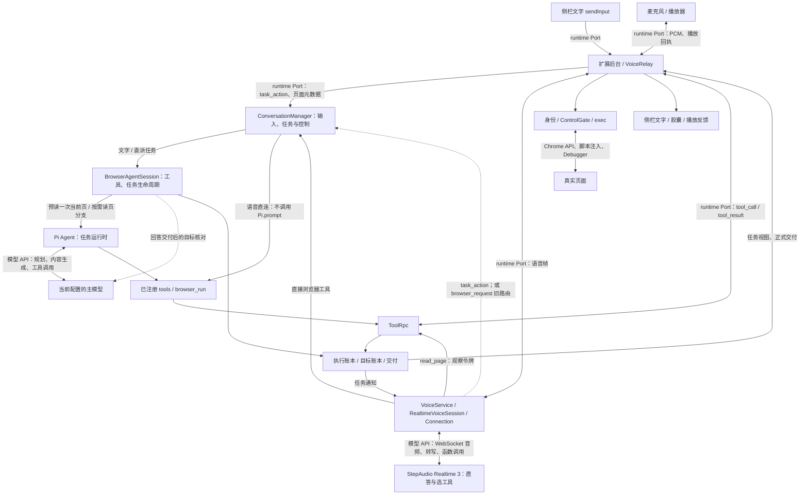

# 架构

[文档导航](README.md) · [协议](protocol.md) · [当前状态](STATUS.md)

本页只写结构为什么这样分、哪些边界是规则。接口、常量与流程以代码为准。

## 扩展宿主边界

- 产品只有扩展形态。本机伴随进程、Native Messaging、Jev 与 Node 会话循环都已退役，会话循环只有扩展内的 pi-agent-core 一种（[退役验收](evals/20261001-retire-native-and-dead-code.md)、[删减验收](evals/20261004-cut-unused.md)）。
- 扩展后台负责页面执行、身份检查与控制闸门；任务宿主（offscreen 文档）运行任务核心（`@sideagent/agent/browser-core`）。
- 当前页面、任务 ID 和执行事实由协议传递，不由模型叙述补造。
- 模型能力只登记在一处，见[模型与思考档](model-effort.md)。
- 排查时可离线重放某一步模型请求，见 [`ModelRequestTrace`](../agent/src/model-request-trace.ts)。
- 目标核对在回答交付之后运行，不拖慢回答，见[目标核对](goal-check.md)。

## 主链路图

实线为调用/数据方向，虚线为条件路径；并非每次输入都会经过所有节点。

```mermaid
flowchart TD
  Text[侧栏文字 sendInput] -->|runtime Port| BG[扩展后台 / VoiceRelay]
  Audio[麦克风 / 播放器] <-->|runtime Port：PCM、播放回执| BG
  BG -->|runtime Port：task_action、页面元数据| CM[ConversationManager：输入、任务与控制]
  BG <-->|runtime Port：语音帧| VS[VoiceService / RealtimeVoiceSession / Connection]
  VS <-->|模型 API：WebSocket 音频、转写、函数调用| RT[StepAudio Realtime 3：直答与选工具]
  VS -->|直接浏览器工具| CM
  VS -.->|task_action；或 browser_request 旧路由| CM
  CM -->|文字 / 委派任务| Session[BrowserAgentSession：工具、任务生命周期]
  Session -->|预读一次当前页 / 按需读页分支| Pi[Pi Agent：任务运行时]
  Pi <-->|模型 API：规划、内容生成、工具调用| LLM[当前配置的主模型]
  Pi --> Tools[已注册 tools / browser_run]
  CM -->|语音直连：不调用 Pi.prompt| Tools
  VS -->|read_page：观察令牌| RPC[ToolRpc]
  Tools --> RPC
  RPC <-->|runtime Port：tool_call / tool_result| BG
  BG --> Gate[身份 / ControlGate / exec]
  Gate <-->|Chrome API、脚本注入、Debugger| Page[真实页面]
  Session -.->|回答交付后的目标核对| LLM
  RPC --> Facts[执行账本 / 目标账本 / 交付]
  Session --> Facts
  Facts -->|任务视图、正式交付| BG
  Facts -->|任务通知| VS
  BG --> UI[侧栏文字 / 胶囊 / 播放反馈]
```

- **普通问答。** 语音路径先只拿页面标题、URL 和观察令牌；模型调用 `read_page` 后才读可见文字。侧栏文字路径先读一次当前页面，再交给主模型；不设快捷路径或意图预判。
- **明确填写。** 语音路径由 Realtime 选工具，任务宿主调用同一个已注册工具，不增加 Pi 推理。“不保存/提交”应贯穿要求、工具选择与权限检查，不应只靠一句提示词。
- **复杂任务。** 文字和语音委派都进 Pi。`browser_run` 组合的步骤走同一工具闸门。
- 端到端耗时与各分支使用频率**待验证**，不按模块数估算。

## 职责与事实边界

- Pi 是运行时，不是另一个模型。理解与决策只在 Realtime 与主模型两处。
- 任务回执的 accepted/applied 只说明已接收或控制已应用，不说明网页目标完成。
- Realtime 与 Pi 只提出工具调用；扩展确认任务、页面归属和闸门后才执行。
- `decisionGuard` 是采用某次观察的约束，不是执行结果。语音观察令牌只授权读当前页面；`read_page` 不覆盖全页或图片。
- 执行事实只由扩展产生；超时或断连保守记为未知。不应把 ok、reject 或模型叙述单独当执行事实。
- 连续失败与原地打转的停止门槛以代码为准，依据见[验收](evals/20261001-data-to-file.md)。
- 动作核验只证明该动作的后置条件，不能代替完整用户目标。页面下载的完成事实只来自 `chrome.downloads`（见[协议](protocol.md)）。
- 中止、插话、改口、接管时，任务原要求、未知执行和已接受未消费的插话都应保留。停声或关通话不等于撤销后台任务。
- `response.done` 是生成完成，`playback_done` 才是播放回执。任务视图、摘要与侧栏缓存都是投影，不应因同名状态就合并删掉。
- 模型交付时附的 `unfinished` 只是模型自述，不进任务宿主的事实链，也不应把结果升级为完成。模型报完成而本轮改页面的尝试都没生效时，任务宿主记为 partial 并补一句说明；计数只看工具结果。
- 工具名、元素编号、原始 JSON、Chrome 错误码等原文只留在记录和模型上下文。用户看到的文字都经 [`shared/user-facing.ts`](../shared/user-facing.ts) 翻成人话，翻不出就说笼统但真实的话，不回退原文。
- 长期记忆分三种（“这件事的要求”只留在会话里，不入库），记成哪种由快速模型只答窄问题、代码落位；每轮带哪些由纯代码规则决定，不调模型。设计见[记忆模型](memory-model.md)。

## 新任务不让模型手工记账

执行条目由真实回执自动登记；新任务已有目标计划时，不再给模型手工登记执行条目的工具，免得模型与自动登记同时维护同一条目（[验收](evals/20260922-automatic-result-registration.md)）。重启恢复或仍有旧槽位的任务保留原入口，不迁移历史项。

## 阅读失败与恢复

- 扩展内没有本机文件系统，`fetch` 成功响应采用有界内联。
- GET 出错或超时只是取数失败，不制造未知写入。POST 与可能重复造成后果的操作仍保留未决保护，见[结果不确定的边界](unknown-results.md)。
- 历史未知记录不因用户说“继续”被清除；接管、中止、重启检查点不重放原未知动作。验收见 [MDN 阅读恢复](evals/20260930-mdn-reading-recovery.md)。
- 本机文件、上传、剪贴板、原始 CDP 等低频工具已删去（[删减验收](evals/20261004-cut-unused.md)）。写能力闸门只看仍注册的写工具。
- 大段数据由程序直接存进会话文件区，不经模型重打（[验收](evals/20261001-data-to-file.md)）。截图默认只进模型上下文，给用户看的规则见[文件卡片与截图](artifacts.md#截图哪些给用户看)。
