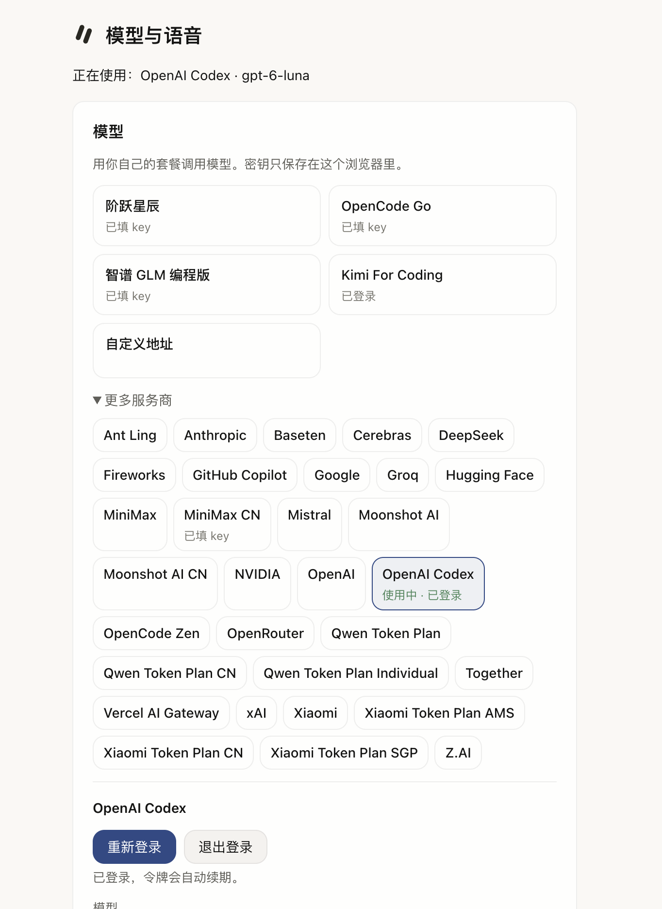

# 设置页「模型与语音」重做：7 版原型（2026-10-06）

这是设计参考，不是产品代码。用户把选择交给实现的代理（Claude Code）。交接说明写在 [#62](https://github.com/yishu-ziyu/By-Your-Side/issues/62)。

## 内容

| 文件夹 | 版本 | 推荐 | 单文件原型 |
| --- | --- | --- | --- |
| [abc/](abc/README.md) | A 安静列表、B 左右两栏、C ⌘K 命令面板 | A | [abc/bys-settings-proto.html](abc/bys-settings-proto.html) |
| [defg/](defg/README.md) | D Raycast 分组、E Zed 一页平铺、F Chatbox 只列在用的、G Cline 细线列表 | D，备选 F | [defg/bys-settings-refs.html](defg/bys-settings-refs.html) |
| [refs/](refs/README.md) | 8 个参考：repo@commit、文件路径、真实界面截图 | — | — |

两个 html 都是单文件，下载后双击就能打开。不联网，不写存储，刷新就还原。

## 基于的 BYS 源码

main `a0169d8`。这几个文件到 main `eb4aeed` 都没改：

- `extension/src/settings/main.ts`：页面结构、全部文案、凭据状态。
- `extension/src/settings/settings.css`：现在的布局，宽 560px。
- `extension/src/inproc/model-runtime.ts`：`providerChoices()` 导出 35 家，加上「自定义地址」共 36 项。
- `extension/src/sidepanel/styles.css`：颜色、圆角、间距、动效 token。到 `eb4aeed` 只删了任务条的 `.tb-site`，与设置页无关。
- `shared/voice.ts`：音色、人设。

## 没放进来的文件

- 与 main 逐字相同的文件（token、settings.css、brand-mark.svg）。重建前用 `git show` 取出，命令写在 [abc/README.md](abc/README.md) 和 [defg/README.md](defg/README.md)。
- 开源项目的源码原文和整仓 clone。只给 repo@commit 和路径，见 [refs/README.md](refs/README.md)。
- Raycast 的整页大图（每张约 2.7 MB）。只留裁剪版。
