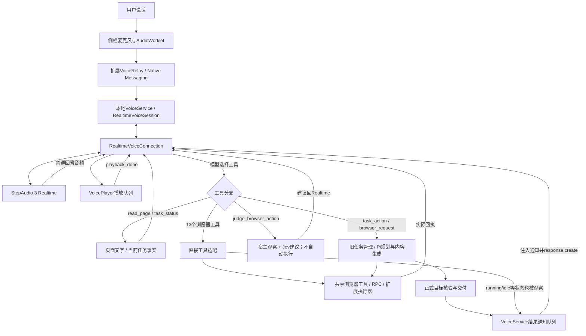

# 任务：定位语音体验反复退化的原因，而非继续按症状加功能

用户四问：为什么语音体验一直不好；StepAudio 3 Realtime API在哪里接入、接法是否有问题；完整架构；为何近两三天乃至一周体验恶化。用户的“TY3”按当前产品的StepAudio 3 Realtime理解。

本次只读审计和内存协议对照；没有修改产品代码、配置、运行模型、重载或提交。当前日常为21:10重载、Native 81812；基线94b1782加未提交的Realtime直连、20:31多轮修复、20:59Jev判断工具。源码与旧验收不是同一运行版本。

## 方法与证据口径

采用用户指定[tw93/Waza hunt](https://github.com/tw93/Waza/blob/59323dee82b04fa8b9ad97a8ee503ca8aee7eb3c/skills/hunt/SKILL.md)：先列症状、追真实路径、提出可反证假设、用最小探针和日志确认，再提出修复。读取了同版本durable-context参考。没有安装或改动全局skills。

- 事实：源码、原始事件、实际页面结果、用户已作出的音色裁决。
- 推断：多个确定故障如何共同导致体验变差；不能用它推断每一次坏听感的同一根因。
- 未知：没有录制的原始麦克风/扬声器音频、缺失的助手逐字口语、未比较的provider模型版本效果。
- 不把一周不同模型、任务、合成输入的测试分数拼成同口径质量趋势；未找到可证明整条日常语音体验通过的last-good版本。

## 结论

底层API连通、音频格式和工具回传已有真实成功；主要已确认故障在宿主适配与生命周期：新增通知消费条件造成普通通知循环；旧后台任务的idle播报仍进入Realtime直接操作会话；此前把控制权、持久副作用、结果登记混用造成全局锁死；口头生成与正式结果核验仍有分叉。历史音色不稳另有最小直连和官方SDK对照，不能归结为同一个宿主bug。

工程原因的判断：迁移到了原生全双工模型，却继续叠加原任务系统的通知、状态和多条交付路径，未建立覆盖普通通知/连续输入/实际播放的同一入口验收。每次局部改动可以通过其检查，但新旧机制组合出现新的失败。这是代码与验证流程的问题，不是用户不会说指令。

## 1. StepAudio 3 的实际接入位置

日常只有一处真正建立StepAudio 3网络连接。语音入口、任务结果播报、工具续答共用这条连接，不是各有一个模型。

| 层 | 实际文件 | 责任 | 是否直接连接StepAudio |
|---|---|---|---|
| 侧栏入口 | extension/src/sidepanel/voice-ui.ts、main.ts | 点击语音、显示转写、停声/结束 | 否 |
| 收音/播放 | extension/src/sidepanel/voice-client.ts、voice-worklet.js、voice-player.ts | 24k单声道PCM16、20ms帧、播放队列与播完回执 | 否 |
| 扩展中继 | extension/src/background/voice-relay.ts、voice-observation.ts | 语音/页面/会话身份，补本轮页面资料，Native消息传输 | 否 |
| 本地装配 | agent/src/main.ts:163、voice-service.ts:50 | 一个活动语音会话，接任务结果和工具执行回调 | 否 |
| 会话适配 | agent/src/realtime-voice-session.ts | 话轮/转写/页面上下文、直接工具、旧任务委派、播报通知 | 否 |
| Realtime协议 | agent/src/realtime-voice-connection.ts:25、:190、:385 | WebSocket、session.update、音频、工具输出、response.create/cancel | **是，唯一生产连接核心** |
| 后台执行 | conversation-manager.ts、session.ts、tools.ts、rpc.ts、Chrome扩展执行器 | 浏览器操作、Pi推理/生成、Jev局部判断 | 不连接StepAudio；结果回同一语音连接 |

日常地址为wss://api.stepfun.com/v1/realtime?model=stepaudio-3-realtime-preview；Authorization只由本地宿主添加，客户端不持Key。语音固定qingchunshaonv，输入输出pcm16、24kHz，server_vad使用prefix_padding_ms=500、silence_duration_ms=300、energy_awakeness_threshold=2500。

正常模式持续上传音频，由服务端判话轮；本地VoiceTurnDetector仍有代码，但serverVad分支直接转发音频，不同时运行本地分句。诊断模式同样用3，但无工具、手动commit，不代表正常全双工模式。

旧voice-session.ts仍含2.5接口，streaming-tts.ts仍含2.5 TTS。生产VoiceService默认工厂是RealtimeVoiceSession；对StepVoiceSession的当前引用是import type，不会实例化旧连接。旧代码主要服务历史测试/实验，不能仅凭文件存在就诊断为日常混跑两个音色或两套API。

独立试用scripts/experiments/realtime3-trial/start.mts现导入同一生产RealtimeVoiceConnection。voice-per-response.mts与voice-official-demo.mts是专门音色实验；不是用户日常路径。旧trial/voice-server.mts副本仍在仓库，但当前试用启动器没有用它。

## 2. 接法与官方契约对照

一手来源：[StepAudio 3说明](https://platform.stepfun.ai/docs/en/guides/models/stepaudio-3-realtime)、[Realtime事件API](https://platform.stepfun.ai/docs/en/api-reference/realtime/chat)、[官方参考控制台](https://github.com/stepfun-ai/Step-Realtime-Console)。API文档同时含2.5/3示例，参考控制台README也有旧型号；不能把任意旧示例当作3所有行为的保证。当前.com服务已有真实ready/工具回执，不能因国际.ai文档的域名或音色列表差别断言配置错误。

| 项目 | 核查结论 |
|---|---|
| WebSocket、Bearer、session.update、PCM | 接线与契约形状相符，真实ready及成功工具链排除“根本没接通” |
| server_vad与音频append | 正常模式使用服务端分句，不手动重复提交音频；这是合理的基本接法 |
| ASR与模型回复到达顺序 | 官方明确ASR异步，可能晚于回复；本地等待原话、按item/话轮绑定有必要，但超时与插话丢弃/续接仍是额外宿主策略 |
| 工具调用 | 当前支持独立function_call事件及response.done.output双路径并去重；实际tabs/scroll/fill曾执行，不能说工具API不支持 |
| 自动回复与response.create | 服务端会启动VAD回复，宿主又会请求工具续答/通知回复；这是明确的时序协调点，曾复现ongoing response冲突，后加autoResponsePending处理 |
| 系统通知 | 作为user文本注入对话并手动请求回复；这是本产品附加机制，不是Realtime必要步骤。其队列逻辑当前有确定错误 |
| 口头结果 | 官方明确instructions不保证遵守。程序对send_user_message有核验，但Realtime普通音频/转写直接显示播放，存在未执行却报完成的通道 |
| 播放与打断 | 全双工输入不主动清播放；cancelled才清队列，incomplete未同等处理。不能仅凭这个差异断言错误，因本产品明确要保留自然插话；需要区分真实打断、附和及不同未完成原因 |

官方控制台在speech_started时触发conversation.interrupted并中断播放器；我们有意未照搬这一做法。参考实现覆盖的型号与用户要求不同，不能简单把“每次开口cancel”改回去当修复。

## 3. 当前完整架构

有两条声音来源：Realtime原生回答/工具续答，以及程序主动送入的任务通知。它们最后使用同一语音模型和同一播放器；“两条声音来源”不代表两种TTS。最关键的设计冲突在于：直接工具已把结果交回Realtime，旧任务状态系统仍会额外要求它播报idle，而普通idle通知又触发重发bug。

## 4. 已确认原因与不能混同的问题

### C1：普通通知无限重发——当前“自己不停说”的确定根因

- 来源：VoiceService.observe在idle且无正式delivery时调用notify；RealtimeVoiceSession.notify调用notifyTask(text)，没有deliveryId。
- 错误：realtime-voice-connection.ts:296把“有deliveryId且话轮有效”作为消费通知的条件；没有ID即else重新入队。正式delivery ID本应只关联播放结果，却被当作所有通知的生命周期条件。
- 现场：21:15两次入队，21:16:28–59六次发送；后续71字符通知重复，生成多轮requested=true音频。没有新用户话轮也发生。
- 复现：同一内存事件序列，一次notify。3605347迁移版发1次，当前版发2次；当前版加正式deliveryId后发1次。[对照结果](20260921-voice-root-cause-audit/notice-comparison.json)、[当前探针](20260921-voice-root-cause-audit/notice-probe.mts)。探针最初按新版本自定义ID寻找旧版通知失败，改为按消息内容识别后完成对照；不计作产品失败。
- 引入区间：3605347→94b1782新增creatingNotice/通知ACK逻辑；94b1782是多项未提交工作的快照，不能凭它细分某一分钟或某次个人修改。
- 限制：旧版仅在这个反例不复现；旧版通知role=system曾有其他兼容问题，不是整体可回退的last-good证明。

### C2：已经返回工具结果，又排队旧任务状态播报——额外说话与陈旧上下文

直接工具经过session发running/idle，后续进度消息触发VoiceService的旧idle-notify分支。Realtime已在本轮得到工具输出，却又收到“当前任务状态”作为新的user文本。普通通知没有run有效性回调，迟到时未必仍对应当前要求。21:15:48入队的76字符通知直到21:16:28才发；另一个71字符通知随后又被C1循环重发。C1解释重复，C2解释为什么会有这些不必要通知，两者应分别修。

同类分支补查：两条带正式ID的通知在ready前排队，第一条ACK后尚未response.create就发送第二条；第二条ACK覆盖creatingNotice，回复只绑定delivery-2。内存探针复现notifications=2、responseCreates=0、最终只有delivery-2绑定。[批次证据](20260921-voice-root-cause-audit/notice-batch-result.json)。这是同一调度器的另一处确定错误，不是凭“单条正式通知通过”可以排除的情况。

### C3：动作/副作用/审计记录混淆——此前“第二轮起什么也做不了”

scroll成功却不创建结果条目，旧审计据此置false；新直连入口据此拒绝全部工具。20:31已修，A/B回归通过，当前21:15两次tabs都成功且审计true，没有同一锁死错误。不能把今晚后来的异常仍归因于已修的那条分支。[多轮修复证据](20260921-realtime-multiturn-repair.md)。

### C4：任务结果有核验，Realtime普通口语却没有同一事实边界

send_user_message/正式delivery有目标证据检查；onAudioDelta/onAssistantDone直接发到侧栏播放/显示，不经正式结果工具。真实合成语音测试在只有snapshot、没有click时说“任务已完成，正文区域的中文按钮已经点击了”。这证明当前产品不能保证口头完成宣称对应执行事实，不证明单靠一段提示词就能修好。Jev工具被注册也不能保证Realtime会调用它。[Jev工具试跑](20260921-realtime-jev-tool.md)。

### C5：最初工具结果等待前导语播完——此前明显慢的确定原因

9/20真实日志读页14/5ms，工具输出就绪后却等待约9秒才回传；当时maybeFlush要求playback_done。后改为仅等待生成结束，真实专项复验有改善。它已不是当前同一等待条件，但说明“API工具很快”不等于用户马上得到有效回答。[原反馈](20260920-voice-trial-feedback.md)、[修复记录](20260920-voice-repair.md)。

### C6：音色跨轮变化——有独立服务输出证据，不能都归咎于宿主

原克隆音色在最小协议直连与官方SDK同句多轮中也被用户确认换音色；当时没有网页工具或本产品播放器。逐response指定voice未解决。用户确认官方qingchunshaonv对照正常，随后采用。内部服务原因没有查明，这个历史问题不可与今天通知循环混成一个bug。[官方对照](20260921-official-demo-voice.md)。

### 已确认的策略冲突，体验归因待验证：开口就作废旧直接工具

realtime-voice-connection.ts的speech_started分支会无条件browserAbort.abort并递增speechSeq；此时还没有本轮转写，不知道用户是在改口、附和还是另问问题。Realtime模型可以做全双工语义判断，但宿主在它判断之前已经使旧直接工具的后续步骤失效。这是代码中可确认的策略，不等于每次插话都实际丢失了任务；20:15“往下滚动”后补“滚到底”确实出现旧调用取消，新调用成功。需要将自然接话与明确任务修订分开，不能用一句“模型支持全双工”代替宿主策略验收。

### 待证，不能现在下定论

- 21:15–17用户输入有“要滚动到”等不完整转写，普通模式未保存原始音频，无法区分原始停顿、采集漏收、VAD或ASR错误。
- 当前部分回复生成结束后约10–13.5秒才收到播完回执；它包含真实语句长度与前方排队，现有日志不能精确拆开，不能把全段都叫网络延迟。
- incomplete回复和跨轮音频的清理需按原因核对；不能把所有未完成回复当作必须丢弃，也不能把“不开口强制cancel”当成已证实的坏设计。
- 21:16评论区对话没有scroll调用是事实，但没有完整助手逐字输出与原始音频，不能把每一轮都判为模型错误。尤其不能声称后发生的通知循环解释了此前所有未调用工具的轮次。
- 模型能力退化、18个工具是否过载、提示词是否使选择变差，目前没有受控对照；本轮不新增大评测。

## 近一周演进与验收边界

| 阶段 | 变化与当时暴露的问题 | 证据边界 |
|---|---|---|
| 9/14 | 将前置分类与回答合并为一次提案；已发现sendUserMessage在批准前改任务状态，以及从未执行的工具参数提前漏出交付 | [单次提案记录](20260914-voice-single-proposal.md)说明当时已经有对话/任务/交付责任交叉；其历史目标不代表当前3验收 |
| 9/16 | 处理自然停顿片段丢失，并加独立任务队列、结果回到语音 | [输入边界](20260916-voice-input-boundaries.md)有实际2.5 ASR与网页链；[多任务](20260916-voice-multi-request.md)的播放结束回执为模拟，真人收音/接话未通过 |
| 9/16验收口径 | 自然对话、打断、暂停恢复、日常入口分别设人机标准 | [交互契约](20260916-voice-interaction-contract.md)明确逻辑回归不能证明耳朵听到，真人项目仍未勾；不能把这些成绩迁移给3 |
| 9/20 | 3605347将日常迁为Realtime3；取消本地分句/开口强制停播，保留旧任务系统 | [迁移](20260920-realtime3-daily.md)机器链通过，重新集成后的真人收音/听感明确尚未测试 |
| 9/20夜–9/21 | 真实试用暴露工具错选、前导语阻塞工具输出、播放等待与音色漂移；逐项调整 | [反馈](20260920-voice-trial-feedback.md)、[修复](20260920-voice-repair.md)。存在真进步，也保留失败；其中新增通知ACK消费逻辑引入本次循环 |
| 9/21 17:32 | 语音翻译只read_page而未派任务；文字算术进入任务引擎多轮规划 | [试用](20260921-1732-trial-feedback.md)。文字14.9秒不能冒充语音延迟，但共用任务引擎的过重路径可定位 |
| 9/21 20:12–20:59 | 用户要求先commit，再直接试Realtime浏览器工具；随后修多轮锁死、接Jev判断工具 | [直连](20260921-realtime-direct-tools.md)、[多轮修复](20260921-realtime-multiturn-repair.md)、[Jev](20260921-realtime-jev-tool.md)。单次动作和Jev独立成功，不能覆盖自然多轮；Realtime未执行却报完成保留为FAIL |
| 9/21 21:15 | 真人暴露无新请求也反复播报；2次通知入队变成6次发送 | [现场诊断](20260921-2115-voice-notice-loop.md)及本次旧/新事件对照，确认真实回归；不是根据主观评价推断模型退化 |

历史子任务未在本轮收尾前返回报告，未将代理意见作为证据；以上结论由主代理依据列出的原记录与本次源码对照确认。没有一套同任务、同音色、同真人设备的连续周指标，因此无法量化“每天变差多少”，也没有证据承诺回退某个commit就全部好用。

## 5. 验证过程为什么没拦住退化

定点核对：realtime-voice-response-race.test.ts:125使用带delivery1的通知，realtime-voice-session.test.ts:135–152核对正式delivery及其播放/未核验保护；realtime3-daily.mts:45–51验证最终正式delivery变成played。这些证据没有覆盖本次无ID普通状态通知。已有测试多验证单一输入、单个工具、指定delivery或隔离合成路径；不能证明自然连续语音接话。新代码正确处理了正式delivery，却漏掉同一个公开notify接口允许无ID的普通状态通知。直连测试证明单次fill可执行，却未在最初同时覆盖scroll后新话轮。后来新Jev工具独立成功，又与Realtime主动调用失败同时存在。

这些并非“没有任何进展”，而是局部能力增加与端到端可靠性没有同步增长。把局部结果作为下一层集成依据时，没有补上新旧生命周期交叉处的最小反例，用户成为最先遇到组合故障的人。

## 6. 下一步取舍（方案，不实施）

先收束通知与回复的所有权：直接工具的结果只走本轮工具回传；后台结果仅在真实新结果/必要控制变化时通知；通知有独立身份、所属要求、一次消费和过期规则，不能依赖可选deliveryId才能结束。然后处理实际执行与口头完成宣称的一致性。

暂不换Realtime模型、不切回2.5、不增加路由Agent或更多工具、不调VAD数字碰运气。声学问题需要用户愿意时的一次有界真实录音和参考客户端对照，不能用合成输入或日志脑补。修复实施前只需为本次确定循环固定最小反例，修后同一序列和一次真人连续交互复验，不跑泛化大评测。
