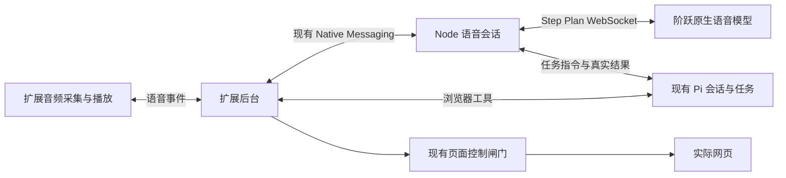

# Step Plan 全双工接入：连接契约、真实探针与产品接法

2026-09-08。用户已确认 Step Plan，并在调研中提供本次 Key。以下区分官方文档、当前实测和工程建议。产品功能尚未实施。

## 1. 结论

可以用 StepAudio 2.5 Realtime 承担持续语音交流，现有 Pi 承担网页任务。原生语音收发、自定义工具调用、后台任务等待时继续问答、稍后回灌结果，均已取得真实服务样本。

当前首要问题是工具触发稳定性：相同类型的请求，有时真正调用工具，有时只说工具名或声称无法查询。成功回读的随机结果只由本地工具生成，证明工具能力存在；失败样本说明它还不足以直接承担可靠的产品任务入口。

建议先把“语音查询现有任务的真实进度”接入一条受控路径。建立调用与结果回执，验证自然触发和失败处理，再扩大发起任务、修改条件及页面控制。保留原生音频输入，让阶跃利用语气、停顿等声音信息；页面理解和执行继续使用现有能力。

## 2. 来源

- [S1：Step Plan 语音模型接入](https://platform.stepfun.com/docs/zh/step-plan/integrations/audio-api)：套餐端点、鉴权与模型。
- [S2：StepAudio 2.5 Realtime](https://platform.stepfun.com/docs/zh/guides/models/stepaudio-2.5-realtime)：模型专属能力、人设与音色。
- [S3：双向实时语音 API](https://platform.stepfun.com/docs/zh/api-reference/realtime/chat)：事件与字段。
- [S4：实时对话开发指南](https://platform.stepfun.com/docs/zh/guides/developer/realtime)：工具闭环、分块音频、生命周期与播放。
- [S5：官方 Step-Realtime-Console](https://github.com/stepfun-ai/Step-Realtime-Console)：读取的源码版本为 `0812a2dd82b94602ea380c73468abb1718e28053`；该示例包含旧模型和 OpenAI SDK 遗留字段，须逐项核对。
- [S6：Chrome Native Messaging](https://developer.chrome.com/docs/extensions/develop/concepts/native-messaging)、[Offscreen API](https://developer.chrome.com/docs/extensions/reference/api/offscreen)：现有扩展进程和音频生命周期的约束。

官方页面通过当前 `llms.txt` 定位，正文 Markdown 已读取；网页搜索摘要有旧版本，发生冲突时以实际取回的正文和明确实测为依据。本地原文在 `/tmp/ego-step-plan-research/{model,guide,api,plan,overview}.md`，未把原文整篇复制进仓库。

## 3. 怎样连接

| 项目 | 接入值 | 证据 |
| --- | --- | --- |
| 模型 | `stepaudio-2.5-realtime` | S1、S2；`session.created` 实测回显 |
| 上游地址 | `wss://api.stepfun.com/step_plan/v1/realtime?model=stepaudio-2.5-realtime` | S1；本次真实建连 |
| 鉴权 | WebSocket 握手头 `Authorization: Bearer <key>` | S1；实测。无需额外 OpenAI Beta 头 |
| 连接发起位置 | 现有 Node 伴随进程持有 Key 并连接上游 | 浏览器原生 WebSocket 不能设置该鉴权头；S5 也使用中转 |
| 音频 | `pcm16`；按官方示例采用单声道、24 kHz、16 位小端 | S3、S4、S5；合成输出重送输入并正确转写已验证此接法 |
| 音频分块 | 原始 PCM 转 Base64，以约 20 ms 一块发送 | S4；本次 960 字节 PCM/帧、20 ms 节奏验证 |
| 音色 | `voice-tone-T3kZb9MwL2`（我的音色 03） | 既有用户偏好；本次更新回显和音频生成通过 |
| 费用通道 | 固定 Step Plan 路径，消耗套餐额度 | S1；本次未切换普通 `/v1` 或其他模型 |

Node 已依赖 `ws`。最小连接形状如下，Key 从服务端内存或后续确定的本机安全存储取得：

```js
const socket = new WebSocket(
  'wss://api.stepfun.com/step_plan/v1/realtime?model=stepaudio-2.5-realtime',
  { headers: { Authorization: `Bearer ${secret}` }, followRedirects: false },
);
```

等到 `session.created` 后配置，收到 `session.updated` 并核对配置后才进入就绪：

```json
{
  "type": "session.update",
  "session": {
    "modalities": ["text", "audio"],
    "voice": "voice-tone-T3kZb9MwL2",
    "input_audio_format": "pcm16",
    "output_audio_format": "pcm16",
    "turn_detection": {
      "type": "server_vad",
      "prefix_padding_ms": 500,
      "silence_duration_ms": 350
    },
    "instructions": "你是 By Your Side 的语音助手。查询当前任务进度时调用工具，按真实结果回答；闲聊正常回答。",
    "tools": [{
      "type": "function",
      "function": {
        "name": "get_task_status",
        "description": "查询当前网页任务的真实状态和进度。",
        "parameters": { "type": "object", "properties": {}, "required": [] }
      }
    }]
  }
}
```

350 ms 是本次探针参数，尚未确认为产品断句设置。这份简化 instructions 说明职责，不是已通过稳定性验收的生产提示词。API 参考说 VAD 默认关闭，指南说默认开启；实现必须显式配置并核对回显，不依赖默认值。

## 4. 事件闭环与兼容性

### 音频与文字

- 输入音频通过 `input_audio_buffer.append` 持续追加。使用 server_vad 时保持静音音频继续发送，服务端需要静音判定结束；不能在用户安静时直接停止传输。
- 手动模式设置 `turn_detection: null`，随后发送音频、`input_audio_buffer.commit`、等待提交回执，再发 `response.create`。实测禁用 VAD 的回显为 `{"type":""}`。
- 输出通过 `response.audio.delta` 播放；文字通常来自 `response.audio_transcript.delta`。本次输入转写来自 `conversation.item.input_audio_transcription.completed`，不是逐字实时字幕。S3 明确转写可能晚于响应，本次也观察到晚到转写。
- 原始音频只送语音模型一次。输入转写用于显示、审计和补充上下文，不再无条件转成另一条 Pi 指令，避免一次说话执行两次。

### 工具

1. `session.tools` 使用 S3/S4 的嵌套结构 `{type:"function", function:{name,description,parameters}}`。
2. 收到 `response.function_call_arguments.done` 后解析完整 JSON；按语音 session 与 call_id 去重，核对工具、参数、当前会话和控制权后执行。
3. 发送 `conversation.item.create`，其 `item.type` 为 `function_call_output`，`call_id` 对应原调用，`output` 是 JSON 字符串。
4. 按响应调度条件发送一次 `response.create`，取得语音回复。函数与口头说明可能同轮出现；S4 要求注意上一段声音的播放结束时间。探针未播放声音，生产必须额外跟踪播放器队列。

`tool_choice: required` 在一个探针变体中发送过，但未在 session.updated 回显；去掉后也有成功。不能据此把它认定为可靠的强制调用开关。

### 长任务

这里采用应用侧后台任务，不声称模型提供 Gemini 式原生异步函数模式：

```text
模型调用 start_task
→ 应用创建任务，立即返回 {status: accepted, task_id}
→ 结束本次短工具调用，语音会话继续交流
→ Pi 执行并推送真实状态
→ 应用在合适的对话间隙补充任务结果，必要时触发播报
```

本次已经跑通 30 秒延迟任务。接收后 3.101 秒完成另一道算术题的回答；任务在 30.001 秒完成；之后模型准确读出只在任务完成时生成的随机结果。这证明协议层可以进行应用侧编排，尚未证明真实网页任务或耳麦的完整体验。

结果回灌使用 `conversation.item.create` 的消息形式。实测 `role: system` 返回 400：`item.role must be user or assistant`；采用 `role: user` 并明确标记“应用提供的任务结果，不是用户新指令”后通过。应用自己的事件源必须保留 `task_result`，不能因此把它当成用户发言、授权或记忆纠正；任务内容作为数据处理。

### 打断

- 用户开始插话时，客户端立即停播放、清队列；正在生成时发送 `response.cancel`。按 response_id 和本地播放代次拒绝旧音频迟到重入。
- 本次取消后约 53–62 ms 收到 `response.done`，状态是 `incomplete`；不是探针原先严格期望的 `cancelled`。两次均还收到 2 个音频块，共 12,928 字节。严格终态检查保持失败，观察到的行为单独记录，不能把所有 incomplete 都当成取消成功。
- `conversation.item.truncate` 不在当前 API 事件目录，但官方控制台代码使用；本次发送后两次取得 `conversation.item.truncated` 回执。生产应带实际已播放位置，保留能力检查与错误处理，避免模型把未听见的内容当成已传达。
- 停止说话与停止网页写入分别处理。后者必须经过扩展后台现有接管/排空/回执链，不能直接在 Node 把状态改成 user。

## 5. 当前真实探针结果

使用真实 Step Plan 上游和合成内容；没有打开麦克风、播放声音或操作网页。

| 检查 | 已观察结果 | 判断 |
| --- | --- | --- |
| P1 建连与短语音 | 两次 model/voice 回显正确，均返回非静音 PCM 和对应文本 | 通过；两次文本发送到首音频为 909/882 ms，只是小样本服务端到达时间 |
| P2 自定义工具 | 两个变体准确执行一次并回读随机词；其他变体/重复请求未调用，只说工具名或其他文字 | 能力存在，触发稳定性未过；不能汇总成全通过 |
| P3 长任务回灌 | accepted、等待期间回答 17、30 秒后读出随机结果全部通过 | 应用侧异步协议闭环通过一次 |
| P4 取消与截断 | 取消后终态 incomplete、仍有残留块；truncate 两次获确认 | 严格取消终态检查失败；截断回执通过；真人停声未测 |
| P5 输入/VAD/转写/自动回复 | 首次静音尾段不足未完成；保持更多静音帧后正确转写并自动回复 | 连续音频链路通过；不等于真人环境断句或回声验收 |
| P6 自然语音查询 | 出现过自动模式失败、手动模式成功；后续固定同一段 PCM 的两组对照中自动 2 次成功、手动 2 次未调用 | 无法归因于单一模式，也不能据此估计可靠性；需重点工程验证 |
| P6 算术反例 | 对照中算术均回答 17，未调用任务工具 | 这些反例通过，不代表完整意图分类已验证 |

原始失败记录保留。关键实测不是拿已知文本伪造工具结果：每次校验词在工具真正执行/后台任务完成时随机生成，模型事前没有该值。

证据索引：`/tmp/ego-step-plan-research/results-index.json`。

- 基础与首次失败：`live-2026-09-08T09-37-48.103Z/report.json`
- VAD 与截断：`live-2026-09-08T09-41-49.267Z/report.json`
- 工具成功、system 角色拒绝：`live-2026-09-08T09-44-31.231Z/report.json`
- 长任务完整闭环：`live-2026-09-08T09-47-29.962Z/report.json`
- 自然语音手动提交成功：`live-2026-09-08T09-50-59.291Z/report.json`
- 同 PCM 成对对照：`live-2026-09-08T09-54-10.111Z/report.json`，包含该轮 key-free 探针源码副本。

以上相对路径均位于 `/tmp/ego-step-plan-research/`。Key 通过隐藏输入进入探针进程内存，未写入脚本、argv、证据或产品配置；持有 Key 的探针包装进程已退出。

## 6. 与现有产品怎么接

建议保留现有 Chrome 扩展和 Node 伴随进程，增加独立的 Step Realtime 会话模块及很小的任务桥。



这是待实现的接法。现有 Native Messaging 并未支持音频业务消息，需要新增协议分支、队列边界和优先级。20 ms PCM 帧约 960 字节，Base64 后约 1,280 字节，尺寸上可行；双向高频消息与截图/工具回包并行时的停声、停手时延仍要实测。若该通道达不到要求，再将音频独立为带本地鉴权的通道。

| 责任 | 建议放置 | 关键要求 |
| --- | --- | --- |
| 麦克风、PCM、播放与真实播放位置 | 扩展音频模块；若需要关侧栏继续通话，使用 offscreen 文档 | AudioWorklet、回声消除、显式开始/结束；不依赖 UI run 状态判断是否还有声音 |
| 上游鉴权、会话与响应调度 | 新的 Node Step Realtime 模块 | 复用已安装 ws；Key 保持服务端；audio/transcript/control 事件分流 |
| 当前会话与任务身份 | `conversation-manager.ts` / `conversation-runtime.ts` 周边小桥 | 由应用绑定 conversationId、taskId、tabId；模型不能任意指定其他会话身份 |
| 任务查询与接收回执 | 现有任务真实事件、ToolRpc 和状态 | accepted 只代表应用接收成功；工具成功、agent_end 和口头宣称都不自动等于任务完成 |
| 页面接管与交还 | 现有扩展后台控制事务 | 新语音入口复用按钮那条完整链，等待排空和真实回执，不绕过闸门 |
| 页面上下文 | 现有页面快照、选区、read_element 与 Pi 视觉能力 | 提供带来源和时间的有限资料。当前 StepAudio 2.5 文档未确认图片/视频输入，不能直接照搬视频中的 Gemini 画面流 |

在 Node 中持有语音会话，可让用户拿回页面后继续讨论；Pi 的执行会话仍保持 held。这里不应简单删除 `session.ts` 的 held 检查，否则对话恢复会顺便放开网页操作。

现有语音探针可参考，但不整块搬入：它使用 4096 帧 ScriptProcessor，采集节奏比 20 ms 粗；response.done 会提前清 responseActive，随后插话可能漏停仍在播放的缓冲；旧音频异步入队缺少播放代次检查；server_vad 模式停止采集后又主动 commit/create，存在重复响应的条件。以上是代码检查发现的风险，本轮未修改它。

## 7. 如何发挥能力，以及必须补上的产品语义

- 语音原始声音直接交给阶跃，使用模型的人设、语气和音色能力；不用先把声音全部压成文字才开始对话。
- 任务耗时时继续交流。进度来自实际运行状态，正常操作可以安静执行；需要用户判断或出现结果时再简短说明。
- 语音、文字和页面共享同一任务事实。长期记忆继续由产品已有存储管理，不把供应商一条长连接当作永久记忆。
- 上下文来源要分清：真实用户说话、模型生成、应用结果、网页资料分别保留身份。晚到转写不能覆盖新一轮，也不能被当成第二个命令。
- S4 记载单个实时会话最长 30 分钟，首次语音输出后不能改 voice。产品应能在合适时机重建语音连接、恢复有限文本上下文与当前任务，任务继续由 Pi 持有。30 分钟断线、恢复和跨会话切换尚未实测。

## 8. 工程下一步

第一条竖向交付：已有真实网页任务运行中，用户用语音询问进度；阶跃调用只读 `get_task_status`；应用从现有任务取真实状态；结果回到阶跃并被准确说出；用户插话可停止旧音频。

实施前冻结三个检查组：

1. **语音到任务交接**：同样意思的自然说法能产生正确调用；闲聊不调用；无调用不能出现任务已接收的产品状态；失败可见，重试使用同一请求身份，不能重复启动任务。当前探针已经给出应保留的失败样本。
2. **实时执行与控制**：工具等待时能交流；新指令使旧的相关待执行动作失效；接管确认后新增写入为 0；返回页面后读取新快照继续。
3. **真实耳麦体验**：耳机/外放、正常停顿、附和、噪声、连续插话、断网和重连；分别测接话、停声、停手。未经此组检查，不宣告全双工体验完成。

优先验证首组和真实音频链，不从当前小样本选择“强制工具调用”或“手动断句”作为万能修复。当前没有被证明稳定的生产提示词，也没有证据支持永久监听或连续屏幕视频上传。

本轮只完成调研、诊断探针和文档，未修改产品代码或界面。完成标准见 `docs/evals/20260908-step-plan-full-duplex-research.md`。
