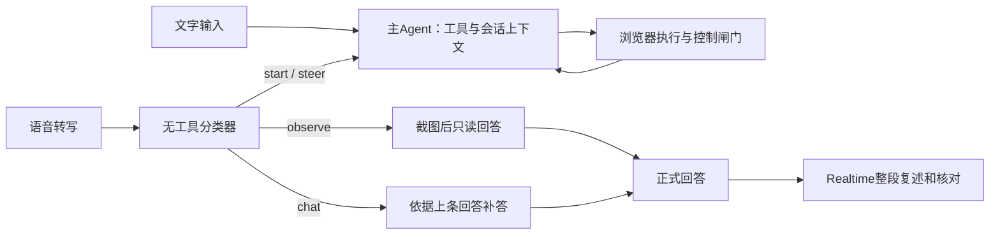
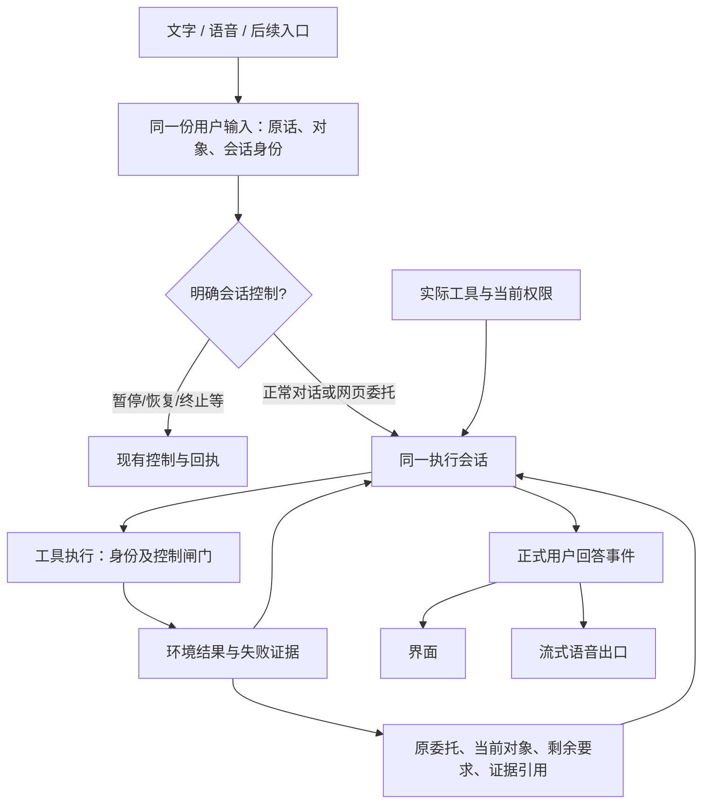

# By Your Side：Harness 调研与架构取舍

2026-09-09。状态：研究与修复标准，不是已实现架构。主代理独立调查。用户此前否决真实体验，要求每步修改后亲自检查；此约束继续有效。

## 结论

建议保留 Pi 和现有浏览器执行、控制、回执设施，优先收拢语音旁路：**文字与语音应进入同一个掌握能力、上下文和任务进展的执行会话。** 模型选择怎么完成请求；Harness 负责提供准确能力、保留原始委托与证据、执行权限约束、检查交付和记录可诊断事件。

这里研究的是“Pi如何适配By Your Side”，不是选择替代Pi的框架。此前把“换框架”作为选项并无具体迁移对象或比较证据，用户指出后已撤回。

不要把“好的 Harness”理解成更多分类器、更多提示词或更多 Agent。也不要把统一理解成把所有输入强制改成 start：聊天、正在运行的任务、暂停状态仍须有正确生命周期。统一的是能力和任务上下文，以及执行入口。

这可以从结构上解决本轮四个问题，比为“圈出来”添加特判更能支持后续能力。语音播放延迟属于交付出口的另一处缺陷；核心 Harness 应给流式出口留好接口，但不能等全部架构改完才解决开口等待。

## 1. 研究范围与证据等级

关注用户实际操作：看页面→找到对象→执行动作→纠正→继续→停止；以及未来增加工具时是否需要修改多处语音规则。

- 已观察：当前源码、依赖Pi 0.84.4、真实后台日志、三条生产M3分类探测。
- 外部依据：官方工程文章、当前官方文档、Pi开源文档。它们说明设计方法，不证明我们项目性能。
- 推断：下述推荐架构能减少能力分裂与错误放大，需要按冻结标准做本地实验。
- 未验证：统一路径的实际延迟、不同模型的工具选择质量、当前音色与流式TTS兼容性。
- 不作依据：框架宣传性能、未经本机验证的成功率、Grok非官方重建仓库的线上效果。

本仓库的开发 Harness（AGENTS、评估器、代码验收）与产品运行 Harness（用户输入、工具、状态、交付）是两件事。本轮两者都出了问题：前者的评估漏了真实任务，后者把任务送进了无工具旁路。

## 2. 一手资料中对我们有用的结论

| 一手来源 | 可采用的原则 | 在本项目的含义 | 不照搬的部分 |
|---|---|---|---|
| [Anthropic：Building effective agents](https://www.anthropic.com/engineering/building-effective-agents)，2024-12-19 | 固定工作流适合可清楚分解的任务；路由需要类别明确且分类可靠；开放任务依靠工具反馈循环 | “观察并标注”横跨类别，不能一次分类后永久剥夺工具；普通网页委托由工具循环解决 | 不因此删除暂停、身份、权限等确定性边界 |
| [Anthropic：Writing tools for agents](https://www.anthropic.com/engineering/writing-tools-for-agents)，2025-09-11 | 工具是给模型使用的接口；明确用途/参数/结果；用真实多步任务评估，避免以表面格式差异否决正确结果 | 注册工具时同时提供能力描述、效果类型与结果证据；不能只测“回复有关键词” | 不把所有工具包装成更大的万能工具；不要求唯一工具顺序 |
| [Anthropic：Effective context engineering](https://www.anthropic.com/engineering/effective-context-engineering-for-ai-agents)，2025-09-29 | 上下文要筛选，结构化记录可以保持进展与依赖 | 保存原委托、当前对象、未完成要求与证据引用；对话历史和任务状态分别投影 | 不新建第二套长期记忆产品；不把一切历史灌进每次分类 |
| [Anthropic：Effective harnesses for long-running agents](https://www.anthropic.com/engineering/effective-harnesses-for-long-running-agents)，2025-11-26 | 明确可检查的用户结果，增量推进，靠环境验证避免过早报完成 | “找到”与“圈画”是不同结果；说完话或工具返回都不自动证明整项完成 | 不把编码场景的200项任务表搬进一次简短浏览器对话 |
| [Anthropic：Scaling Managed Agents](https://www.anthropic.com/engineering/managed-agents)，2026-04-08 | 会话事件、推理循环、执行环境分离；会话记录不等于模型当前上下文 | 保持会话/运行身份及可追溯事件，工具执行器可扩展，模型侧上下文可按需构建 | 不迁移到托管服务、不引入分布式基础设施；文章中的延迟收益不适用于我们 |
| [Pi agent runtime](https://github.com/earendil-works/pi/tree/main/packages/agent)；本机[SDK](../../node_modules/@earendil-works/pi-coding-agent/docs/sdk.md) | 已支持工具循环、事件、steer/followUp与上下文转换；已安装SDK还支持扩展钩子 | 复用现有底座即可，先修产品接线和上下文，而非替换SDK | 不能把Agent的steer当作立即停止浏览器写入；停止仍由现有执行闸门负责 |
| [LangChain：Deep Agents context engineering](https://docs.langchain.com/oss/javascript/deepagents/context-engineering) | 工具元数据与相关用法说明共同提供给模型，能力组件可带自己的提示 | 能力声明与实际注册保持同源，新工具不需要语音专属能力清单 | 不因为文档包含规划/子代理/文件系统就全引入 |
| [OpenAI：Harness engineering](https://openai.com/index/harness-engineering/)，2026-02-11 | 环境应可观察；关键架构约束用机械检查执行 | 能力注册一致性、证据来源和身份约束写成契约检查 | 这是开发环境经验，不是直接可替换我们的产品运行时 |
| [Anthropic：Demystifying evals](https://www.anthropic.com/engineering/demystifying-evals-for-ai-agents)，2026-01-09 | 区分运行Harness与评估Harness；观察最终环境状态；结合代码与人工评分，多次试验保留失败 | 圈画以页面标记和目标一致性判定；语音以首播放时间和听感判定；不能靠一次绿色或回复字符串 | 不默认在每个用户请求里增加独立评审模型 |

这些来源对方法有共识，但没有哪篇能给出浏览器实时语音产品的现成最优结构。Deep Agents和Managed Agents在此仅作接口设计参考，不是经过评估的迁移候选。下面是对本仓库的工程判断。

## 3. 当前结构为什么会限制能力上限

### 3.1 能力不一致

主Agent由`conversation-runtime.ts`注册browser/fleet工具，`session.ts`使用主system prompt。语音分类、观察回答和补答分别调用独立`completeSimple`，没有同一套工具描述。`mark`已在`tools.ts`和主prompt中存在，却不在作出observe/chat判断的能力视图中。

直接后果：每增加一种操作，都可能需要在语音分类、观察回答和补答提示中再教一次。工具扩展没有沿同一条入口传递。

### 3.2 错误路由成为终局

`executeVoiceInput`在observe和chat分支直接return。观察返回类型只有文字，没有“原请求还欠动作”的交接结果。模型没有获得主执行器工具，也不能在发现需求超出观察后继续完成。

生产分类探测使用当前M3，单次结果如下（重建输入，不是原始录音重放）：

| 输入 | 实际结果 |
|---|---|
| 在当前页面找到临时模型ID，然后圈出来。 | observe |
| 上条错误拒绝后：你可以圈出来的。 | chat |
| 不是让你解释，我是让你把它圈出来。 | steer |

证据：`/tmp/ego-mark-routing-probe-20260909.json`。最后一种也不是完整恢复：探测状态为none，而生产steer要求当前运行任务，否则会拒绝。因此不能只把chat改为steer。

### 3.3 说过的话被提升为事实

`answerSourcedChat`在没有latestResult时用latestDelivery.text作为facts。对话里“我不能圈”不是工具注册信息，也不是实际失败回执，却可能成为下一轮补答的事实依据。保留对话本身没错，错误在于改变了它的证据等级。

### 3.4 剩余要求没有可靠归属

observe只记录recentTurns和reply，没有建立对应任务目标；VoicePlanStore记录的是调度计划，不是“找对象、标注对象”这类任务结果。UserDeliveryLedger记录的是交付与播放，不是用户目标是否达成。

所以“已经回答了”容易替代“已经做完了”。未完成动作既没有被显式保留，也没有明确的取消/纠正归属。

## 4. 值得保留的现有设施

| 已有部分 | 当前价值 | 改进边界 |
|---|---|---|
| Pi AgentSession / BrowserAgentSession | 工具循环、原生会话、流式事件、工具间steer | 普通语音内容接入它，不重新实现循环 |
| TaskDispatcher / TaskReceiptStore | request幂等、accepted/applied/unknown等事实、落盘 | 不用新任务状态覆盖它；恢复不自动重做unknown操作 |
| extension执行闸门 / run与epoch | 用户接管、过期写入拒绝、worker范围 | 能力统一不能绕过闸门；mark仍是改变页面的操作 |
| VoiceObservation | 当前页、document身份和一次读取的一致性 | 作为可调用的证据来源保留，不能把一次观察授权升级为任意写权限 |
| Pi session / TaskProgress / VoicePlanStore | 会话恢复与已有投影 | 优先扩展现有事件和派生状态，不建一套平行“第二真相” |
| UserDeliveryLedger / PanelHistory | 正式正文身份、历史去重、播放状态 | 只记录交付；“已显示/已播放”不等于“已执行/已验证” |
| 浏览器原生mark、定位、滚动锚定 | 已实现用户所需圈画 | 复用，不重做覆盖层 |

## 5. 推荐结构：能力同源、统一执行、状态有证据、出口可流式

### A. 能力只有一个权威来源

从实际注册工具生成模型可见能力摘要：用途、输入schema、读/改变页面等效果、当前可用性与限制。暂不做工具市场或大规模发现系统。实际执行仍由当前闸门做最终判定，摘要不是授权。

新增工具可以增加工具定义、执行器和验证器；不能还要求改语音分类器、补答器、播报器。通过契约测试确保暴露给模型的能力确实有执行器，未注册或不可用能力不会被默认启用。

### B. 正常内容不能被“观察/闲聊”分类永久截走

推荐目标是正常语音和文字共享主执行会话。保留必要的会话选择和控制识别，减少“是否有能力执行”的前置裁决。纯只读快捷路径若保留，必须证明没有吞掉操作，并能把不完整请求交回执行器；否则取消这条旁路。

不是把所有输入都映射start。空闲、运行、暂停分别遵守现有调度与Pi队列；运行中的对话不能重开run、取消旧目标或并发操纵同页。首个迁移切片只覆盖空闲会话中的页面委托及后续纠正，验证后再迁移运行中对话。

### C. 上下文分清来源

- 用户原话：用户要求和纠正；可解释意图，但不把已取消的旧话恢复成新授权。
- 能力事实：实际工具与策略提供，助手自述不能改写。
- 页面观察：带页面/文档/时间来源；只说明当时看到了什么。
- 工具回执：动作实际执行、拒绝或结果不明的证据。
- 助手回答：可被纠正的对话记录，不转写成能力或执行事实。
- 任务进展：从上述事件派生，保留目标与剩余结果，不由“发送了一条回复”驱动完成。

不删除错误回答的历史，而是让后续能识别它是错误陈述并纠正。

### D. 保留尚未满足的用户要求

先做有界的本次委托状态，关联现有conversationId/requestId/runId和控制版本。保存原话引用、当前对象、要求的结果、相关工具证据与未完成/受阻/取消状态。简单任务不强制额外规划模型；主Agent在同一循环中登记/更新，宿主校验身份及证据引用。

要承认一个边界：宿主可以保证“已登记结果不能无证据被标为完成”，不能以此保证模型从任意自然语言中永不漏掉要求。原句覆盖要通过真实组合任务和反例评估，不能再用状态字段制造万能完成证明。

### E. 交付与播放不阻塞执行，也不重做推理

保留正式正文的身份，分别记录生成、显示、首音频、首播放、播放结束。播放只消费正式正文，不把观察回答再做一遍推理，不等全文字符相同才播放。模型ID/数字等的合理读法不能被字符相等规则当成失败。

流式TTS可行性已查[Step官方文档](https://platform.stepfun.com/docs/zh/api-reference/audio/ws-audio)，但当前音色和套餐尚未实测。先解决“已有文字仍等整段音频”，再让正式正文边生成边说；两个切片分别交用户听。不能借此播放内部思考或未完成工具参数。

### F. 能解释每个失败发生在哪

沿既有request/run/toolCall/delivery身份记录：输入来源、路由决定、能力版本/可用工具、上下文来源类别、工具调用与回执、结果验证、首正文/音频/播放等。日志不保存密钥或音频；复现所需原话优先引用已有本机会话，受控测试完整记录。原话丢失时报告不可完全重放，不能静默扩大私人日志采集。

## 6. 真实选项与取舍

| 选项 | 能解决什么 | 主要问题 | 判断 |
|---|---|---|---|
| 为圈画补分类示例和提示词 | 可能让已知句子通过 | 新工具继续多处补规则；错误事实和剩余目标仍丢失 | 只作为诊断对照，不作为最终修复 |
| 保留观察/补答旁路，增加能力摘要和需要动作的交回协议 | 改动相对集中，可先恢复部分能力 | 多套上下文/额外模型调用仍在；交回又依赖判断 | 可作短期桥接，必须有退出标准 |
| **保留Pi，统一正常输入执行会话；补能力/证据/目标契约** | 对四层缺陷形成共同修复，新增能力可复用 | 需处理运行中插话、只读范围与低延迟，不宜一次全迁移 | **推荐，按小切片验证** |

没有可用的同类产品可靠基准率，不给成功概率。关键假设：现有主Agent在获得完整请求与工具后可正确完成组合操作；迁移不能明显恶化响应，也不能破坏接管/恢复。下一步实验专门验证这两个假设。

## 7. 分步落地与退出条件

1. **建立评估器和基线**：冻结修复标准；用真实入口保存失败，不用只读工具模拟器证明页面操作成功。
2. **首个可见切片**：统一空闲会话页面委托与后续纠正的交接，使用同源能力和上下文；修复错误助手话被提升为facts。只改足以让该切片成立的部分。主代理独立验证，用户在原页面圈画检查后停下。
3. **完成剩余要求与运行中接续**：完善有证据的任务状态，覆盖对象变化、接管、取消、失败及恢复。用户检查后停下。
4. **交付出口**：先纯TTS及时开口，再正式正文增量；各自测量并让用户听，不串成无人检查的长周期任务。

这不是把四个根因机械拆成四个互不相干的补丁：第2步是可完整验收的纵向切片，带上必需的能力与来源修复；第3步扩大生命周期覆盖。每步检查后才能继续，范围变更重新对齐。

继续条件：真实组合任务与反例通过，扩展测试无需语音特判，身份/控制回归不退化。调整条件：统一路径造成明显响应阻塞时，评估基于同源上下文的受限只读快路。停止条件：只能靠关键词或放松执行闸门才能通过，或原始请求尚未满足却被报完成。核心故障不靠更换模型掩盖。

## 8. 当前交付状态

研究与标准已形成；产品代码未修改；没有宣称四层问题已修复。上一轮886测试和31项检查是旧版本证据，不能覆盖本次失败。独立验证须按新标准重新做。验收标准见[20260909-harness-capability-continuity.md](../evals/20260909-harness-capability-continuity.md)。

## 9. 用户澄清后的具体方向：Pi底座与产品适配层的分工

用户指出：Pi是好框架，真正要研究的是它与产品性质的结合和扩展；不要没有候选与依据地提出“换框架”。本节取代泛化的框架选型表述。

| 产品性质 | Pi 0.84.4已有接口 | By Your Side仍需实现的适配 | 不可错误推断 |
|---|---|---|---|
| 用户持续交谈，执行时可以纠正 | AgentSession.prompt / steer / followUp，消息与工具生命周期事件 | 原话与当前对象进入同一会话；运行中修改在合适工具边界进入；一般聊天不强制新建任务 | steer不是立即停止在途浏览器动作 |
| 用户随时接管真实浏览器 | Pi可abort、可拦截工具事件 | 继续复用extension硬闸门、run/epoch、排空及真实停止回执；暂停不能由语言承诺代替 | tool_call钩子或setActiveTools不能代替执行瞬间的权限检查 |
| 增加工具即可增加产品能力 | customTools/registerTool、getAllTools/getActiveTools/setActiveTools、工具schema与description、promptGuidelines | 当前权限形成模型可见能力快照；产品prompt从实际注册生成用法信息；测试提示与执行器一致 | 我们使用customPrompt；不能假设promptGuidelines会自动进入自定义prompt |
| 记住用户要什么、还差什么 | before_agent_start / context / session_before_compact；appendEntry与session_start恢复 | 对用户要求、页面观察、工具结果、助手话分级投影；保存有界当前任务状态，关联现有回执，不造第二套状态真相 | appendEntry只持久化，默认不进LLM上下文，需要显式投影；记录助手话不是证据升级 |
| 边做边回应、文字语音同源 | message_update/text_delta、tool_execution事件 | 识别可交付正文与内部过程，按交付身份输出增量；语音客户端消费音频；打断清理旧输出 | SDK的流式text_delta不等于所有流都适合直接对用户朗读 |

本机接口证据：[SDK](../../node_modules/@earendil-works/pi-coding-agent/docs/sdk.md)、[扩展文档](../../node_modules/@earendil-works/pi-coding-agent/docs/extensions.md)、[prompt构建实现](../../node_modules/@earendil-works/pi-coding-agent/dist/core/system-prompt.js)。`memory-runtime.ts`已使用before_agent_start，是可参考的现有接线方式。

纯函数探测已确认：当前Pi的buildSystemPrompt在customPrompt分支保留自定义提示，但不自动加入promptGuidelines。该发现不代表工具schema没发给模型；两者是不同输入通道。当前mark本身没有promptGuidelines，此项也不是声称已找出线上圈画失败的新唯一根因，而是说明未来工具扩展必须核对实际适配行为。

因此“统一执行会话”只是第一项结构调整，不能作为完整架构结论。还要设计上述产品语义：何时接受纠正、谁拥有页面、什么内容可信、何时算完成、哪些文字可以开始说。实现应沿现有BrowserAgentSession/ConversationManager与扩展闸门做有边界的适配，不起一个名为Harness的空壳后把旧旁路原样装进去。

## 10. 开源复用核对：先采用已有实现，再写产品差异

用户进一步要求优先调查开源实现；好方案能迁移就迁移，新增代码必须服务整体框架与后续能力。本节记录已读源码后的判断，不以搜索结果或框架名替代评估。

### 已核对的复用候选

| 需求 | 已读源码 | 采用方式 | 必须适配/不采用的部分 | 对未来的收益 |
|---|---|---|---|---|
| 能力注册与动态启用 | [Pi dynamic-tools](https://github.com/earendil-works/pi/blob/main/packages/coding-agent/examples/extensions/dynamic-tools.ts)、本机getAllTools/getActiveTools/setActiveTools | **直接复用已安装Pi API**，不自建工具注册框架；参考示例组织单工具说明 | 自定义prompt的用法说明拼接需我们适配；浏览器实际权限仍由闸门执行；示例TUI命令不用搬 | 新增工具不再新增语音分类/播报特判；后续工具选择也沿同一元数据 |
| 本次任务状态在会话中恢复 | [Pi todo](https://github.com/earendil-works/pi/blob/main/packages/coding-agent/examples/extensions/todo.ts) | **适配迁移恢复机制**：从当前会话分支的toolResult.details重建，沿用session_start/session_tree | 不能照搬toggle即done；必须关联工具证据与目标。不能再另造与现有TaskReceipt/TaskProgress不一致的状态仓库；TUI列表不用搬 | 对象纠正、会话恢复、后续多步任务共享同一进展记录 |
| 工具可见性随模式变化 | [Pi plan-mode](https://github.com/earendil-works/pi/blob/main/packages/coding-agent/examples/extensions/plan-mode/index.ts) | **只复用工具集合切换及上下文钩子机制** | 示例用文本DONE标记判完成、工具名白名单用于编码场景，不适合证明浏览器业务结果；不迁移这两部分 | act/teach或后续产品模式能共享执行层，而不是各写一套Agent |
| 明确区分助手话与工具证据 | [OpenHands Event](https://github.com/OpenHands/software-agent-sdk/blob/7a018907c9b6cac2ee7b205a1b4a5e3e0228e8e4/openhands-sdk/openhands/sdk/event/base.py)、[Observation](https://github.com/OpenHands/software-agent-sdk/blob/7a018907c9b6cac2ee7b205a1b4a5e3e0228e8e4/openhands-sdk/openhands/sdk/event/llm_convertible/observation.py)、[事件说明](https://docs.openhands.dev/sdk/arch/events) | **迁移来源分级的设计**：immutable事件、source独立于LLM role、观察关联tool_call_id/action_id | Python/Pydantic不能直接接入当前TS运行时；使用现有shared协议和Pi消息扩展承载，不引入整个OpenHands；“来源”也不自动等于内容正确 | 后续接搜索/其他工具时，结果不会与助手猜测混为一谈；失败可沿证据追溯 |
| 文本增量→音频、取消与播放状态分开 | [LiveKit StreamAdapter](https://github.com/livekit/agents-js/blob/b11b7b4d0d734082b3d2d21a447b0b093b4482fc/agents/src/tts/stream_adapter.ts)、[SpeechHandle](https://github.com/livekit/agents-js/blob/b11b7b4d0d734082b3d2d21a447b0b093b4482fc/agents/src/voice/speech_handle.ts) | **适配其流式队列/取消/播放生命周期模式**，后续小实验再决定是否摘取具体代码 | StreamAdapter用于把非原生流式TTS分句；Step已有原生增量接口，不应反向包成整句等待。类依赖LiveKit TTS/Task/metrics/io等，不是可无依赖复制的单文件；不能未经验证引入整套通信栈 | 后续换音色或语音provider时只适配出口；输入/工具执行不跟着重写，文字与声音共享交付身份 |

源码观察：Pi todo用当前branch重建状态，适配会话树；plan-mode的完成来自模型DONE标记；OpenHands明确source与role是不同概念；LiveKit的输入转发、分句合成和顺序输出可并行推进，用AbortSignal取消。它们分别解决不同问题，不能组合名称就算得到好Harness。

### 复用前必须做的最小验证

1. Pi API先在本机0.84.4做小契约探测：动态工具与自定义prompt能力说明一致；上下文投影保留来源；会话分支恢复不串状态。
2. 状态迁移只导入原理/必要片段；注入模型谎报done，必须因没有关联环境证据而不报完成。
3. 语音候选单独验证首音频前打断、播放中打断、flush、断连、英文ID和持续输入；不能因知名开源实现就跳过同一路径验证。
4. 记录引入的依赖、源码来源与版本；能调用现有API就不复制内部实现，复制/适配必要片段才保留相应版权与来源。GitHub许可证接口已核对：Pi MIT、OpenHands SDK MIT、LiveKit agents-js Apache-2.0；当前没有复制源码到产品。

### 哪些代码仍应由我们写

没有发现可以原封不动负责“用户持有真实浏览器、边说边改当前任务、可随时接管、结果与声音分离”的单一模块。我们需要写的是窄的产品适配：

- Pi输入与产品request/run/控制版本之间的交接；
- 基于现有工具元数据和执行闸门的能力投影；
- 用户要求、对象、剩余结果与环境证据的关联；
- 正式正文到现有侧栏/VoicePlayer的流式出口适配。

“需要自己写”不是因为外部方案一般，而是这些语义由本产品决定。通用循环、会话事件、工具注册与已验证的流式算法不重复发明。

### 如何判断有复利，而不是为了改而改

| 这次改动 | 眼前结果 | 后续可验证的复用收益 |
|---|---|---|
| 能力同源 | 语音能调用mark | 新测试工具接入时voice特判改动为0，且实际可用 |
| 输入与会话统一 | “你可以圈出来”接住原对象 | 后续增加输入入口时只写输入适配，不复制任务逻辑 |
| 来源与剩余结果明确 | 错误拒绝不变能力事实，观察后还记得要画 | 多步任务、纠正、恢复复用同一状态，不通过重复模型总结补洞 |
| 输出与执行解耦 | 文字已出后不再等整段复述 | 声音出口调整不改工具权限/任务状态；播放失败不重新执行任务 |

这些收益进入验收，而不是写成愿景后默认成立。首个切片仍需同时满足“用户真能圈出来”和至少一个扩展性检查；不为远期设想扩大到框架重写。

检出的只读源码与版本记录：`/tmp/ego-harness-oss-research-20260909/sources.json`。Pi使用本机锁定0.84.4的官方示例；LiveKit/OpenHands以上链接锁定本次读取版本。外部实现未在产品中运行，不能称已迁移或兼容性通过。
