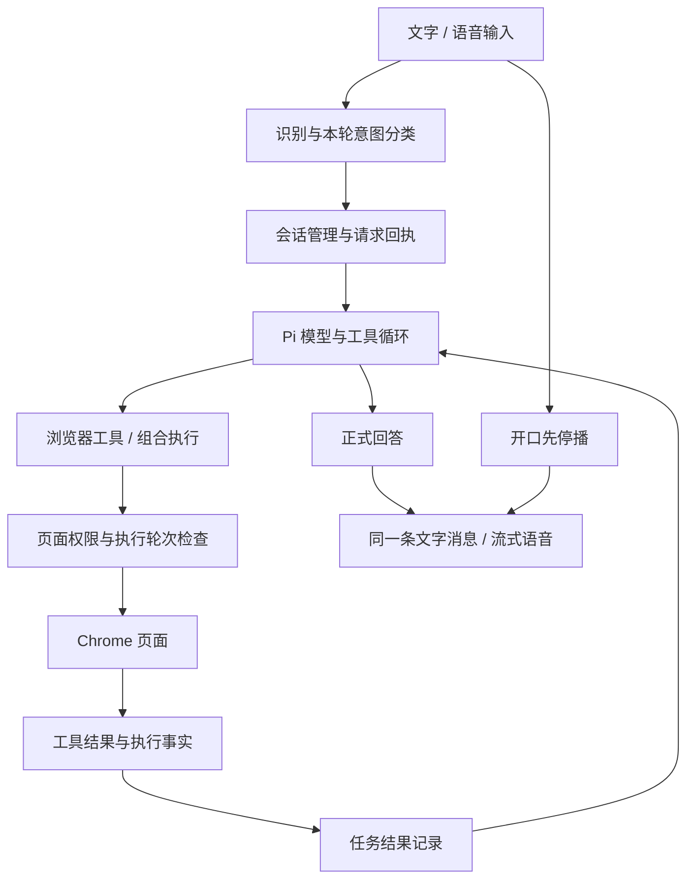

# By Your Side 连续任务响应与系统设计调研

当前最值得调整的是任务完成、改口接续和播报之间的关系。已有浏览器执行能力可以保留；目前没有证据支持先替换整个框架。暂停视频的真实失败同时涉及过长的模型生成、执行方式与完成状态不一致，以及新要求不能及时接管当前推理。单独加快语音、换模型或隐藏完成播报，都不能解决全部问题。

建议先在现有 Pi 与浏览器权限体系内修正完成判断和当前要求的归属，再用同一批任务比较更少轮次、更短上下文和不同推理配置。只有现有框架无法满足经过实测的接续要求时，才考虑扩大替换范围。本文给出研究结论与候选实验，不授权产品实施。

## 1. 范围与证据强度

检查对象是本地 `/Users/mahaoxuan/Desktop/ego` 当前工作区，包括未提交的产品改动。主执行依赖为 `@earendil-works/pi-coding-agent` 与 `pi-agent-core` 0.84.4。实际问题会话使用 MiniMax-M3，记录的推理级别为 medium。当前材料截至2026年9月10日。

证据分为四层：本次真人反馈与实际运行轨迹；当前源码和已安装依赖；研究用的生产模块探针；外部一手文档。此前1020项工程测试和流式语音验证沿用已有记录，本轮没有重新运行整套测试，也没有操作用户页面或重载产品。多会话、记忆、协作等历史验证只作为已记录能力，不重新称为本轮验收通过。

本次只有一条连续使用轨迹，可以定位具体断点，不能估算日常成功率或P95。现有日志的 `first_response` 是第一次SDK消息更新，可能包含起始或思考事件，不等于用户看见正式回答，也不是严格的供应商首token计时。完整原始页面和模型推理留在本地私有轨迹，本文只保存必要的时间、计数和执行事实。

研究范围及交付条件见[scope.md](scope.md)，脱敏计时见[timing-evidence.json](timing-evidence.json)。

## 2. 项目现状：已有基础与主要耦合

这张图省略了记忆和协作分支。关键是：语音能先停止播放，但模型当前一轮不一定同时停下来；完成状态和正式回答又分别由应用记录与模型生成控制。

| 范围 | 当前职责与已有能力 | 与本次问题的关系 |
|---|---|---|
| 侧栏与语音 | 文字、语音、当前页资料进入同一会话；Step实时输入，正式正文进入纯TTS；开口能先停声 | 输入与音频已能较快响应，不能代表任务已转向 |
| 会话与请求 | ConversationManager分配任务；TaskDispatcher记录请求、去重、持久化accepted/unknown等状态 | 接受请求是入口事实，不是已开始按新要求执行 |
| Pi运行循环 | 保存会话、执行模型调用、工具循环、steer队列、错误与压缩 | 正在生成的一轮会推迟新要求被模型消费 |
| 工具与浏览器 | snapshot/read_element、click/fill/js等；已有browser_run组合执行；字段事务page_operation | 不缺基本执行器；不必为减少轮次另造一套浏览器执行层 |
| 页面控制 | 控制权、任务/成员身份、执行epoch、待消费改口阻止旧写入 | 必须保留；停止模型等待不等于撤销已发生的网页动作 |
| 任务结果 | TaskResultBook按工具名、目标、调用身份更新结果项；状态再注入模型上下文 | 用户结果与具体实现方式混在一起，形成关键冲突 |
| 正式交付 | send_user_message创建正文；UserDeliveryLedger按run去重；VoiceService播报 | 同run的新要求没有自动让旧结果失去播报资格 |
| 多会话与协作 | 会话隔离、成员任务、共享页短事务、接管与交还 | 有可复用基础；本例没有成员协作，不应先归因于多代理 |
| 记忆与纠正经验 | 明确保存偏好、有限相关记忆、纠正经验与站点作用域 | 本例无证据表明记忆检索占主耗时，不应借机重写 |
| 运行记录与验收 | 请求回执、会话日志、RunTrace、合成语音和隔离Chrome驱动 | 已足够复盘本例，但缺少跨环节的连续体验门槛 |

源码入口：[会话装配](../../../agent/src/conversation-runtime.ts)、[会话管理](../../../agent/src/conversation-manager.ts)、[工具封装](../../../agent/src/tools.ts)、[组合执行](../../../agent/src/browser-program.ts)、[任务结果](../../../agent/src/task-results.ts)、[正式交付](../../../agent/src/user-delivery.ts)、[语音出口](../../../agent/src/voice-service.ts)。历史能力与未通过项以[STATUS](../../STATUS.md)和对应验收记录为准。

项目的主要问题不是模块数量本身，而是几类状态没有明确对齐：用户现在要什么、模型现在读到什么、页面实际发生什么、哪条结果此刻适合说出来。继续新增独立状态管理器容易扩大这个问题。

## 3. 真实路径的耗时拆解

### 3.1 时间线

| 本地时间 | 事件 | 判断 |
|---|---|---|
| 11:24:44.518 | 暂停指令的语音提交 | 计时从收音提交开始，未包含用户说话时长 |
| 11:24:45.278 | 得到转写 | 约760ms |
| 11:24:46.492 | 任务运行开始 | 分类和入口调度约1.2秒 |
| 11:25:11.203 | 模型先登记观察、点击暂停、确认暂停三项 | 第一次模型生成约24.7秒 |
| 11:25:14.994 | 第一轮页面结构读取完成 | 工具约91ms |
| 11:25:30.943 | 脚本读到paused=false | 视频仍在播放 |
| 11:25:35.496 | 执行pause并返回paused=true | 距任务开始约49秒，暂停工具约4ms |
| 11:25:39.845 | 再读到paused=true，播放时间不变 | 已有直接的结果证据 |
| 11:25:46.483 | 又读取一次完整页面结构 | 工具约79ms |
| 11:25:49.343 | 接受“播报前三条评论” | 新要求进入steer队列 |
| 11:26:52.714 | 模型发出“视频已暂停”的正式回答 | 最后一轮生成约66.2秒 |
| 11:26:52.718 | 读评论要求才进入模型消息流 | 接受后等待约63.4秒 |
| 11:26:53.058 | 旧完成结果首段音频返回 | 比正式回答晚约344ms |

页面已暂停以后继续等待，不是TTS仍在合成整段音频。这次语音出口没有形成分钟级瓶颈。

### 3.2 模型轮次与上下文

| 模型轮次 | 随后动作 | 模型区间 | 记录的推理token |
|---|---|---:|---:|
| 1 | 登记任务结果 | 24.705秒 | 1088 |
| 2 | snapshot | 3.697秒 | 129 |
| 3 | 脚本读取播放状态 | 15.938秒 | 796 |
| 4 | 脚本暂停 | 4.548秒 | 161 |
| 5 | 脚本核查状态 | 4.346秒 | 111 |
| 6 | snapshot | 6.559秒 | 320 |
| 7 | 正式完成回答 | 66.227秒 | 3824 |

7轮共记录6429个推理token、6984个输出token；7次工具执行累计185ms。这里的“模型区间”包含请求、上下文处理、供应商生成与传输，不能全部解释为纯计算时间。第一次SDK更新合计约11.6秒，其余大部分时间发生在更新开始之后。

第一轮的输入与缓存输入合计约3.3万token，最后一轮约5.7万token。缓存命中已经存在；不能把提速方向简单写成“加缓存”。连续读入完整页面结果和保留此前会话，也值得与推理输出长度分别比较。上下文多不自动等于错误，但当前投入与“暂停视频”这个目标不相称。

## 4. 根因与尚未证实的推断

### 4.1 完成记录实际描述的是执行方法

当前登记项同时装入人的结果描述和具体工具/目标。结果匹配要求工具名、target一致；成功工具回执把匹配项变为satisfied。模型登记“click暂停按钮”，实际改用js暂停，js无法完成click登记项。若后续还遵循“pending表示没完成”，就会出现页面已正确、应用仍不结束的冲突。[^1]

另一个方向也存在问题：把一项描述为“确认视频暂停”、工具填snapshot，并不会让记录器检查paused值。一次snapshot调用成功就可能满足它。模块探针同时复现了这两个性质，见[bookkeeping-probe.json](bookkeeping-probe.json)。探针只说明记录器怎样判定，不把它当成真实页面验收。

因此，“减少验证”不是充分修法。应区分至少两种事实：某次操作被执行，以及用户要的状态被观察到。为新代码自由编写一段“我成功了”同样不能作为验证。结果证据应关联本次目标与文档，操作改法需要保留相同结果身份和实际执行记录。

既有R3核查反例还没有通过：隐藏旧内容、无关更新和同tab换文档可能被误当成原操作成功。这个事实限制了修法，不能以“只要页面某处出现相同文字就算完成”来换速度。

### 4.2 小任务也被强制登记，文字说明与实际门槛不一致

提示词主要说“多步骤页面任务先登记”，但实际执行断言对有run且尚未登记的多数工具都要求登记，包含snapshot等观察工具。模型不能仅凭一句“简单任务少想一点”可靠绕过这条代码门槛。登记本身还需要一个模型往返。[^2]

这里的设计问题是把过程管理放到了几乎所有页面任务的必经路径。应该评估哪些信息能由宿主从真实调用中直接记录，哪些必须由模型提前声明；不是把保护副作用的回执一起删除。

### 4.3 收到改口与消费改口相隔一整轮

已安装Pi的steer语义，是把消息排到当前助手轮次和工具执行结束之后、下一轮模型调用之前。当前实现的await session.steer表示入队完成，不表示模型已读到新要求。这个行为由源码和本例63秒等待共同确认。[^3]

应用已经在收到改口时提高控制epoch，并用pendingCorrections阻止旧写入。这是有用的保护。但正在生成的旧回答仍可继续，send_user_message不属于网页写工具。普通工具的写入保护不会自动阻止旧答案播报。

因此，不能用“已送达当前任务”来推导“正在按新要求处理”。后续实现需要明确入队、已消费、开始新动作的证据边界。

### 4.4 播报只知道同一个run，不知道同run里要求已变化

当前正式交付以conversationId、runId、deliveryId绑定。它能排除另一个任务和重复消息，但用户在同一个run内补充或替换要求时，旧结果仍可能合法通过。流式出口收到符合run的正式正文就开始合成，不会等待模型消费新要求，也没有结果时效判定。[^4]

静音一个过期结果可以减少打扰，却不会减少那63秒的新任务等待。反过来，只加快改口又不管播报归属，仍会在竞态下插播旧结果。这两件事要分别处理、共同验收。

### 4.5 模型与上下文是可测因素，尚不能给出替换结论

实际medium配置下仍产生了较长推理。可以试较低推理配置、较短工具定义和更聚焦的当前页面上下文，但没有同任务对照，不能量化收益，也不能保证供应商严格执行某个推理预算。

本例没有网络错误或工具重试链解释全部等待。也没有证据证明所有复杂任务都该限制为极少轮次。应把简单控制任务与复杂检索、带副作用提交分别评估。

## 5. 外部一手做法及适用边界

### 5.1 Pi：先使用已安装的扩展点

Pi明确区分steer与follow-up；其核心也提供工具前后检查、完成轮次后的停止钩子和context转换。当前版本已经具备这些接口，升级不是使用这些能力的前提。可借鉴的是由宿主在确定边界控制结束与上下文，而非反复要求模型自行结束。钩子本身不提供用户目标验证，也不意味着abort会撤销网页动作。[^5]

### 5.2 LiveKit：对话持续响应与任务继续运行分开

LiveKit的异步工具让长工作与对话并行；任务取消是单独的、可选择启用的能力。其工具循环指南强调让工具返回必要结果、限制循环，并建议仅配置变化时原地更新，避免额外交接。适合借鉴这些生命周期区分。不能照搬“普通插话取消所有工具”，也不应靠重复填充语音掩盖动作缓慢；本项目已明确普通插话先停声，不自动停手。[^6][^7]

### 5.3 Stagehand：单次动作与自主任务使用不同原语

Stagehand把单次act、结构化提取、观察和多步agent分开；已观察到的动作可直接执行，重复动作可利用缓存减少模型往返。其agent支持步数上限与取消信号。可借鉴的是按任务需要减少推理回合，复用当前工具和browser_run。缓存不能把旧页面目标当成当前目标；框架返回success也不能替代本项目对网页实际状态的验证。[^8][^9]

### 5.4 Browser Use：缩短输出，并控制页面信息进入上下文的方式

2025年的官方工程文章介绍了历史与新页面状态的缓存组织、按需截图、定向提取，以及缩短动作输出。它对应本例的长生成和上下文增长。该文的性能数字来自其自有模型、基础设施及任务集，不能用来承诺本项目提速倍数；其中用额外模型提取页面信息的做法也未必适合一次暂停操作。本文只采用设计思路。[^10]

### 5.5 Anthropic：稳定边界，持续质疑补偿性规则

2024年的文章强调从简单可组合流程开始，并区分固定流程与自主探索；该页已提示工具生态发生变化。继续查阅2026年的Managed Agents文章后，更适合本项目的原则是：会话事实、模型循环与执行环境保持可替换的边界，不把完整历史等同于每轮模型上下文。该文讨论长任务云端基础设施，不是要求本地侧栏迁云或新增多个代理。[^11][^12]

### 5.6 Will's S与Apple反馈设计：消息真实还不够，打断也要合理

Will's S《Feedback反馈》强调按信息重要性选择呈现方式，状态可被动展示，重要结果才值得强确认；《You assist me!》强调用户主导和灵活交还。Apple当前反馈指南也强调信息重要性与中断程度匹配。对本项目的推断是：过期的简单完成结果可以保留为文字，而不必自动抢占语音；失败、需要决定的阻塞和用户正在等待的答案不能被统一静音。以上资料是设计依据，不是本项目的实测结论。[^13][^14][^15]

## 6. 方案比较

| 方向 | 能解决什么 | 解决不了什么 / 代价 | 本轮判断 |
|---|---|---|---|
| 仅降低推理级别或换快模型 | 可能降低每轮生成时间，试验可逆 | 方法与结果冲突、排队语义、旧结果资格仍存在；准确率未知 | 值得做对照，不作为主修法 |
| 在现有系统内理顺完成、接续、播报 | 直接对应三类已确认断点；可保留工具和回执 | 需要明确结果证据、取消边界，不能只改一句提示词 | 优先方向 |
| 把常见小操作做成少轮次受约束执行 | 可减少登记、规划与重复读页 | 必须定义适用条件和失败回退；不能按“句子短”判断安全与简单 | 作为前一方向内的小实验 |
| 替换为完整语音或浏览器Agent框架 | 可获得现成的生命周期与执行原语 | 重接本地浏览器、权限、历史、记忆、接管、语音；没有证明比复用更划算 | 暂不建议 |

“简单”应指目标明确、状态可检查、操作边界有限。例如暂停一个已确定的播放器。不能按字数、工具数量或站点名字判断；“把钱转过去”虽然短，也不属于低成本试错动作。

不建议另开一个常驻模型专门决定“是不是简单任务”，再把每句话多串一次分类。当前已经有意图分类和执行宿主，先检验能否在这些边界内作出决定。也不建议因LiveKit的工具数量建议就机械裁成固定数量：本项目能力复用、动态禁用和页面共享限制必须保持真实一致。

## 7. 推荐改动顺序与范围

### 第一步：校正完成契约

先明确用户结果、实现方法与执行事实的区别。目标仍是暂停视频，方法可以从点击改为其他授权方式；成功必须有针对同一目标的状态证据。记录状态与模型看到的状态只能有一个权威来源。

这一步优先修状态矛盾，避免把“结束更快”实现成“更早假成功”。保留请求去重、unknown不重放、文档身份与用户接管。R3恢复问题应继续单独记录，不能借此宣布已经解决。

### 第二步：让已接受的新要求有明确生效点

将三种行为分开：停止声音；结束当前过时的模型生成；取消尚未执行的任务动作。普通插话只做第一种；确认是替换或修改任务时，第二、三种按当前状态处理。对明确追加的步骤，要保留之前仍有效的工作，而非一律清空重来。

优先检查现有pendingCorrections与控制epoch能否承担“当前要求版本”的职责，避免增加另一套平行状态。新要求在无工具执行、只有旧模型生成时，应该有可验证的及时接续办法；若写入已经在途，应先记住其结果或unknown，不能自动重新提交。

### 第三步：用同一要求的有效性管理语音

正式结果继续入历史，但在开始合成与开始播放时，核对它对应的要求是否仍有效、是否有更新要求、用户是否还在等待。不要只按时间阈值丢弃，也不要让模型凭感觉判断是否重要。

这需要区分“过期简单结果”和“迟到但重要结果”。用户明确请求的阅读内容、关键操作失败、待用户决定的阻塞，应保留可获得的反馈。具体口头策略仍需产品判断。

### 第四步：在以上正确性成立后压缩关键路径

针对有限可检查的任务，对照减少登记往返、复用当前观察、已有browser_run组合执行、聚焦结果返回、降低推理配置。复杂任务保留自主观察与多步能力，不必被一起压成短流程。

上下文方面，保留完整会话作为可查证记录，给当前模型的工作上下文可以更聚焦；不能丢掉否定、最近改口、页面身份、已执行和unknown动作。先证明这些条件保持，再评价省下多少时间。

## 8. 实验与可否决条件

下表是实施前建议冻结的实验，不是已经通过的验收，也不是未经讨论的交付承诺。先运行固定样本并报告每条耗时，再扩大统计；小样本不称P95。

| 实验 | 固定条件 | 观察与否决条件 |
|---|---|---|
| 完成方式变化 | 同一目标先登记点击，后用授权替代方式达到结果 | 真实结果成立后可结束；仅调用成功/无关页面变化不能通过 |
| 小操作速度 | 播放/暂停、切换已知标签、滚到已知位置等，不涉及不可逆提交 | 候选动作在目标明确、页面就绪条件下争取3秒内可见；超过5秒解释瓶颈，不能用提前说“完成”过关 |
| 改口接续 | 在旧模型长生成期间发替换要求 | 候选目标：接受后1秒内使旧生成失去执行/播报资格；记录新要求实际消费时间，不以入队回执充当生效 |
| 追加不丢失 | “先暂停，然后读前三条评论”与“改读后二条”分开测 | 保留应该保留的前置步骤，替换应该替换的目标；不能全部当取消 |
| 旧结果插播 | 确认旧操作成功后立即发送新任务 | 新任务期间旧简单结果不自动插播；历史事实仍在 |
| 关键迟到结果 | 模拟在途写入后迟到成功/失败/unknown | 不重复写，不丢关键失败，不把取消当回滚 |
| 模型与上下文对照 | 同一模型medium/较低推理；原上下文/聚焦上下文分别改变 | 同时比较成功、轮次、推理输出、首动作、确认到反馈时间；若速度收益以遗漏或假成功换取则否决 |
| 整体用户路径 | 暂停视频→读评论→改口→继续，真实耳麦 | 机器通过后，用户判断是否跟得上节奏；单次语音正常不等于整段通过 |

3秒、1秒等数字是待确定的设计目标，来自期望的即时操作体验，不是假称行业统一标准。若当前模型单次生成就稳定超预算，先报告可达到的分布，再判断是否需要更小的动作接口或更适合的模型；不要偷偷放宽门槛。

## 9. 还缺什么证据，何时再扩大改动

目前不能确认不同模型/低推理配置能降低多少时间，也未完成新要求安全中断旧模型的集成试验。没有对复杂网页、长任务和不同网络条件做对照。这些会影响性能方案，但不会推翻本例已经确认的状态冲突和接续等待。

可以先停止继续泛搜框架：已有一手实现足以支持“明确循环边界、减少无效往返、区分对话和任务生命周期”的方向。下一个有价值的信息来自同任务对照，而不是更多产品宣传页。

只有在当前Pi无法安全保留执行记录并及时接续，或其集成代价明显高于替换时，才重新评估框架；只有在减少轮次仍不能满足动作预算时，才扩大模型选择。任何替换都必须继续使用同一用户页面、权限和事实边界，不能拿新开的简化演示环境代替原路径。

此前的三条建议保留方向，但需要修订表达：不是简单地“少检查”，而是检查真正的结果；不是收到每句话就终止任务，而是区分停声、改口与追加；不是把晚消息全部静音，而是把播报与当前有效要求、信息重要性绑定。下一次实施范围应围绕这些契约确定。

## 来源与复核入口

外部动态文档均于2026年9月10日读取。Notion为私人设计资料；未复制图片临时签名地址。外部性能均为供应商资料，未在本项目重现。

[^1]: 当前源码，[结果匹配](../../../shared/task-results.ts)、[TaskResultBook](../../../agent/src/task-results.ts)、[状态投影](../../../agent/src/product-context.ts)。研究探针命令：`npx tsx docs/research/20260910-agent-responsiveness/probe.mts`；结果见[JSON](bookkeeping-probe.json)。
[^2]: 当前源码，[BrowserAgentSession.assertTaskResultExecution](../../../agent/src/session.ts)与[工具调用](../../../agent/src/tools.ts)。
[^3]: 已安装Pi 0.84.4，`pi-coding-agent/dist/core/agent-session.js`的steer与`pi-agent-core/dist/agent-loop.js`的runLoop；本地入口[steerCurrentTask](../../../agent/src/session.ts)。版本与时间证据见[timing-evidence.json](timing-evidence.json)。
[^4]: 当前源码，[UserDeliveryLedger](../../../agent/src/user-delivery-ledger.ts)、[VoiceService](../../../agent/src/voice-service.ts)、[正式消息创建](../../../agent/src/user-delivery.ts)。
[^5]: earendil-works，[Pi Agent README](https://github.com/earendil-works/pi/blob/main/packages/agent/README.md)与[agent-loop.ts](https://github.com/earendil-works/pi/blob/main/packages/agent/src/agent-loop.ts)，动态main；关键行为另外对照已安装0.84.4源码，不把main当成当前安装版本。
[^6]: LiveKit，[Async tools](https://docs.livekit.io/agents/logic/tools/async/)，动态官方文档；重点为异步工作、foreground、显式取消与副作用边界。
[^7]: LiveKit，[Tool loop design](https://docs.livekit.io/agents/logic/tools/design/)，动态官方文档；重点为工具输入输出、循环边界和原地更新。文档的默认语音中断策略不直接应用到本项目。
[^8]: Browserbase，[Stagehand Act](https://docs.stagehand.dev/v3/basics/act)与[Observe](https://docs.stagehand.dev/v3/basics/observe)，v3动态文档。
[^9]: Browserbase，[Stagehand Agent](https://docs.stagehand.dev/v3/basics/agent)，v3动态文档；涉及步数上限、取消信号和会话延续，不证明本地适配收益。
[^10]: Gregor Zunic / Browser Use，[Speed Matters: How Browser Use Achieves the Fastest Agent Execution](https://browser-use.com/posts/speed-matters)，2025-10-09。浏览抓取遇到content-type问题，随后直接读取官方HTML正文；不采用其速度倍数作本项目承诺。
[^11]: Anthropic，[Building effective agents](https://www.anthropic.com/engineering/building-effective-agents)，原文2024-12，当前页包含生态变化提示；作为架构原则使用。
[^12]: Lance Martin、Gabe Cemaj、Michael Cohen / Anthropic，[Scaling Managed Agents: Decoupling the brain from the hands](https://www.anthropic.com/engineering/managed-agents)，2026-04-08。
[^13]: Will's S Design Note，[Feedback反馈](https://www.notion.so/217886bc60ff813a899bdba0007f5fc8)，页面编辑时间2025-06-19，私人设计笔记，Notion标记unverified；作为设计参考，不作为产品实测。
[^14]: Will's S Design Note，[You assist me!](https://www.notion.so/1f8886bc60ff81d2bbe1e6aa3f751726)，页面编辑时间2025-05-19，私人设计笔记，Notion标记unverified。其汽车/Waze例子未作独立功能核验，本文只取人机控制设计观点。
[^15]: Apple，[Feedback / Human Interface Guidelines](https://developer.apple.com/design/human-interface-guidelines/feedback)，当前官方索引可读，正文浏览页需要JS；要点与Will's S笔记对照，未声称本轮完整读取官方动态正文。
