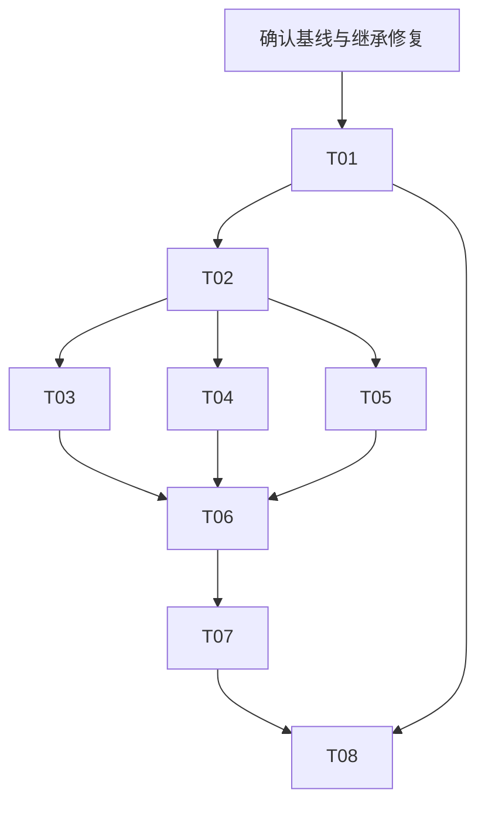

# By Your Side：产品体验第一版开发任务包

版本：v1.0。包含八张开发票；这轮只编写计划与验收标准，没有实现产品功能。
建议复制到本地仓库 `docs/tasks/product-experience-v1/`。当前文件在独立交付包中，尚未写回 Mac 项目。

## 目标与范围

下一版交付四件可感知的改善：看得懂当前任务、知道改口改了什么、中断后能接续、完成后拿到可核对的成果。保持通用浏览器能力，先用「读查整理、跨页筛选、填写但不提交」三类完整工作检验质量。

不重写 Pi、浏览器执行器、会话或记忆系统；不在本票组接入通用 Jev 网页动作循环、自动技能学习、新 ASR/TTS、大规模 UI 重设计或商业发布。

## 依据与开始前检查

上轮已经核对的项目资料：`README.md`、`AGENTS.md`、`docs/STATUS.md`、`docs/ROADMAP.md`、`docs/human-ai-contract.md`、根目录 `package.json`、`agent/src/product-context.ts`、`shared/voice.ts`、`extension/src/sidepanel/receipt-view.ts`，以及此前显示、恢复、语音与完整用户路径验收记录。

最后可核对的基线为 `867f60b` 加本地未提交修复。本轮 DevSpace 实际调用再次返回账号连接 400，未能刷新代码状态；以上不是当前工作区状态保证。每个 Agent 开工先重新读取当前代码与上述资料。

**并行开工前置项：**

1. 核对上一轮「只改字体不改变显示模式」缺陷是否已修、review 是否完成；未完成的工作保留，不重复覆盖。
2. 集成人员先列明继承改动，再在获得相应授权后整理为可回退的本地检查点。所有工作树从同一个已确认基线创建。不能只从旧 HEAD 建 worktree，从而漏掉未提交修复。
3. P0 恢复矩阵未完成时，不把后续接续按钮当成能力完成。票可以先实现受控部分，但相关真实恢复门槛必须在启用前通过。
4. 没有产品代码修改、日常配置修改、重载、推送、部署或付费服务调用的授权，不从任务文档推导出这些额外授权。按当前会话已有授权执行；不确定项记录并提出具体缺口。

## 八张票与依赖

| 编号 | 目标 | 依赖 | 独立验收用例 |
|---|---|---|---|
| T01 | 量清完整任务的完成质量与介入成本 | 无；先核对基线 | A01-01—A01-06 |
| T02 | 提供由真实状态生成的统一任务视图 | T01 的结果／计时口径 | A02-01—A02-08 |
| T03 | 显示轻量任务条和实际使用材料 | T02 | A03-01—A03-08 |
| T04 | 让修改回执区分收到、送达、实际应用 | T02；继承显示范围修复 | A04-01—A04-10 |
| T05 | 提供有真实恢复能力的接续入口 | T02；相关 P0 恢复门槛 | A05-01—A05-08 |
| T06 | 统一成果、依据与未完成项交付 | T02、T03、T04、T05 | A06-01—A06-08 |
| T07 | 做好停播、接管、改口三类语音协作 | T04、T05、T06 | A07-01—A07-08 |
| T08 | 完成首次使用与可回退试用版本 | T01—T07 | A08-01—A08-08 |

T02 合入并冻结接口后，T03/T04/T05 可在独立工作树实现；公共文件仍串行集成。T08 可提前只读整理安装卡点，但不能提前宣称集成完成。独立验收是每张票有自己的判据，不等于没有依赖。

## 认领与并行规则

一张票一个责任 Agent、一个独立 Git worktree、一个 workspaceId。认领必须记录：票号、责任人、基线 commit、分支、工作树、workspaceId、预计修改文件、依赖版本。认领表由用户或集成人员串行维护，避免多个 Agent 同时改共享索引。

`session.ts`、`conversation-manager.ts`、`shared/protocol.ts`、`shared/voice.ts`、侧栏 `main.ts` 属于公共集成文件。认领票不等于永久占有这些文件；同时涉及它们时，先交接口变更说明和最小补丁，由集成人员逐票应用。禁止把其他票的大量重构混入自己的提交。

独立模块和对应测试可以并行；真实模型配对、音频验收和页面计时串行进行，记录机器负载。相同页面不由多个 Agent 同时控制。

临时工作树在合入、核对无未提交／未合并内容后再清理；不能为清理而丢弃未合入成果。

## 验收权与状态

具体口径见 `01-ACCEPTANCE-CONTRACT.md`。所有数字是本轮拟采用的目标，不是现有实测结果或行业保证。交给 Agent 后，视为这版任务的固定验收依据；发现不可行或口径错误，要保留证据提出变更，不能实现侧自行降线。

工作状态：待认领 → 实现中 → READY_FOR_REVIEW → ACCEPTED / CHANGES_REQUESTED。缺少必要环境、真实用户或授权时记录 BLOCKED；已测试失败记 FAIL，不伪装成 BLOCKED。

实现 Agent 提交代码和自测证据，只能标 READY_FOR_REVIEW。最终 code review 与验收裁决由 ChatGPT 在可访问实际代码和原始证据时完成。连接不可用则保留待复核，不凭摘要批准。

每张票的「工程实现」「真实功能」「真人体验」分别报告。可先 review 已完成部分，但该票要求的任一层未完成时，不标整票 ACCEPTED。T01 验收评测器是否可信，不要求当前产品先达到最终版本完成率。

## 交付文件

每票使用 `10-DELIVERY-TEMPLATE.md`，建议落地为 `docs/evals/<本机日期>-product-tNN.md`。原始证据放 `out/acceptance/<唯一时间戳>-tNN/`，不要覆盖历史目录。日志中不得包含密钥、真实敏感表单内容或账户凭据。

提交至少包含：基线及结束 commit/补丁、改动文件、验收用例逐项状态、命令与退出码、原始证据路径、未运行项、开关与回退方式、需要 reviewer 检查的风险。

本包未创建 GitHub issues、未替任何 Agent 认领、未修改日常扩展。完成一张票不自动授予推送、重载或开启功能的许可。
