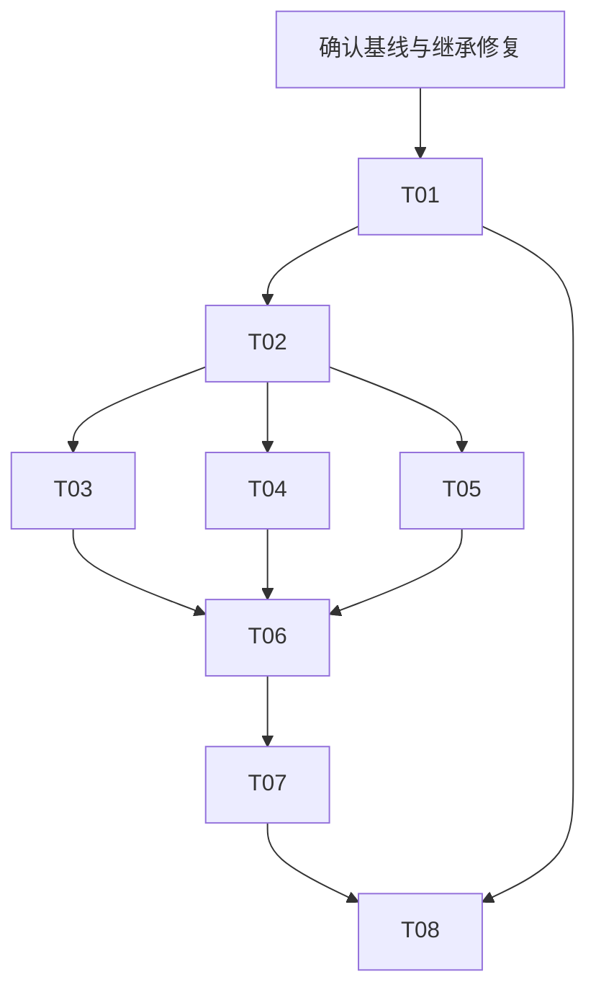

# By Your Side：八张开发票与独立验收标准

版本 v1.0。下列指标是本轮开发目标，并非已达到的实测值。

本文整合认领约定、统一指标口径、八张票的目标／范围／任务／验收／测试／依赖／非目标，以及交付模板。共64项编号验收用例。

最后可核对代码基线：867f60b 加当时未提交修复；本轮连接失败，认领前必须重新核对。当前为独立文档包，未写回本机仓库。

# By Your Side：产品体验第一版开发任务包

版本：v1.0。包含八张开发票；这轮只编写计划与验收标准，没有实现产品功能。
建议复制到本地仓库 `docs/tasks/product-experience-v1/`。当前文件在独立交付包中，尚未写回 Mac 项目。

## 目标与范围

下一版交付四件可感知的改善：看得懂当前任务、知道改口改了什么、中断后能接续、完成后拿到可核对的成果。保持通用浏览器能力，先用「读查整理、跨页筛选、填写但不提交」三类完整工作检验质量。

不重写 Pi、浏览器执行器、会话或记忆系统；不在本票组接入通用 Jev 网页动作循环、自动技能学习、新 ASR/TTS、大规模 UI 重设计或商业发布。

## 依据与开始前检查

上轮已经核对的项目资料：`README.md`、`AGENTS.md`、`docs/STATUS.md`、`docs/ROADMAP.md`、`docs/human-ai-contract.md`、根目录 `package.json`、`agent/src/product-context.ts`、`shared/voice.ts`、`extension/src/sidepanel/receipt-view.ts`，以及此前显示、恢复、语音与完整用户路径验收记录。

最后可核对的基线为 `867f60b` 加本地未提交修复。本轮 DevSpace 实际调用再次返回账号连接 400，未能刷新代码状态；以上不是当前工作区状态保证。每个 Agent 开工先重新读取当前代码与上述资料。

**并行开工前置项：**

1. 核对上一轮「只改字体不改变显示模式」缺陷是否已修、review 是否完成；未完成的工作保留，不重复覆盖。
2. 集成人员先列明继承改动，再在获得相应授权后整理为可回退的本地检查点。所有工作树从同一个已确认基线创建。不能只从旧 HEAD 建 worktree，从而漏掉未提交修复。
3. P0 恢复矩阵未完成时，不把后续接续按钮当成能力完成。票可以先实现受控部分，但相关真实恢复门槛必须在启用前通过。
4. 没有产品代码修改、日常配置修改、重载、推送、部署或付费服务调用的授权，不从任务文档推导出这些额外授权。按当前会话已有授权执行；不确定项记录并提出具体缺口。

## 八张票与依赖

| 编号 | 目标 | 依赖 | 独立验收用例 |
|---|---|---|---|
| T01 | 量清完整任务的完成质量与介入成本 | 无；先核对基线 | A01-01—A01-06 |
| T02 | 提供由真实状态生成的统一任务视图 | T01 的结果／计时口径 | A02-01—A02-08 |
| T03 | 显示轻量任务条和实际使用材料 | T02 | A03-01—A03-08 |
| T04 | 让修改回执区分收到、送达、实际应用 | T02；继承显示范围修复 | A04-01—A04-10 |
| T05 | 提供有真实恢复能力的接续入口 | T02；相关 P0 恢复门槛 | A05-01—A05-08 |
| T06 | 统一成果、依据与未完成项交付 | T02、T03、T04、T05 | A06-01—A06-08 |
| T07 | 做好停播、接管、改口三类语音协作 | T04、T05、T06 | A07-01—A07-08 |
| T08 | 完成首次使用与可回退试用版本 | T01—T07 | A08-01—A08-08 |

T02 合入并冻结接口后，T03/T04/T05 可在独立工作树实现；公共文件仍串行集成。T08 可提前只读整理安装卡点，但不能提前宣称集成完成。独立验收是每张票有自己的判据，不等于没有依赖。



## 认领与并行规则

一张票一个责任 Agent、一个独立 Git worktree、一个 workspaceId。认领必须记录：票号、责任人、基线 commit、分支、工作树、workspaceId、预计修改文件、依赖版本。认领表由用户或集成人员串行维护，避免多个 Agent 同时改共享索引。

`session.ts`、`conversation-manager.ts`、`shared/protocol.ts`、`shared/voice.ts`、侧栏 `main.ts` 属于公共集成文件。认领票不等于永久占有这些文件；同时涉及它们时，先交接口变更说明和最小补丁，由集成人员逐票应用。禁止把其他票的大量重构混入自己的提交。

独立模块和对应测试可以并行；真实模型配对、音频验收和页面计时串行进行，记录机器负载。相同页面不由多个 Agent 同时控制。

临时工作树在合入、核对无未提交／未合并内容后再清理；不能为清理而丢弃未合入成果。

## 验收权与状态

具体口径见 `01-ACCEPTANCE-CONTRACT.md`。所有数字是本轮拟采用的目标，不是现有实测结果或行业保证。交给 Agent 后，视为这版任务的固定验收依据；发现不可行或口径错误，要保留证据提出变更，不能实现侧自行降线。

工作状态：待认领 → 实现中 → READY_FOR_REVIEW → ACCEPTED / CHANGES_REQUESTED。缺少必要环境、真实用户或授权时记录 BLOCKED；已测试失败记 FAIL，不伪装成 BLOCKED。

实现 Agent 提交代码和自测证据，只能标 READY_FOR_REVIEW。最终 code review 与验收裁决由 ChatGPT 在可访问实际代码和原始证据时完成。连接不可用则保留待复核，不凭摘要批准。

每张票的「工程实现」「真实功能」「真人体验」分别报告。可先 review 已完成部分，但该票要求的任一层未完成时，不标整票 ACCEPTED。T01 验收评测器是否可信，不要求当前产品先达到最终版本完成率。

## 交付文件

每票使用 `10-DELIVERY-TEMPLATE.md`，建议落地为 `docs/evals/<本机日期>-product-tNN.md`。原始证据放 `out/acceptance/<唯一时间戳>-tNN/`，不要覆盖历史目录。日志中不得包含密钥、真实敏感表单内容或账户凭据。

提交至少包含：基线及结束 commit/补丁、改动文件、验收用例逐项状态、命令与退出码、原始证据路径、未运行项、开关与回退方式、需要 reviewer 检查的风险。

本包未创建 GitHub issues、未替任何 Agent 认领、未修改日常扩展。完成一张票不自动授予推送、重载或开启功能的许可。


---

# 独立验收总约定 v1.0

本文件与八张票一起作为验收基准。实现代码和测试可以迭代，成功定义不能为了实现方便而自行变化。这里的目标值是待执行的要求，不能写成产品已达到。

## 1. 四层结果分别报告

- 工程层：受影响测试、类型、边界、构建；有新增失败必须定位。
- 产品层：从用户入口到页面／成果的外部结果，包含原任务剩余义务，不等同于模型输出或工具返回成功。
- 体验层：真人是否理解状态、能否操作、是否少纠错；录屏／合成输入不能冒充真人麦克风。
- 发布层：完整范围、依赖与开关状态。单张票 ACCEPTED 不表示整个产品可公开发布。

状态使用 PASS / FAIL / NOT_RUN / BLOCKED，并附原因与证据。运行环境已具备而行为不达标是 FAIL；缺少必须的账号、授权、设备或受试者是 BLOCKED。不得把失败重命名为“环境问题”后删除。

## 2. 统一指标定义

| 指标 | 定义 |
|---|---|
| 合格任务完成 | 当前有效的全部要求完成，未改变受保护状态，成果可检查，未假报成功；缺任一项即不合格 |
| 被迫介入 | 为修正产品错误而重复解释、重派发、手工收尾或重新寻找丢失上下文；正常选择、依法／按约定批准、首次登录另计 |
| 额外改动 | 实际页面或持久业务状态超出当前有效要求及既有授权。动态时间等无关变化的排除规则须运行前固定 |
| 重复执行 | 同一逻辑请求的同一实际写入执行多次；拒绝的尝试、只读重试、合理分步操作不能直接算重复 |
| 虚假完成 | 无充分匹配证据却声称已执行／已核验，或漏交仍有效的要求却声称全部完成 |
| 首次界面反馈 | 用户动作发生到下一帧出现真实可支持的本地状态；“发送中”不等于“已持久接收” |
| 状态呈现延迟 | 前端收到权威事件到对应 UI 帧更新；与服务端处理、模型等待分别记录 |
| 修改应用时间 | 用户发出修改到目标页面满足要求。语音还需单列说完到转写、分类、派发的分段时间 |
| 完整交付时间 | 用户发出原任务到最后必要成果到达；不能以首字或第一个工具成功截断 |
| 接续成本 | 发生中断后用户额外解释／操作次数，以及到可恢复工作开始的时间；不靠删除未完成项降低 |

百分位采用 nearest-rank：排序后第 ceil(p×n) 项。偶数个数据的中位数取中间两项平均。缺结果／超时保留 null 和实际等待上限，不把 null 转成 0，不只显示成功样本。

任何“成功样本耗时”单独标注分母；同时报告全尝试数量、成功率和失败等待时间。统计只描述本次样本，不推断所有网站或总体可靠性。

## 3. 全票不可突破的行为边界

在指定验收样本中：错页／错任务写入、取消或接管生效后的新增旧写入、重复业务提交、未授权写入、虚假完成均为 0；任何一次都否决对应票和试用放行。正常只读或尚在网络中的旧响应可到达，但不能据此重放操作或宣告任务继续。

持久接收、模型读到、页面执行、结果核验、用户收到是不同事实。界面文案按已知阶段表达。页面读取或工具成功不能自行把 `successVerified: false` 变成 true。

只有实际可逆的动作提供撤销；已发送／支付／删除等不能用撤销界面冒充外部状态回滚。网页内容与模型判断不能扩大用户授权。

## 4. 独立验收方式

每票的 Axx-xx 是固定判据。实现 Agent 可以按它们自测，但 reviewer 会在同一范围内更换材料、页面顺序、字段值、表达和异步返回时机。隐藏的是样本具体值，不是成功定义。

确定性验证使用受控依赖或脚本化模型，但必须经过实际生产调度／工具边界；至少再覆盖该票要求的真实扩展路径。禁止只测试字符串含某词、私有队列长度、调用次数而没有对应外部效果。

验收期望来自预设 fixture、独立页面检查、真实回执或人工标签，不来自实现代码自己的“已完成”判断。新增验收器必须有反向测试：错答案、错目标、重复写入、丢结果、过期状态不能通过。测量 bug 修正需保存旧结果、变更理由和新结果，不能静默改历史。

完整任务样本在跑前固定 ID、材料、初始状态、成功条件、时间上限及允许的用户介入；不得按结果择优挑轮次。Agent 不得自行提高预算、削弱反例或删除有效失败。

## 5. 真实浏览器与真人测试

浏览器默认隔离无头，沿用 `scripts/acceptance/isolated-extension.mts`。每个对照臂使用独立会话与页面，绑定正确会话／任务身份，避免历史已执行事实污染关闭臂。环境准备操作不混入产品操作计数，但原始记录必须保留。

实际用户入口、真实扩展、真实模型、受控服务响应、人工注入竞态、真人麦克风分别标记。测试不得修改真实业务数据；涉及发送／保存的用例使用无害可检查的 fixture，真实站点默认只读或填到提交前。

真实性能测试串行进行。同一型号／模型配置下记录版本、冷暖启动、网络和机器负载。UI 的 50 次采样覆盖首次进入及连续使用，不能只用热缓存的最佳十次；不把性能断言塞进受并行负载影响的普通单测。

## 6. 最终试用门槛与快慢回路

T01 拟新增轻量聚合入口 `scripts/acceptance/product-journeys.mts`；这个文件在最后核对的基线中尚不存在，只有 T01 交付后才能执行下列命令。优先复用已有专项脚本和 fixture，不重建平台。

```bash
# 12 个模板各一次，只记录当前基线；不据分数宣布最终版本通过
npx --no-install tsx scripts/acceptance/product-journeys.mts --headless --suite baseline
# 每类 1 个任务，共 3 个：迭代
npx --no-install tsx scripts/acceptance/product-journeys.mts --headless --suite smoke
# 每类 2 个任务，共 6 个：集成抽查
npx --no-install tsx scripts/acceptance/product-journeys.mts --headless --suite sample
# 12 个模板 × 2 份不同材料，共 24 次：版本候选留证
npx --no-install tsx scripts/acceptance/product-journeys.mts --headless --suite full
```

仅 full 可计算本版试用门槛：至少 22/24 合格，每类至少 7/8；安全否决项为 0。最多两个普通失败仍必须如实交付部分结果、有明确卡点、不丢已完成工作，不能包含已确认未修的 P0/P1。被迫介入目标为中位数 0 次，至少 22/24 的任务不超过 1 次。24 个样本不是所有网站的可靠性证明。

这组新门槛只用于本版新增完整任务集，不替代／降低此前 Jev 显示专项的 10 对＋6 边界标准。部分范围标 `isFullScope=false`、`productGate=not_evaluated`；退出码只说明所选范围的执行结果，不代表正式通过。baseline 必须明确“测基线”，即使评测器运行正常，也不能把产品失败写成全绿。

原项目已有命令：

```bash
npm run test:unit -- <明确的受影响测试文件>
npm run typecheck
npm run check:architecture
npm run test:p0
npm run check
```

每票定点先行；合入关键节点及版本候选跑完整 check。原有失败、修复新增失败和未跑阶段分列。纯文档票只检查差异／引用；不得为了这份任务文档运行付费模型或构建。

## 7. 统一提交与 review 流程

认领 → 重读基线与依赖 → 复现／补反例 → 实现＋同票测试 → 原始证据 → show_changes → READY_FOR_REVIEW。实现 Agent 不自封 ACCEPTED。

Review 按「具体行为、身份与权限、持久化／恢复、用户交付、验收器可信度、范围控制」逐项检查。已被验证的旧范围只做受影响回归，不每次全项目重审。

新接口必须保持旧快照／旧回执的读取兼容；缺字段显示未知，不从旧助手文字臆造当前结果。版本与开关、回退步骤写入交付。日常重载、启用、推送和公开发布另按用户授权执行。


---

# Ticket T01：建立完整任务评测集

状态：待认领。验收版本：v1.0。目标负责人：评测／基础设施 Agent。
开工先读 `00-README.md`、`01-ACCEPTANCE-CONTRACT.md`，重新核对工作区；本票不要求当前产品先达到最终版本完成率。

## 目标

能够回答：哪类浏览器任务真正完成、哪里需要用户救场、耗时在哪。把“万能”拆成可复现的工作结果，不再用工具调用成功或产生回复代替产品完成。

## 背景与对应范围

对应产品方案第一版 Ticket 1。复用已有 acceptance 脚本、隔离扩展和独立检查器，增加轻量任务数据及聚合报告；不重建评测平台。

## 指标

| 指标 | 目标 |
|---|---|
| 任务覆盖 | 12 个模板，阅读查证／跨页筛选／填写操作各 4 个 |
| 页面多样性 | 每类至少 2 种结构或交互方式，记录实际来源；不能只改标题充当第二种结构 |
| 判据完整性 | 12/12 写明成果、受保护状态、允许介入、检查来源、超时与初始状态 |
| 记录完整性 | 所有已开始尝试都有结果；失败、超时和中断不从分母消失 |
| 验收器反向检查 | 下列 A01-02 全部错误变体被识别，0 个假通过 |
| 基线 | 12 个模板各记录一次现状；有产品失败不等于评测器失败，报告必须分开 |

以上为目标，不是当前已达到。最终产品门槛由总约定规定，本票不能自行替产品开绿灯。

## 修改范围与接口

优先复用 `scripts/acceptance/isolated-extension.mts`、现有页面／恢复／显示专项、`scripts/eval/` 与已有结果格式。建议新增任务清单、轻量 `scripts/acceptance/product-journeys.mts` 及 oracle 测试；新文件路径属于本票拟交付，不是假设仓库已有。

任务数据至少描述：caseId、family、用户原文、材料／fixture 版本、前置条件、必须交付项、允许及禁止的实际变化、允许人工步骤、检查方法、时间上限。结果记录 runId/requestId、材料与页面身份、构建与模型版本、原始事件位置、正确性、介入原因及完整耗时。能复用现有字段就复用，不新增持久产品数据库。

## 任务

建立下列 12 个模板。具体材料和初始值在实现前写入用例，reviewer 在相同范围内更换独立材料。

| 模板 | 用户工作 | 关键检查 |
|---|---|---|
| R01 | 从当前文章提取指定事实并给来源 | 事实与来源吻合；页面未被修改 |
| R02 | 对选中文字解释并继续追问 | 指代仍指原选区；不误改后台任务 |
| R03 | 长文阅读中修改阅读显示 | 内容不重译／不丢失，原问题仍回答 |
| R04 | 查证一个原文未明确说明的条件 | 不编造缺失信息，明确标注未找到 |
| C01 | 比较三个页面的同类条件 | 单位／口径一致，三个来源可核对 |
| C02 | 按多个条件筛选候选 | 包含／排除理由正确，不能漏条件 |
| C03 | 运行中修改其中一个筛选条件 | 只变该条件，其余要求保留 |
| C04 | 某个来源需要登录或读取失败 | 已有结果保留，缺口不伪造，介入单独记录 |
| A01 | 填多个字段但不提交 | 指定值正确，其他字段不变，提交数 0 |
| A02 | 填写期间修改其中一个字段 | 最终值正确，其他字段和任务不丢失 |
| A03 | 用户接管改一项后交还 | 接管期间无 Agent 写入，人工修改保留，剩余项完成 |
| A04 | 已接收任务中断后明确继续 | 保留要求与附件，不重放已确认／未知动作，能完成的剩余项真实完成 |

三类中分别采用不同页面结构；实际外站默认只读或提交前填写。业务保存／重复执行验证用无害 fixture。未完成实现路径记录 FAIL/NOT_RUN/BLOCKED，不删掉模板。

聚合入口支持总约定中的 baseline/smoke/sample/full，部分范围永不标正式通过。失败样本需能单独重放，不能为了调一个失败每次全跑。每臂使用新会话与独立页面，避免历史答案污染。

## 独立验收标准

| ID | 独立检查方式 | 必须观察到的结果 |
|---|---|---|
| A01-01 | reviewer 检查 12 个清单并替换每类一个材料 | 期望不是从助手输出反推，新的材料能按原成功定义检查 |
| A01-02 | 将正确结果分别改成错误答案、漏项、错页面、重复提交、虚假来源、只回执无成果、过期任务、伪造“成功” | 各反例都不合格；真正合法的分步动作不被误判重复 |
| A01-03 | 向聚合器加入超时、缺结果、中途中断 | 仍保留该尝试，完整等待时间和失败原因可查 |
| A01-04 | 运行 smoke/sample/full 的假结果集以及 baseline | 选定范围、分母、门槛一致；部分范围不能产生 full PASS |
| A01-05 | 同数据独立计算中位数、P95 和成功率 | 偶数中位数、null、失败样本口径与总约定完全一致 |
| A01-06 | 从用户入口执行 12 个基线任务并查看原始证据 | 每项状态和介入都有证据；脚本正确运行不掩盖产品失败；scope 清楚区分真实／受控输入 |

## 测试要求与命令

新增 oracle 的行为测试，建议 `agent/test/product-journeys-oracle.test.ts`；这是拟新增文件，交付后才运行：

```bash
npm run test:unit -- agent/test/product-journeys-oracle.test.ts
npx --no-install tsx scripts/acceptance/product-journeys.mts --headless --suite baseline
```

复跑实际改到的旧验收器测试。独立录制或人工检查可以补充，不能替代错误结果必须被拒绝的自动化测试。

## 依赖与交付

无其他新票依赖；必须使用已确认基线，继承现有未完成路径的真实状态。
交付清单、oracle、聚合入口、12 项基线和逐用例报告，按 `10-DELIVERY-TEMPLATE.md` 提交 READY_FOR_REVIEW。

## 不包含

不负责顺手修完 12 个模板里发现的所有产品 bug；不扩充模型池；不接入新模型／新权限；不以为当前实现量身定做的固定页面代替结构多样性。


---

# Ticket T02：由真实状态生成统一任务视图

状态：待认领。验收版本：v1.0。建议负责人：任务状态／协议 Agent。
先读公共约定，重新核对 T01 的数据口径及现有 `TaskProgressSnapshot`。

## 目标

侧栏、页面提示和语音针对同一任务说同一件事：目标是什么、作用于哪页、正在做什么、为何等待、已有成果和仍缺什么。

## 背景

对应第一版 Ticket 2。已有 `TaskProgressSnapshot`、`ProductContext`、任务结果账本和回执；新增的是只读展示转换，不是第二套任务状态机。

## 指标

| 指标 | 目标 |
|---|---|
| 生命周期一致性 | A02-01—08 全部通过；无已结束任务被展示为仍在执行 |
| 身份一致性 | 错会话／错任务／过期版本投影 0 次 |
| 证据可追踪 | 每个展示为“已执行／已核对”的条目能指向原事件或回执 |
| 额外模型调用 | 单纯生成／更新展示视图新增 0 次模型调用 |
| 旧数据兼容 | 缺少新增字段的旧记录正常读取，未知信息不靠猜测填满 |

## 修改范围与接口

重点：`agent/src/task-progress.ts`、`agent/src/product-context.ts`、`shared/voice.ts`、`shared/protocol.ts`。可新增单一的展示投影模块，例如 `shared/task-view.ts`。对外数据只能从现有状态和正式记录生成，不作为可执行命令或新的权限来源。

视图最少包括：task binding（conversationId/runId/controlVersion）、目标原文及已接受的修订、可靠的作用页面、当前活动、等待／阻塞原因、已有成果引用、未完成项、数据时间。字段无依据时省略或标未知。

`successVerified` 当前为 false 的语义必须保留；不能从 agent_end、idle 或助手自报成功推导业务成功。暂停、等待网络、缺少用户信息、已中断不可合成一个含糊“思考中”。

## 任务

先在代码中确认各项事实的实际来源，再定义兼容的只读接口。目标及修订不强行归纳成未经验证的新目标；结果账本没有登记不等于没有交付义务。页面由任务绑定确定，不跟随当前选中 tab 自动变化。

处理旧事件晚到、跨会话切换、恢复与取消；明确消息顺序及作用域规则。把投影接到当前发送／重放路径，供 T03—T06 消费。公共协议最小变更由本票统一负责，其他票通过集成人员串行接入。

## 独立验收标准

| ID | 输入／操作 | 必须观察到的结果 |
|---|---|---|
| A02-01 | 相同事实序列分别由实时消息和历史重放输入 | 可见结果一致，不重复产生任务或操作 |
| A02-02 | A 任务在 A 页运行，用户切 B 页／B 会话 | A 任务目标仍为 A；B 视图不混入 A 的活动 |
| A02-03 | 已取消后收到旧 running／tool_end | 终止状态不复活；旧事实只能归档到原任务 |
| A02-04 | running、用户接管、已中断、错误分别输入 | 各状态与真实下一步一致，不能伪装成完成 |
| A02-05 | 工具成功但原任务尚有未交付内容 | 显示已发生的动作，仍保留剩余要求，不判全任务成功 |
| A02-06 | tool receipt 为 unknown 或缺核验 | 明确未知／待核对，不生成成功说明或任意百分比 |
| A02-07 | 旧快照缺新增字段、字段损坏或消息乱序 | 兼容读取或明确失败，不回退到更早“成功”掩盖风险 |
| A02-08 | 修改后重连并再次查询任务视图 | 修订、成果、页面与任务身份均来自持久事实；投影本身无模型／页面副作用 |

## 测试要求与命令

新增 `agent/test/task-view.test.ts`（拟新增），覆盖外部视图与来源绑定，不对私有变量或 JSON 键顺序断言。

```bash
npm run test:unit -- agent/test/task-view.test.ts agent/test/task-next-step.test.ts agent/test/task-recovery-matrix.test.ts
npm run typecheck
npm run check:architecture
```

真实扩展至少走一遍 A 任务运行→切 B→回 A→接管→交还；截图和事件对照由 reviewer 检查。若改协议，增加对应解析／重放契约回归。

## 依赖与交付

依赖 T01 的口径；不以 T01 产品分数作为开工门槛。交付接口说明、兼容策略、八项证据及独立复现入口。

## 不包含

不做界面重设计、不增加新的语义判断模型、不自动拆解所有自然语言为结构化任务、不提高权限、不修改恢复成功定义。


---

# Ticket T03：轻量任务条与实际材料入口

状态：待认领。验收版本：v1.0。建议负责人：侧栏前端 Agent。

## 目标

不展开工具日志也能知道正在做什么、使用哪些材料、现在该由谁行动。用户切标签页不会悄悄改变任务对象。

## 背景

对应第一版 Ticket 3。沿用已认可的暖纸色、光球与阅读布局；只补任务信息结构，不重做视觉品牌。

## 指标

| 指标 | 目标及口径 |
|---|---|
| 初次本地反馈 | 点击发送／控制到可见本地处理状态 P95 ≤150ms，50 次；不得提前冒充持久接收或已停手 |
| 权威状态呈现 | 收到权威任务事件到对应 UI 帧 P95 ≤200ms，50 次 |
| 材料准确性 | 已纳入材料全部可见，未纳入的页面不标为“正在使用”，错页绑定 0 |
| 可达性 | 320 CSS px 窄侧栏和键盘操作均能访问核心控制，无横向遮挡／焦点丢失 |
| 信息可理解性 | reviewer 在运行、接管、阻塞三种真实界面中，5 秒内分别指出目标、作用页和下一步，3/3 正确 |

性能按总约定在固定环境串行测量；首次反馈只能写“发送中／正在停止”，最终事实等待真实回执。

## 修改范围与接口

复用 `extension/src/sidepanel/main.ts`、`steps.ts`、`attachments.ts`、既有样式和组件。任务条独立为小组件，消费 T02 视图；在 main.ts 只做装配，不继续堆全部逻辑。

材料入口显示本次实际使用的页面／链接、选区和附件。待发送草稿可移除材料；运行中更改材料必须通过真实修改请求，不是只改 UI。不能暗中纳入所有浏览器标签页。

## 任务

设计常态为“目标＋当前活动”的两层信息，阻塞时露出具体原因与真实可用控制。详细步骤和日志仍按需展开。短任务不强制停留进度动画，不输出虚构剩余时间／百分比。

保留页面与会话控制的原有语义。按钮点击不先改成最终状态；失败保留原状态和可重试入口。为屏幕阅读器、键盘与减少动态设置提供同等信息。需要不同设计取舍时提交最多两种局部方案，由用户判断后实现，不借机改全站。

## 独立验收标准

| ID | 用户路径 | 必须观察到的结果 |
|---|---|---|
| A03-01 | 发送任务，服务端接收延迟／失败 | 本地反馈及时且真实；没有 accepted 证据不写“已接收” |
| A03-02 | 三个材料只移除一个后发送 | 实际送入模型的材料与界面一致；被移除项不再被使用 |
| A03-03 | 任务在 A 页执行，用户切 B 页 | 任务条仍明确作用 A；不把 B 自动并入任务 |
| A03-04 | 接管和停止请求在处理／成功／失败三阶段 | 控制文案区分请求中和已生效；没有先宣布停手再继续写 |
| A03-05 | 任务快速完成、长时间无进展、部分阻塞 | 不强制动画等待；没有新事实不制造新进度；阻塞原因可见 |
| A03-06 | 切会话、关闭重开侧栏、历史重放 | 展示与任务身份一致，不重复控制或污染草稿 |
| A03-07 | 320px、键盘、减少动态 | 材料与控制可达，焦点顺序正确，关键信息不依赖动画 |
| A03-08 | 独立录屏与时间戳检查 50 次交互／50 次状态更新 | 两个 P95 达标，并通过三种状态理解检查；不以模拟截图替代真实界面 |

## 测试要求与命令

拟新增 `extension/test/task-view-ui.test.ts`；复用历史、会话、材料行为测试。

```bash
npm run test:unit -- extension/test/task-view-ui.test.ts extension/test/session-management.test.ts extension/test/attachments.test.ts
npm run typecheck
npm run build
```

真实扩展截图、键盘操作和帧级时序单列证据。页面设计不能只靠 DOM class 存在断言通过。

## 依赖与交付

依赖 T02 接口合入。T03 拥有任务条组件；其他票需要 main.ts 装配时串行集成。交付组件、状态截图／录屏、时序数据和八项验收表。

## 不包含

不新增页面自动观察权限、不默认持续监听所有标签页、不新增动画品牌、不把日志清空当作界面简洁、不假造任务完成度。


---

# Ticket T04：可核对的修改回执

状态：待认领。验收版本：v1.0。建议负责人：任务调度／交付 Agent。

## 目标

用户能区分“收到修改、送达原任务、实际应用”，并且只改指定内容，原任务其余要求继续完成。

## 背景

对应第一版 Ticket 4。基于现有 TaskActionRequest、TaskReceipt 和显示修改链路；继承上一轮“只改字体不改变模式”的修复，不另开平行实现。

## 指标

| 指标 | 目标 |
|---|---|
| 阶段真实性 | 10 项用例全部通过；accepted 不冒充 applied／verified |
| 修改范围 | 指定样本中未要求改变的字段／显示属性额外变化 0 次 |
| 去重与连续性 | 同请求重放额外执行 0 次；同属性最后要求生效，不同属性不丢失 |
| 原任务保留 | 修改未取消的成果义务不丢失，所有独立测试任务完整交付 |
| 反馈延迟 | 权威修改回执到呈现 P95 ≤200ms，50 次；不承诺所有模型判断／实际网页操作均在 200ms 内完成 |
| 普通修改确认 | 对目标明确、范围已授权的普通修改新增确认轮次为 0 |

## 修改范围与接口

重点：`agent/src/conversation-manager.ts`、`agent/src/session.ts`、`agent/src/task-progress.ts`、`shared/task-actions.ts`、侧栏 `receipt-copy.ts`／`receipt-view.ts`。

优先复用现有请求／任务／页面／控制版本。确需增加回执字段时保持旧数据兼容，且字段来自宿主事实，不能直接采信模型自报结果。

“预算 800→600；地点不变”只在旧值、新值、作用对象与保留项都有可靠依据时显示。任意自由文本不能靠关键词猜成结构化差异；没有依据时显示原要求及真实阶段，不伪造“其他不变”。

## 任务

将收到、送达、执行、核验明确分层，回执仍关联同一 requestId 和 runId。显示已执行但事实交接失败时保留旧写入阻断，恢复只补交接，不重复页面操作。

建立少量可验证的差异展示，首先覆盖已有显示参数及 fixture 中有明确来源的条件／字段值。仅用于展示的变化描述不能成为额外授权。取消、局部范围、混合请求和过期文档仍走已有约束。

更新模型载荷时必须同步 record.input 的精确匹配，防止原样回显后不能销账；契约文本不直接进入用户界面。其他功能不顺手重构。

## 独立验收标准

| ID | 场景 | 必须观察到的结果 |
|---|---|---|
| A04-01 | 已接收但模型尚未读取／尚未执行 | 只显示对应事实，不出现已完成 |
| A04-02 | 初始仅译文，只要求宋体；再换双语初始态 | 字体正确，模式各自保留，原文／译文内容不被重译 |
| A04-03 | 初始宋体，只要求切模式；明确同时改两项 | 单项不越改，组合要求完整执行 |
| A04-04 | 连续同属性修改、不同属性修改，异步结果乱序 | 最新有效同属性要求生效，不丢其他属性，旧结果不能覆盖 |
| A04-05 | 同 requestId 重放与同文本不同新请求 | 重放不重做；确实的新请求不因文字相同被误吞 |
| A04-06 | 显示成功但 Pi 接收事实失败 | 保留已执行记录，旧计划写入仍被挡住，恢复不重做显示 |
| A04-07 | 判断／执行／读回期间取消、接管或刷新 | 无过期写入；取消后不声称原任务继续 |
| A04-08 | 纯否定、能力询问、局部范围、显示＋总结 | 不误执行，范围限制随回退保留，混合请求不漏项 |
| A04-09 | 新载荷包含契约，Pi 原样回显；再只回显裸原文 | 原样回显精确销账，裸原文不误放行；界面不展示内部契约 |
| A04-10 | 原任务比较／数段落未完成时追加修改，完成后查询 | 修改结果和原任务成果均在正确任务内；有依据才显示前后差异；50 次呈现时序达标 |

## 测试要求与命令

复用已有反例，不删旧失败；新增字段变更、回执阶段和原任务交付测试。

```bash
npm run test:unit -- agent/test/jev-display-review-regressions.test.ts agent/test/display-steering.test.ts agent/test/continuous-steering.test.ts extension/test/receipt-copy.test.ts extension/test/delivery-receipt.test.ts
npm run typecheck
npm run test:p0
```

实际最新文件名以开工核对为准，不能以路径不存在为理由跳过所需覆盖。真实扩展分别覆盖开关关闭、开启、实际回退；至少跑一个修改与原任务同时完成的完整路径。付费／真人授权按公共约定。

## 依赖与交付

依赖 T02 和继承显示范围修复。公共任务文件由集成人员串行应用；不要同时在同 checkout 与 T05 开发。

## 不包含

不替换通用语音分类、不扩充 Jev 能力、不新建任意自然语言差异推断模型、不增加普通修改审批、不扩大授权或更改失败定义。


---

# Ticket T05：有真实恢复能力的接续入口

状态：待认领。验收版本：v1.0。建议负责人：任务恢复／接管 Agent。

## 目标

用户回来时知道已完成什么、哪里卡住、需要自己做哪一步；已有路径支持时，从原任务剩余部分继续，而不是重新说明或重做全部工作。

## 背景

对应第一版 Ticket 5。已有恢复输入、结果账本、下一步判断和接管／交还能力；本票补用户入口及缺失连接，不另造恢复系统。

## 指标

| 指标 | 目标 |
|---|---|
| 上下文保留 | 八项指定场景内原目标、附件关联、任务身份、已完成事实及未完成项无丢失 |
| 正向接续 | A05-01／02／03 的可恢复样本 3/3 完成剩余工作，已确认动作不重复 |
| 必要交代 | 正向接续无需重复原目标或重新上传仍可恢复的附件；允许一次明确继续／交还 |
| 诚实阻塞 | 未知外部写入／缺证据时不盲目重做，不因安全停写就算业务成功 |
| 摘要呈现 | 收到最新恢复快照到可见摘要 P95 ≤200ms，50 次 |

## 修改范围与接口

重点：`agent/src/task-recovery.ts`、`shared/task-next-step.ts`、`agent/src/conversation-manager.ts` 及 T02 视图；前端复用已有接续／接管入口。若发现会影响 P0 的事实持久化缺口，修复需留同票反例并明确增量范围，不能仅添加提示按钮。

视图必须说明目标、已完成、剩余、阻塞原因与合法下一步。缺材料／账号／原文档身份要具体指出。旧快照恢复优先核对实际页面与当前授权，不能复用旧“允许”。

## 任务

把可恢复状态和已有动作入口连接起来。无恢复能力时不制造按钮；“继续”只请求现有恢复流程，不直接执行旧工具参数。取消或停止后保留历史，不自动复活。

显示成功但交接失败时，接管／交还只把要求与执行事实重新交给原任务；不可再次执行同一显示修改。暂停时人工更改的字段应保留，后续操作按新观察。

P0 接收后首次输出前重启、未知写入等门槛仍需单独通过；相关门槛未齐时，整票保持待验，不因为 UI 已实现而 ACCEPTED。

## 独立验收标准

| ID | 场景 | 必须观察到的结果 |
|---|---|---|
| A05-01 | 运行中关闭侧栏，再打开并返回旧任务 | 后台任务不因侧栏关闭而终止；正确摘要，剩余成果可取得 |
| A05-02 | 任务已持久接收、首次模型输出前重启 host，再明确继续 | 原目标和必要附件可恢复，同一任务续接并完成，不以等待更晚检查点代替 |
| A05-03 | 一步已确认后中断，用户手改另一字段再交还 | 已确认步骤不重做，人工值保留，剩余项正确完成 |
| A05-04 | 发送／保存结果未知 | 展示已知事实和未知项，不重复提交，不把安全阻塞记为全任务成功 |
| A05-05 | 同 URL 换文档、账号变化或原附件不可恢复 | 旧授权不复用；具体说明缺口，不静默选替代对象或附件 |
| A05-06 | 等待恢复读回期间取消／换任务，读回晚到 | 不启动旧任务，不污染新任务视图和页面 |
| A05-07 | 显示已执行，但交接失败后通过接管／交还继续 | 只恢复交接，无第二次页面执行，原任务剩余成果完成 |
| A05-08 | 重连、重复点击继续和50次快照呈现 | 请求去重、状态不复活；按钮只对应实际能力；呈现时序达标 |

## 测试要求与命令

拟新增 `extension/test/resume-entry.test.ts`；配合现有恢复矩阵与 P0。

```bash
npm run test:unit -- extension/test/resume-entry.test.ts agent/test/task-recovery-matrix.test.ts agent/test/task-next-step.test.ts agent/test/jev-display-review-regressions.test.ts
npm run test:p0
npm run typecheck
```

真实隔离扩展必须跑正向接续，并分别留接收后重启、执行后中断、取消晚到的证据。具体 P0 runner 参数从当前脚本读取；不得猜参数后宣称实机已验。

## 依赖与交付

依赖 T02；可并行实现 UI，但启用受相关 P0 的实机验收约束。交付恢复状态表、每个按钮的实际调用关系、正向完成及阻塞场景的分开报告。

## 不包含

不自动恢复旧网页动作、不改变 unknown 恢复政策、不承诺任意动作可撤销、不把“重新发送原任务”包装成恢复、不接入新的授权渠道。


---

# Ticket T06：统一成果、依据和未完成项交付

状态：待认领。验收版本：v1.0。建议负责人：交付链路／结果前端 Agent。

## 目标

用户拿到的是能核对、复制、继续使用的成果，而不是一串工具过程。修改回执、原任务回答和剩余事项不会互相覆盖。

## 背景

对应第一版 Ticket 6。复用 UserDelivery、UserDeliveryLedger、现有 Markdown 来源与结果账本；不新增成果数据库或重写聊天系统。

## 指标

| 指标 | 目标 |
|---|---|
| 完整交付 | 八项指定用例里所有仍有效的成果义务均被交付或明确标为未完成；漏项却报全部完成为 0 |
| 身份与来源 | 错任务交付 0；可引用来源与真实页面对应；虚假执行证明 0 |
| 重放一致性 | 同 deliveryId 重放不重复呈现；不同有效修订不能因相似文字被误删 |
| 可用成果 | 比较结果可复制、来源可打开；填写结果可核对提交状态；长结果不静默截断关键义务 |
| 呈现开销 | 收到正式交付到显示结果 P95 ≤200ms，50 次，不含模型生成时间 |

## 修改范围与接口

重点：`agent/src/user-delivery.ts`、`user-delivery-ledger.ts`、`shared/voice.ts`、侧栏现有回答／回执呈现。确需增加 outcome、来源引用或剩余项字段时走兼容扩展；旧记录缺字段不能由叙述猜出已核验结果。

回答文本可以由模型生成；是否存在实际执行／核验、任务身份和部分完成约束由原事实链处理。不要让“任务卡结构完整”代替内容正确性验收。

## 任务

阅读比较类先呈现结论及必要差异，来源可定位；填写类呈现实际变更和是否提交；部分完成明确已完成／未完成／卡点。过程仍可展开查看，但不在每个结果前重复全部日志。

原任务有两个交付要求时分别追踪检查，不以最近修改覆盖原义务。对长成果沿用可用内容存储／展开能力，不任意提高声音文本上限或创建无来源下载链接。只有实际支持的成果才提供导出。

保留流式、正式交付和修订的关系：旧流不能覆盖新正式结果，取消的前缀不能复活。多个正确版本可以更新或明确保留版本，不把全部回答拼接后误判重复结论为失败。

## 独立验收标准

| ID | 场景 | 必须观察到的结果 |
|---|---|---|
| A06-01 | 三页面比较并要求来源 | 三者差异完整、口径一致、来源可打开；缺项不判完成 |
| A06-02 | 填四字段但不提交 | 实际四值正确、提交次数 0，结果明确未提交 |
| A06-03 | 原任务数段落＋概括，中途改显示 | 正确段落数、概括、显示结果均保留；只报字体成功不能通过 |
| A06-04 | 工具成功但未满足业务目标，或操作结果未知 | 不伪造已核验；缺口和真实状态可见 |
| A06-05 | 植入错来源、错 runId、漏结果、虚假“已完成” | 独立检查拒绝；界面不拿其他任务证据背书 |
| A06-06 | 同交付重放、两次有效修订、晚到旧流 | 同 ID 幂等，新有效修订保留，旧流不覆盖新结果 |
| A06-07 | 短答案、长答案、部分完成分别使用复制／来源／追问 | 不静默丢关键内容，操作沿用正确会话与材料 |
| A06-08 | 真实扩展走结果呈现和50次事件更新 | 结果优先、过程可展开，P95 达标；不能仅凭 DOM 元素存在算通过 |

## 测试要求与命令

```bash
npm run test:unit -- agent/test/user-delivery-evaluator.test.ts agent/test/user-delivery-runtime.test.ts agent/test/user-delivery-ledger.test.ts extension/test/user-delivery-ui.test.ts extension/test/user-delivery-history-evaluator.test.ts
npm run typecheck
npm run build
```

按实际变更增加必要契约／反例测试。真实验收抽取 T01 三类任务各一个，加入一项未完成和一次修改；独立页面与内容检查不能只读助手摘要。

## 依赖与交付

依赖 T02、T03、T04、T05。测试可先用冻结接口的受控输入，整票验收必须在依赖合入后走完整链路。交付可核对成果样例、来源与执行证据、八项验收表。

## 不包含

不新增项目管理系统、不统一强制所有输出为卡片、不自动导出任意文件格式、不将助手叙述升级为执行事实、不增加无实际能力的撤销／继续按钮。


---

# Ticket T07：做好停播、接管、改口三类语音协作

状态：待认领。验收版本：v1.0。建议负责人：语音协作 Agent。

## 目标

“别说了”停声音，“我来操作”让出页面，“改成……其他不变”修改原任务；三者不混淆，原任务成果不因插话漏播或丢失。

## 背景

对应第一版 Ticket 7。使用现有 ASR／TTS 和任务执行链，不为了效果切换服务或另建语音大脑。真人声学与程序链路分别验收。

## 指标

| 指标 | 目标及测量 |
|---|---|
| 本地停播按钮 | 点击到音频实际停止 P95 ≤150ms，20 次；不是仅图标变停止 |
| 明确语音停播 | 真人说完明确停播指令到音频实际停止 P95 ≤1000ms，至少20次，标出声学结束点 |
| 核心意图结果 | 40 条真实指令中至少38条首次得到正确结果；任何停播误取消任务、接管后旧写入为否决项 |
| 误触 | 20 条普通附和、引用／否定控制词、噪声等对照中，不误取消／接管／改任务 |
| 成果连续性 | 指定交付竞态样本原任务有效成果丢失0、同交付重复播报0 |
| 额外确认 | 明确普通修改新增确认轮次0；保留现有终止和危险动作授权规则 |

40 条包括20条停播、10条接管、10条改口，至少2位说话者，覆盖安静和播放语音时的情况。失败全部保留，不能改用文字输入替代。先记录当前基线；达不到目标仍记 FAIL，不由实现侧悄悄更换计时起点或阈值。

## 修改范围与接口

重点：现有语音路由、`agent/src/voice-receipt.ts`、`extension/src/sidepanel/voice-client.ts`／`voice-player.ts`／`voice-speech.ts`。按需读取当前语音实现文件，不猜测未存在的模块。

依赖 T04/T05 的修改与控制事实；语音朗读必须来自匹配的真实回执／正式交付。播放停止不能当作网页停止；网页接管请求处理期间允许显示“正在接管”，最终停手确认需要执行链证据。

## 任务

优化三类高频交互的接收、停止、路由和回执，不扩展通用语音分类范围。明确停播可走现有安全捷径；不依据网页文本或模型猜测直接扩大控制。

完整保留语音请求、会话、任务和轮次身份。正确处理已有结果即将播出／正在播出／新修改到达的组合。用户只停声音时原任务继续；关闭语音不终止后台任务。

精确逐字续播不在本轮；但不能丢掉尚未交付的有效结果，也不能重复朗读整个任务日志作为回执。

## 独立验收标准

| ID | 场景 | 必须观察到的结果 |
|---|---|---|
| A07-01 | 播放中按停播按钮／真人明确“别说了” | 音频按指标停下，网页任务继续，未误取消 |
| A07-02 | 真人“我来操作” | 真实控制生效后无 Agent 旧写入；朗读与页面控制状态一致 |
| A07-03 | 真人“改成……其他不变” | 与相同文字输入结果一致，原任务与其他条件保留，无新增确认循环 |
| A07-04 | 附和、引用“别说了”、否定控制意图与噪声 | 不误操作；模糊意图沿用澄清而非猜控制 |
| A07-05 | 原结果在新输入前后到达、首声前被打断 | 有效成果不丢失，旧轮次无效前缀不复活 |
| A07-06 | 同请求重放、切会话、关闭语音 | 不重复页面执行／播报，不串任务，后台行为正确 |
| A07-07 | 合成故障：转写延迟、模型失败、TTS失败、过期回执 | 显示真实卡点并可按现有路径处理，不伪造已完成或将技术日志整段朗读 |
| A07-08 | 独立真人40指令＋20对照，保存时间线和匿名标签 | 目标分母、错误及延迟计算一致；真人未跑则不得整票 ACCEPTED |

## 测试要求与命令

```bash
npm run test:unit -- agent/test/voice-control-confirmation.test.ts agent/test/voice-display-steering.test.ts agent/test/voice-delivery-run-boundary.test.ts extension/test/voice-speech.test.ts extension/test/voice-audio.test.ts
npm run typecheck
npm run build
```

先自动化故障／身份行为，再用现有 `scripts/acceptance/voice-human-run.mts` 及录音设施安排真人验证。当前脚本参数须实际读取，不预造 CLI。真人录音须经同意，最少保留且不含无关隐私。

## 依赖与交付

依赖 T04、T05、T06。必须提供分别标注的程序测试和真人结果；缺人／设备时工程部分可送审，整票保持 BLOCKED_HUMAN。

## 不包含

不接 GPT Live／Gemini Live 或新语音服务、不新增永久监听、不降低安全确认规则、不追求精确逐字续播、不宣称所有语音端到端回答都能一秒完成。


---

# Ticket T08：首次使用与可回退试用版本

状态：待认领。验收版本：v1.0。建议负责人：集成／首次使用 Agent。

## 目标

第一次使用者能够知道缺哪项条件，完成第一件真实任务并找到成果。集成后的版本可 review、可回退，不能只有开发者自己能跑通。

## 背景

对应第一版 Ticket 8。当前 README 的支持范围是 macOS＋Chrome＋本地伴随进程和任务模型配置。先打通这个范围，不在本票承诺全平台安装、商店上架或托管账号。

## 指标

| 指标 | 目标 |
|---|---|
| 首次使用成功 | 5名未参与该项目开发的首次使用者中至少4名，无旁人代操作，完成安装检查→任务→找到结果 |
| 首次完成时间 | 对满足当前README支持环境且已备有效任务模型凭据的使用者，至少4/5在15分钟内完成；账号申请／依赖下载另计并报告，不隐藏 |
| 可选服务 | 无语音／Jev凭据时基础文字任务照常可用；不得误报整个助手不可用 |
| 安全诊断 | 界面／日志泄露密钥0；诊断不擅自执行网页写入或改配置 |
| 集成质量 | `npm run check`退出0；T01 full至少22/24合格、每类≥7/8、安全否决项0，且无已确认未修P0/P1 |
| 被迫介入 | full样本中位数0次；至少22/24任务不超过1次被迫介入，正常选择／批准单列 |
| 回退 | 在隔离环境验证一次升级／回退，原会话可读取，配置与数据不因回退被清空 |

以上是有限试用版本门槛，不是公开发布或所有网站可靠性的证明。此前专项的独立门槛仍保留。

## 修改范围与接口

优先复用 README、`scripts/install-host.mjs`、已有 doctor／连接状态和模型配置入口。可增加单一首次使用引导组件与测试；不重写安装器、自动注册第三方账号或建设支付／托管体系。

诊断展示：扩展是否连到本地进程、任务模型是否可用、具体缺少的前提；语音／Jev明确为可选。说明下一步可操作动作，不要求用户先读日志或理解 RPC／Pi 术语。

## 任务

根据真实首次使用路径梳理安装／配置步骤，首次建议只填草稿，不自动发送。有效凭据不显示明文；缺失凭据给配置入口。网络失败、错误模型、断开本地进程应分别说明，不统一写“账号错误”。

新版本打包到可定位的本地提交／构建，记录全部依赖票的版本、开关与适用范围。默认不重载日常扩展、不开启新功能、不推送。需要日常试用时提供唯一入口和实际回退步骤，由用户批准后执行。

外部受试者按支持范围准备环境。缺依赖的用户体验也要记录，不能事后剔除不顺利的参与者来凑4/5；可以另列环境不满足的测试，但主样本须在测试前确定。参与者可看产品内指导，不允许开发者在旁边逐步指挥。

## 独立验收标准

| ID | 场景 | 必须观察到的结果 |
|---|---|---|
| A08-01 | 全新支持环境，依产品说明完成配置与首任务 | 不借助开发者代操作，首次结果可找到并核对 |
| A08-02 | 缺Node／host／模型凭据、错误凭据、网络失败分别注入 | 准确区分缺口，提供真实下一步；不泄露密钥、不自动改敏感配置 |
| A08-03 | 不配置语音和Jev | 基础文字阅读／操作正常，界面只标可选能力不可用 |
| A08-04 | 点击起点建议、删除／修改草稿、发送前取消 | 建议不自动执行，用户草稿／附件不被覆盖 |
| A08-05 | 5名首次使用者，无代操作，记录全流程 | 4/5按时间与成果标准完成；失败、求助、环境等待全部保留 |
| A08-06 | reviewer在冻结候选上跑24个完整任务变体 | 总体与分类门槛、介入口径达标；任何安全问题否决；不能以先前别的构建结果拼接 |
| A08-07 | 升级后读取旧会话，再按回退方案恢复旧版本 | 数据可读、不自动重放任务；需要迁移时先备份并说明不可逆部分 |
| A08-08 | 核对构建、commit、开关、已知问题和完整check | 所有证据对应同一候选；日常未启用如实说明；review前不自行标正式发布 |

## 测试要求与命令

拟新增 `extension/test/onboarding.test.ts` 以及受影响的安装／诊断测试；按实际脚本行为只做无害诊断。

```bash
npm run test:unit -- extension/test/onboarding.test.ts extension/test/session-management.test.ts
npm run check
npx --no-install tsx scripts/acceptance/product-journeys.mts --headless --suite full
```

最后命令依赖T01已交付。一次完整运行保留全部尝试；发现失败先定位，修复后冻结新候选再重跑，禁止无改动反复抽样直到碰到全绿。

## 依赖与交付

依赖T01—T07及相关P0门槛。可以提前整理首次使用问题，但整票验收必须在功能整合后完成。交付本地候选版本、安装／回退说明、5人匿名体验记录、24次原始任务证据、完整check与review入口。

## 不包含

不自动推送、部署、商店上架或启用日常扩展；不建设计费／登录托管，不扩到Windows／其他浏览器，不借试用之名处理真实用户的不可逆业务提交。


---

# Txx 交付与独立 review 入口

状态：READY_FOR_REVIEW / BLOCKED（实现 Agent 不填写 ACCEPTED）
责任 Agent：
基线 commit 与继承补丁：
结束 commit / 未提交补丁位置：
分支、worktree、workspaceId：
依赖票已接受版本：
验收标准版本：v1.0；是否有经批准的修订：

## 用户可见变化

说明改前、改后各是什么。不要只写函数和文件名。

## 修改边界

| 文件 | 作用 | 是否公共集成文件 | 是否包含继承改动 |
|---|---|---|---|

## 验收结果

| 用例 ID | PASS/FAIL/NOT_RUN/BLOCKED | 输入与前置条件 | 实际外部结果 | 证据位置 | 检查方式 |
|---|---|---|---|---|---|

## 指标

| 指标 | 目标 | 样本数 | 实测 | 全部尝试／失败是否保留 | 测量边界 |
|---|---|---:|---|---|---|

## 实际执行命令

| 命令 | 退出码 | 开始／结束时间 | 日志 | 未执行的后续阶段 |
|---|---:|---|---|---|

## 原始证据与复现

fixture／材料 ID、任务 ID、请求 ID、页面身份；模型与构建版本；是否真实入口、真实服务或故障注入；复现步骤；截图／录屏／时间线／结果 JSON。不要粘贴密钥或真实隐私数据。

## 仍有的问题

既有失败、新发现问题、未运行项、缺少授权／环境／真人体验；不得用“理论上没问题”替代证据。

## 部署与回退

是否已构建、是否重载日常扩展、新开关状态、哪些配置未改、如何回退代码与数据。实际不可逆的业务动作不得声称可由 Git 回退。

## 独立 Review（由 reviewer 填写）

代码核对基线：
独立重跑用例／新变体：
发现的问题及严重性：
裁决：ACCEPTED / CHANGES_REQUESTED / BLOCKED
剩余启用／发布条件：
