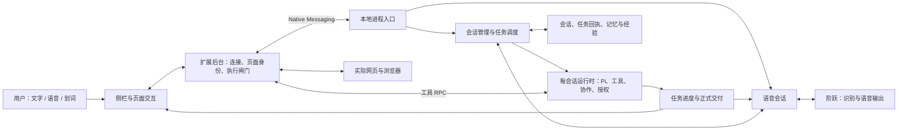

# Voice 全栈架构与改造边界

本页描述职责、因果关系与下一步设计。当前执行进度唯一入口：[STATUS](STATUS.md)。完整产品模块边界见[架构总览](architecture.md)。2026-09-16依据当前源码、装配入口、两轮真人日志及受控失败回归核对；不是仅从目录名推测。

## 产品整体

划词阅读、整页翻译、显式记忆等已有独立路径；本次不重写它们。保留Pi执行内核、现有页面归属、授权与控制版本闸门。语音的“快”不能通过绕过任务控制取得。

## 一条语音的真实路径

1. `sidepanel/voice-client.ts`取得麦克风，AudioWorklet输出PCM；`voice-vad-worker.ts`做人声判断，`voice-signal.ts`切声音片段。开口触发本地播放器停声，同时发interrupt；停顿触发commit。
2. `background/voice-relay.ts`绑定侧栏端口、voiceId、会话及turn；commit还经过页面上下文补全与观察令牌签发。消息再通过native连接送入本地进程。
3. `agent/main.ts`把voice消息交`VoiceService`，把任务/会话消息交`ConversationManager`。两者通过明确回调连接，而非同一个执行循环。
4. `StepVoiceSession`将音频送阶跃，接收最终转写，交manager判定意图。`voice-model.ts`复用当前任务模型，无网页工具地分类；不是阶跃音频模型自行执行网页。
5. manager决定继续倾听、对话、读页或派发任务。派发经过`TaskDispatcher`请求账本，再进入每会话运行时和Pi；实际网页动作经RPC回扩展执行，保持runId/controlVersion/页面权限检查。
6. 正式结果经过交付账本、`VoiceService.observe`和语音输出队列；阶跃TTS产生音频，侧栏`VoicePlayer`播放并发送playback_done。结果生成、音频收到、音频播完是三个不同事件。

装配证据：`extension/src/background/index.ts`实例化VoiceRelay；`agent/src/main.ts`实例化VoiceService并注入manager路由和播放回执回调。已使用AST匹配核对构造调用；模块图来自源码，未声称运行过不可用的CodeGraph服务。

## 必须分清的四种生命周期

| 生命周期 | 身份/事实来源 | 当前持有者 | 正确边界 |
|---|---|---|---|
| 声音片段 | voiceId + turn，PCM、VAD、commit | 浏览器VoiceClient/Detector，后台lease，上游输入映射 | 一次停顿只结束片段，不自动意味着用户完整请求结束 |
| 对话请求 | 原话、拼接片段、意图判定及当前性 | StepVoiceSession、VoiceInputLedger、manager路由 | 新片段先明确是补全还是新请求，再决定派发；判定结束不能等同任务结束 |
| 网页任务 | requestId、runId、controlVersion、页面身份、执行回执 | manager、TaskDispatcher、runtime、扩展闸门 | 只有明确任务动作改变任务；新闲聊不能无意取消任务，旧闲聊不能跨轮启动过时任务 |
| 交付与播放 | deliveryId、responseId、播放代次、playback_done | 交付账本、VoicePlayback、VoicePlayer | 任务完成不等于已播报；打断播放不等于取消任务；未播完全文不能记为已听见 |

## 已确认的跨层问题

| 现象 | 真实原因 | 修改涉及层 |
|---|---|---|
| “别说了”需重复 | 麦克风有信号但部分人声置信度未越过本地门槛；该次没有保存声音，不能判断每段说话者 | 收音检测、停声策略、真实声学验收 |
| 分段说完整后仍等用户说 | 未完成判定等了后续轮次决策，导致片段未及时接回；早期规则又把完整句开头误判为未完 | 意图判定、输入账本、轮次协调 |
| 换一句完整问题仍无答案 | 新问题已判observe，但旧闲聊被当成可保留动作并启动任务，改变runId，新答案被丢弃 | 语音当前性、manager任务派发、观察结果交付 |
| 多条后台结果只播第一条 | 队列一次取空，调用方播第一条即返回 | 输出队列与实际播放完成回执 |
| “别说了”后又开口 | 静默结果继续flush待播任务结果 | 意图含义、输出队列、后台结果通知 |
| 打断后仿佛已经听过全文 | 文本生成时就写对话历史，未等待播放完成 | 语音输出、历史、上游会话同步 |

证据与每次失败保留在[连续对话验收](evals/20260916-voice-conversation-flow.md)和[收音诊断](evals/20260916-voice-input-diagnosis.md)。

## 需要补证的跨层边界

- 原后台commit等待异步页面资料、旧commit可能被新turn丢弃的分支，已在本轮拆分：音频先提交，页面资料按原片段异步补齐；派发仍等待来源就绪。真实扩展慢页面资料与实际阶跃/模型/读页链路通过，见[输入边界验收](evals/20260916-voice-input-boundaries.md)。它证明该分支修复，不倒推过去未保存音频的每次漏听原因。
- 分类可能晚于下一片段的完整转写。输入拼接必须按语义判定顺序处理，而不是只修“晚于下一次开口、早于下一次转写”的一个时序。
- 观察请求、长期任务和音频输出都有各自取消条件；取消旧回答不能自动放弃仍有效的网页任务，保留任务也不能让旧闲聊复活。
- 当前ready同时承载等开口、等补句和已无待答内容。UI仅显示“正在听”不能说明请求是已回答、被丢弃还是仍在等待，验收需同时检查任务/请求终态。

## 选择的改造方法

先固定语义边界，再决定是否提取模块，不做全仓重写。

1. 输入协调只负责收集片段、等意图判定、形成完整请求。它等待的是前一片段的**分类结果**，不是前一请求的网页执行或播报结束。
2. 对话路由只产出语义决定；提交任务仍由已有manager/dispatcher执行。每次提交必须携带原页面、原任务身份与当前性判定，不复制第二套执行账本。
3. 播放协调只决定排队、停播、恢复及完成回执；明确区分用户要求安静、无效结果静默丢弃、等待用户补句。
4. 在现有输入账本/播放队列里集中规则，减少StepVoiceSession中互相影响的标志位。确有独立职责后才抽模块；文件变短不是目标。

当前`StepVoiceSession`约1100行，manager约980行，Pi session约1580行，侧栏main约3200行。行数只是定位职责集中处的线索；前述事件错配才是优先改造的依据。

## 自动化先于真人复测

| 检查层 | 输入及观测 | 能回答的问题 |
|---|---|---|
| 状态与契约重放 | 真实产品类；交换ASR、分类、任务结果、播放回执的顺序；保留每次失败 | 是否丢片段、误派发、旧任务复活、漏播或重复播 |
| 隔离浏览器与真实模型 | 固定页面与多种自然表述；验证DOM、正式交付和任务身份 | 从完整问题到真实页面结果是否贯通 |
| 真实阶跃音频 | 合成音频经当前服务，测输入与输出事件、错误和耗时 | 服务接口行为与时序是否支持设计 |
| 真人日常设备 | 正常音量、自然停顿、扬声器回声、主观接话 | 是否需要重复、是否抢话、是否自然 |

先自动化覆盖两次真人失败和邻近时序，再加载日常版本；真人只判断收音与自然程度，不承担定位后台竞态的工作。每项进展报告交付状态与下一步，不以“整套未完成”代替继续推进。

## 持续输入与多任务容量

输入归属、执行准入、跨任务交付的实测限制及改造决定见[多要求调度设计](voice-multi-request-design.md)。TaskDispatcher 只串行接收请求，不负责等待任务可运行；不能把它当成现成任务队列。
