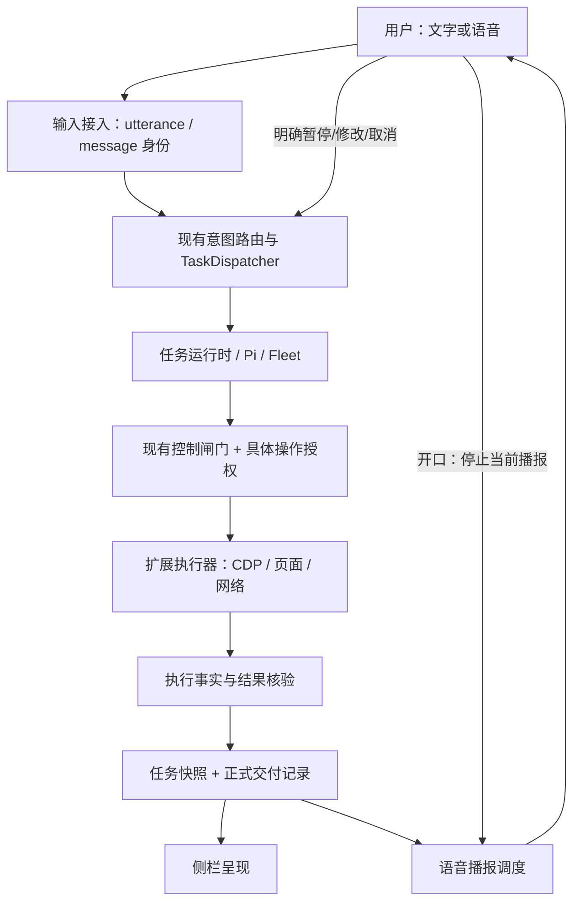

# By Your Side：收敛到可验证正式版的执行规格

版本：提案 1.0 · 2026-09-11  
审阅基线：`176e23fd103497e522c5fc0428af2c559733e6c8`  
仓库：`yishu-ziyu/By-Your-Side`

## 0. 本文件的使用方式和证据边界

这是交给 Coding Agent 的产品改造与验收规格，不是已经实施的改动，也不是已经达标的证明。本次审阅追踪了主分支的语音、任务调度、浏览器执行、结果交付、持久化、侧栏和验收入口；没有逐行审阅所有文件。无法在本次环境中克隆、构建和运行完整项目，未做真实麦克风、登录网站和侧栏实测。仓库里的测试通过数和延迟数字只能记为“作者报告”。

执行前先读仓库 `AGENTS.md`、`docs/STATUS.md`、必要的 `docs/NOTES.md`，然后检查最新 HEAD 对本规格引用路径的差异。保留用户未提交改动，不 reset，不强制覆盖。若现有代码已经修复某项，拿等价证据关闭任务，不重复实现。

本包包含机器可读门槛，但不包含已接入项目的评测执行器。下文新增命令均须实现，不能把命令名的存在当作已经完成验收。质量门槛是本方案提出的正式版目标；缺少运行条件应标记 BLOCKED，不能自行降低门槛。

## 1. 产品判断：保留能力，统一状态与交付

产品定义：**一个能持续交谈、操作当前浏览器、随时把控制权交回用户，并交付可核对结果的浏览器搭档。**

正式版的首要承诺不是支持更多模型、更多 Agent 或更多动作，而是：用户知道它在哪个会话做什么；插话不会丢委托；暂停后不会继续偷跑；结束一定有明确结果；系统不确定时明确说不确定。

保留 Chrome MV3 + 本地 Node 伴随进程 + Pi SDK；保留原生 TypeScript/DOM 前端。保留 Native Messaging 主通道和受限的 WS 调试通道；保留 Step Plan 接入。不要为了应用上一轮通用建议，把生产执行器整体换成 LiveKit、Playwright、Agent-S 或 Electron。Playwright/Chromium用于测试，不接管生产中的浏览器工具链。

保留并强化：TaskDispatcher、持久化请求回执、ControlGate/TeamControl、会话与标签页隔离、现有任务结果核验、user_delivery、browser_run 的受控子动作、页面观察身份、memory/experience/skill 的产品行为。不要建设第二套可绕过这些机制的“语音执行器”。

本轮不做：操作系统级 Computer Use、手机端、云账号/支付后台、新模型市场、EverOS 接入、无人授权的远程动作、以多 Agent 数量作为卖点。没有经过回归的新能力不进入正式版。

## 2. 已核对事实与优先级

### P0-A：fetch 的实际副作用没有被“只读”标签约束

`shared/fetch.ts` 接受任意 GET/POST URL/body；`exec/fetch-url.ts` 使用 `credentials: include`；`shared/control.ts` 的 WRITE_TOOLS 不包含 fetch；`agent/src/tools.ts` 的执行 epoch/canWrite 检查依赖 isWriteTool。即使有其他通用检查，也不能据此称这个能力天然只读。POST 可能改变服务端状态，GET 名字也不是业务无副作用的证明。

处理：补上按具体请求/能力判定的 effect policy，覆盖 fetch、fetch.pages、browser_run 子动作、原始 js 和键盘提交。所有未知/有副作用的操作必须经过当前控制权与授权边界。对需要保留的只读 POST 搜索接口，用明确、受限制的站点能力描述证明用途，不给任意 POST 批量免确认。

先失败测试：把伪装成“读数据”的操作发到隔离 fixture 的计数接口；用户接管、旧 epoch、无授权、审批参数变化时，服务端副作用计数必须为 0。不能只断言前端显示“拒绝”。

### P0-B：响应截断不是内存上限

`readCappedText()` 先 `response.arrayBuffer()` 再截取 512 KiB。这会先把整份响应读入内存。自动跟随重定向也没有在该层重新检查目标；这里只校验初始 hostname，不能宣称严格阻断所有私网访问或 DNS 重绑定。

处理：改成有取消能力的流式读取，限定保留字节数和读取期限；超限就停止继续读取。区分“已保留字节”“已读取字节”“服务端总长度未知”，不得在提前中止后编造总字节数。正确处理 UTF-8 分段。连接/响应超时必须向实际请求传播 AbortSignal，RPC 超时本身不能当成请求已停止。

默认限制跨源重定向。不能在浏览器环境安全检查目标时拒绝该重定向；不要拿一次初始 URL 检查冒充完整网络层隔离。对“禁止所有私网访问”的强承诺，必须有有效的最终网络目的地址限制和测试；仅正则校验域名时明确声明能力边界，不能出具该强承诺的 PASS。

### P0-C：正常语音默认进行诊断录音

`VoiceClient.startCommand()` 的正常分支发送 `capture:true`；服务端录音保留上限是 14 天/2 GiB。开发诊断有价值，但麦克风对话与把原始音频持续保存是两件事。

正式版：默认只保留去敏的时序/计数元数据，不保存 PCM/WAV；独立“录制诊断样本”开关，解释内容、位置、期限，可随时停止和删除。保留诊断模式不执行任务的隔离性。原有录音不能被升级脚本偷偷删除，也不能被上传到 CI 或公开 Issue。

### P1-A：多步任务结束与交付仍缺强约束

STATUS 记载单动作 3 次对照/5 次新版本测试的速度收益，同时记载多步 3 次探针中 1 次“做完但没交付”。这是作者的小样本记录，不是本次复现结果。先复现这个缺口，不能用更多单元测试数量代替。

### P1-B：语音状态责任过度集中

`StepVoiceSession` 同时承担连接、重连、音频输入归属、晚到转写、路由挂起/恢复、早回应、正式 TTS、播报队列和结果通知。现有逻辑已经处理部分“只读插话不取消任务”的情况，不能误报成所有插话都会取消任务。应先建立事件回放测试，再按生命周期抽离，避免再叠加临时布尔变量。

### P1-C：验收证据类型混杂

`run-status-ui.mts` 用真实构建的 HTML/JS，但注入 mock chrome.runtime 和合成消息；它是有效的渲染测试，不是完整产品链路验收。现有 accept:browser 入口又关联开发者个人 ChromeMain。需要一个可重复、隔离、通过真实用户入口的发布评测入口。

### P2：规模、显示和安装

TaskReceiptStore.list 同步扫描请求文件；录音和部分日志使用同步 IO。抛出异常被捕获不等于不会阻塞事件循环。面板 main.ts、background index.ts、voice-session 都聚集较多责任，但“文件短”不应成为产品质量指标。先测事件循环/会话规模/可见体验，按责任边界拆分。

## 3. 目标架构：只有一个任务真相来源



三种生命周期必须独立：

1. **输入生命周期**：采集 → 转写 → 归属确认 → 路由 → 回执。已提交输入具有稳定身份。新声音可以停止播报，但不能因为一个播放 epoch 改变而静默删除已经接收的输入。
2. **输出生命周期**：等待 → 准备 → 播放 → 播完/打断/失败。播报取消不等于任务取消；旧音频不能在新一轮继续冒出来。
3. **任务生命周期**：accepted → running → paused/awaiting_approval → running → terminal。completed 是事实结论，不能从 idle/agent_end 推导出来。

以上可以用普通 TS discriminated union + reducer 实现，不强制引入状态机框架。既有 requestId/runId/controlVersion/voiceTurn/deliveryId 不要全部替换；先写映射与兼容测试，再决定是否新增独立 utteranceId/playbackEpoch。新类型必须替代相应旧状态，不能新增另一份长期不同步的状态源。

## 4. 输入、打断与任务调度的产品规则

| 用户输入/动作 | 正式行为 | 禁止行为 |
|---|---|---|
| 开口、嗯、好的、然后呢 | 允许停止旧播报，接住新输入；不取消正在做的任务 | 在 ASR 未返回前把任务当作取消 |
| “日期改成周五” | 生成新约束版本；未开始的旧写动作失效；在安全节点重规划 | 把修订拆成独立新任务或忘记剩余步骤 |
| “先停一下”/接管按钮 | 立即关闭相应范围的新写动作入口，等待在途动作结清后显示已接管 | 闸门未关闭就显示“现在归你” |
| “别说了” | 只停声音 | 终止任务 |
| 裸“停”且目标不明确 | 先停播报，按已有语义消歧 | 猜成一个不可恢复的取消命令 |
| “不要取消，先暂停” | 只暂停 | 执行被否定的动作 |
| “预算改成600，然后继续” | 一个有顺序、有逐步回执的计划；先更新再续跑 | 只执行第一项、或更新失败后照常续跑 |
| “你刚才说要删除？” | 当作引用/质疑回答 | 当成新的删除授权 |
| 断线后重复相同 requestId | 返回原回执或 unknown，不自动重做 | 生成新ID绕过去重 |

保持复合指令解析对原文覆盖、目标会话唯一性、否定/引用/条件的校验。不要在既有分类器外堆叠另一个含义不同的分类器。模型判断失败时明确失败/澄清；不能吞消息。ASR 关键实体未确认时，不提交不可逆操作。

接管延迟分两项测量：按钮事件到写闸门关闭；按钮事件到在途操作排空。“已经发送的支付请求无法撤回”必须如实显示 unknown/待核对，而不是宣称已回滚。

## 5. 正式结果：做完、说完、确认成功是三个状态

扩展现有 user_delivery 和 task_results，不额外建设平行聊天记录源。

每次 run 必须有且仅有一个可幂等更新的 terminal result envelope：

```ts
type RunOutcome = 'verified_success' | 'partial' | 'failed' | 'aborted' | 'unknown';
interface TerminalResult {
  conversationId: string;
  runId: string;
  resultId: string;
  version: number;
  outcome: RunOutcome;
  summary: string;
  evidenceRefs: string[];
  completedItems: string[];
  remainingItems: string[];
  deliveryId: string;
}
```

这是目标类型，实施时可融入已有类型，避免并存。执行中允许多个 finding/progress；“每个 run 一个终态结果”不等于强迫用户只看一条消息。区分 accepted、executor-reported、verified；模型自述不是核验器。任务部分完成必须保留未完成内容。

核验例：暂停视频读回 paused；填表读回值；保存由独立 fixture 状态/明确回执确认；抓取检查范围、条数、分页和文件完整性；事实问答给来源和范围。不要要求每种网站都提供数据库证据，也不要把缺少独立证据一律伪装成失败；无法确认写操作结果时用 unknown。

已实现的 finding terminate 优化要保留其收益，但必须明确“终结性交付”和“中途发现”。否则为了减少模型轮数而过早终止多步任务。新 run/用户修订后，旧 finalizer/TTS 回包都必须通过 run/control/delivery 身份校验。

终态缺交付的修复只能补做**无写工具的交付整理**，有次数/时间上限；不得为凑出结果重跑页面任务。声音失败时文字结果保留，且显示“声音未完成”；不能把播放失败变成整个任务失败或重复执行。

## 6. 执行层与权限边界

将“工具是否写操作”升级为“这次操作有什么副作用”，同时保留原有 ControlGate 是最终执行闸门的地位。

授权票据至少绑定 conversationId、runId、controlVersion、当前页面/域、操作类型和参数摘要哈希、过期时间、一次性消费标记。用户通过受信任 UI 明确同意才产生授权；页面文字、模型工具返回和旧会话的“好的”不能铸造授权。参数、目标、控制版本变化后旧票据无效。第一版默认票据有效期 60 秒；过期后的语义是重新确认，不是自动续期。

fetch/pages 与原始 JS 不得绕过写闸门。原始页面 JS 不能用正则“去掉几个危险词”冒充只读。正式默认路径优先声明式读取/动作；必须使用通用 JS 时展示其扩大能力范围，限定目标，纳入当前任务授权与取消。若无法证明一项能力满足边界，应收紧它而不是在文案里宣称安全。

不要普遍自动重试有副作用的请求。RPC 超时、浏览器崩溃、请求已送达但回执丢失属于 unknown，保留去重身份，再通过只读核验恢复事实。对界面点击重试也不能假设幂等。

审计页面提示注入：页面内容以不可信资料传入；内部授权由代码产生；秘密不得进入页面、结果、日志。加入假的 API key/cookie canary，检查截图、网络日志、trace、导出诊断中的泄漏。保留已有 URL 脱敏修复，不能把正常路径再次错误截断。

## 7. 本地后端、存储和连接

### 数据与性能

先以 20,000 条请求回执、200 个会话、2,000 条可见历史事件建立性能样本。把实时音频链路上的落盘/清理工作移到串行异步写入器或独立 worker，设置有界队列；诊断元数据丢失可以记录 gap，但任务回执写入失败必须拒绝或 unknown，不能默默丢。

TaskReceiptStore 保留永久去重语义，不要用“清理旧文件”使旧 requestId 可以重新执行。可增加索引、压缩为含必要身份的 tombstone；只有性能测试证明需要时再改为事务数据库。若用 SQLite，只允许一种正式存储后端，迁移必须备份、校验、原子切换，并保留旧版只读恢复路径，不双写多年。

日志给出 conversation/run/request/tool/delivery 身份与脱敏事件，不默认包含音频或敏感正文。临时队列有上限、超限有原因；不无声丢终态结果。将诊断和任务关键写入分开，防止录音压力拖住任务回执。

### 连接

Native Messaging 保留主入口。针对当前 Chrome 文档的宿主到扩展 1 MiB 上限，生产序列化帧限制在 900 KiB 以内，必要时分片、背压、重组校验；不要只测 JS 对象长度或字符串字符数。音频、截图、附件与任务事件分流排队，控制消息优先，不让大载荷饿死接管。

握手协商 extension/host/protocol/storage schema 版本；不兼容时解释如何升级，不尝试带着未知协议执行旧动作。host/service-worker 重启后从持久化身份恢复，不依赖全局变量永远活着。恢复连接不等于继续上一条未确认写操作。

WS 保留开发使用；限制明确的扩展 Origin 和 token，不能把所有 chrome-extension:// Origin 都视为同一可信客户端。不在生产新增公开监听服务。

### 安装

新增 `doctor`：检查 Node、扩展/host版本、native host安装位置与origin、模型凭据可达性、Step Plan语音配置、麦克风权限、网络/代理，但绝不打印 key。设置页将“模型凭据未配置”“本地桥未连接”“语音服务失败”分开，给出对应可执行操作。

优先完成已有支持的 macOS 环境。Linux CI 不能替 macOS Native Messaging 做认证；没有 Windows 实测，就不贴 Windows 正式支持标签。升级不得覆盖 ~/.pi 登录、用户记忆、会话、旧任务回执和下载文件。

## 8. 展示面：默认只回答用户当下四个问题

用户打开面板后，应立即看清：我在哪个会话？它在操作哪个页面？正在做什么/做出了什么？现在由谁控制？

保持今天已经确认的“打开面板进入新会话”行为：空白会话可复用；旧任务继续，顶部有后台运行入口；重连不是重新打开面板，不重复新建会话。不要因为这次重构恢复 README 里过期的旧行为。

### 页面布局

```text
┌ By Your Side                      会话  设置 ┐
│ 后台任务 1 个：整理资料                 查看 │  ← 仅有后台任务时
│ 当前页：页面标题 / 域名                      │
│                                            │
│ 用户委托                                   │
│ ● 正在核对第 2 个条件 · 4.2秒               │
│                                            │
│ 结果卡                                     │
│ 已找到…… / 已填入……但尚未提交              │
│ 范围、来源、剩余项                         │
│ 查看依据              执行过程              │
│                                            │
│ [输入或补充要求………………………………]     发送 │
│ 麦克风：正在听    任务：执行中    接管/停止   │
└────────────────────────────────────────────┘
```

这是信息结构示意，不是已渲染的界面。沿用已有设计 token、光球、简短状态行和折叠步骤，不再加一套角色/球体/动态皮肤。光球只提示工作/说话，不用动效冒充具体进度。不显示编造的百分比或 ETA。

教学、录制示范、技能、记忆、模型高级参数移入第二层面板；不删除已有有效能力。默认不展开团队列表和工具流水。不要把关键“接管”埋到更多菜单。

语音采用两个独立状态：麦克风正在听/已关；声音正在说/被打断。声音被打断时，任务可以仍在执行。错误有清楚的恢复按钮；同一个恢复按钮不悄悄重新下达任务。

重构侧栏为状态 store/selectors + 小型 presenters/components：session navigation、task card、delivery list、composer、voice dock、settings/knowledge。保留 marked+DOMPurify 和链接隔离。按 deliveryId 做幂等渲染；草稿必须按会话保存，发送成功回执前不清空；不要整体 innerHTML 重建输入区导致光标、选区、附件或焦点丢失。

流式文本按帧合批，只更新变化区域；长历史分段/虚拟化，但键盘、屏幕阅读器和查阅旧结果仍可用。宽度 320/400/520 px，高度 600/900 px，200% 缩放，确保关键操作不被遮挡。系统减少动态效果时停止非必要动画。

## 9. 指标字典与正式版门槛

所有门槛都是本方案的目标，**不是当前实测水平**。机器对应规则见 `quality-gates.json`。不得跨设备、模型、缓存状态混算。计时使用单进程单调时钟；跨进程时间先同步或改为同一观测端打点，禁止直接相减不同进程 performance.now。

### 安全与一致性：失败一例就拒绝发布

- 1,000 个控制/权限/重复/跨会话定点案例 + 10,000 个有固定随机种子的事件交错：未授权副作用、闸门关闭后的新写动作、重复不可逆操作、跨会话泄漏/串写全部为 0。
- 500 个确定性完整任务案例：每个 run 恰有一个终态结果记录；可以有多条中间消息；不丢消息、不重复终态交付。
- 100 次 host/SW/连接故障恢复：副作用不自动重放，unknown不假装成功；恢复后页面、任务、UI一致。
- 默认正常语音会话产生的原始音频落盘文件/PCM字节为 0；所有测试 canary 凭据泄漏为 0。

### 真实任务效果

30 个不同任务模板 × 5 次 = 150 次真实模型 + 实际扩展执行。覆盖读取/抽取、表单与受控动作、多步修订三类，每类10模板。总核验成功率 ≥95%，每类 ≥90%，且同一配对集合相对基线下降不超过3个百分点。必须给出分母、首次失败、每类结果和 Wilson 95%区间；这些通过率不等于证明真实世界成功率。

使用独立 DOM/网络/文件/fixture状态核验，不允许被测模型自己说成功就算成功。超时、重连、澄清失败、没交付都计入分母。对不支持能力的边界测试，正确拒绝与任务成功分别统计，不能混到同一个成功率里。

### 延迟与声音

- 100 次合格单动作任务：文字提交到首个真实页面动作 p50≤3秒、p95≤6秒；到有依据终态结果 p50≤6秒、p95≤10秒。至少95%的合格单动作≤2次主执行模型调用。核验和安全步骤不能为凑两轮被删掉。
- 合格单动作须事先在固定集合中定义：已有有效观察、一个可逆已知动作、无审批/跨站/长服务端等待。不能跑完后才把慢样本踢出去。
- 100 条完整语音输入，含至少30条基于当前事实的状态/简单问答：用户说完到客户端**首段有意义且正确的声音** p50≤1.2秒、p95≤2秒。单独记录首音、首句完成、事实核对等待。只有“嗯/收到/我看看”的占位句不能用于满足这一门槛。
- 基于有效任务回执的动作确认语音：至少50条，用户说完到有意义的回执播报 p95≤3.5秒；不等于浏览器任务完成。
- 播报打断：至少100次输入回放和30次真实扬声器/麦克风打断，分别统计；用户声学开口到本地旧音频停止 p95≤250ms。另记VAD检测后停止时间，不能用后者冒充前者。实际声学链路未跑时该门槛 BLOCKED。
- 200条意图/关键实体样本：语义路由正确率≥95%，日期/数量/对象等关键实体准确率≥98%；错误执行未授权动作=0。对模糊输入正确澄清算其专属意图通过，不拿过度澄清刷准确率。
- 明确有效委托的无必要澄清率≤5%；100个“嗯/好的/然后呢”插话不撤销已有委托。

### 前端、控制与规模

- 本地按钮事件→对应写闸门关闭 p95≤100ms（至少100次）；已有短动作在途时显示“正在交接”，不提前显示“已接管”。
- 输入事件→可见文本更新 p95≤100ms；服务端交付抵达面板→结果可见 p95≤300ms。测试含2,000条历史事件，不能只测空面板。
- 320/400/520px × 600/900px及200%缩放：主要操作遮挡/横向溢出=0；键盘主流程全部能完成；减少动态效果有效。
- 20,000条回执+200会话下，伴随进程事件循环延迟p95≤20ms；2小时暖机后的固定负载运行，最后30分钟相对第一个稳定30分钟的后GC堆增量≤50MiB。堆、RSS、音频节点/事件监听数量分别报告，不拿堆合格掩盖外部资源泄漏。
- host→extension序列化帧≤900KiB；响应保留≤512KiB，超限后不继续主动读取；测试包括分块超大响应、永不结束的流、UTF-8跨块、真实取消。
- 基准机是实际 macOS Apple Silicon 参考机，记录具体CPU/RAM/Chrome/Node/模型/网络；机器尚未明确时先采集配置，不自行宣称性能门槛已通过。

### 成本

按“每个核验成功任务的总成本”计算，失败尝试、重试、语音、后台整理和模型路由都进入成本。与配对基线相比平均成本≤1.00倍，p95单任务成本≤1.10倍；若增加成本换取安全性/任务效果，需要用户单独批准新预算，不能让 Coding Agent 自己降低要求。报价不明时同时报告 token/音频秒数，美元成本门槛 BLOCKED，不臆造价格。

必须配置最大评测费用、最大模型调用和最大音频分钟数。没有预算授权可继续离线工作，不运行无上限的付费循环。

## 10. 测试分层与反作弊

L0：纯函数、协议、状态机、属性测试、固定种子事件回放，无真实模型。

L1：真实构建产物 + 隔离浏览器 + fixture，测执行器与UI；使用mock/runtime注入时必须在报告标注 `ui_mock` / `tool_integration`，不能叫全链路。

L2：从真实侧栏输入，走 chrome.runtime → background → native host → Pi/model →真实工具 → 核验 → user_delivery →侧栏。浏览器操作不得由评测脚本替被测 Agent 完成；评测脚本可布置fixture、输入用户操作和独立核验。

L3：真实实时模型、麦克风/扬声器、自然插话、授权、断网和真人观感。播放预录音能验证输入管线，但不能替代真实AEC/设备权限/声学回声测试。

每次报告必须记录每层的 PASS/FAIL/BLOCKED，写明使用mock、模型和浏览器。缺 key、macOS、麦克风、预算或有权限的host时标 BLOCKED。不得用跳过、try/catch吞断言、缩短用例、删除失败或重复跑到绿替代正式门槛。

新增统一命令（由Coding Agent实现）：

```bash
npm run doctor
npm run eval:offline -- --candidate <sha>
npm run eval:integration -- --headless --candidate <sha>
npm run eval:live -- --profile reference-macos --budget-file <local-file>
npm run eval:report -- --run <run-id>
npm run release:verify -- --run <run-id> --artifact <path>
```

无头为默认；任何需要可见窗口/真实用户浏览器的工作遵循仓库授权约定。不要自动连接个人 ChromeMain、自动reload用户扩展、改登录态或打开真实支付/发布页面。现有 npm test/typecheck/build 必须继续可用。

失败先记首次结果，再进行诊断性重跑。已证实夹具错误可以在独立评测修订中修复，须保留原失败、反例和审阅记录；变更测量方法与变更产品目标是两种审批。

锁定评测代码、数据、门槛、核验器和测试入口。候选实现不能在同一个晋级变更里改这些内容。保护分支 + CODEOWNERS + required checks；CI从受保护的评测revision读取门槛而不是从候选分支读取。

保留开发集和发布留出集，按站点/任务模板/说话者分割，不能只更换同一模板的参数。留出集放在 Coding Agent 没有读取权限的位置；同一Agent既出题又答题不算独立评估。若没有第二个权限主体维护留出集，明确记录独立性不足，不能宣称盲测。

留出集每个发布候选最多提交一次。失败可以获得归类后的原因，完整样本在退役后进入回归集；下一候选用未泄漏的新样本。模型给分只可辅助判断，不能替代操作事实和真人许可。

## 11. 必须覆盖的代表性用例

固定动作、页面和预期由评测夹具维护，不写入生产提示词。开发回归集至少包括：

- 当前页暂停视频；两个相似按钮必须按新观察定位；旧节点跨导航失效；iframe/受限页正确解释边界。
- 抽取三页列表并输出完整文件；其中一页404/超时，结果明确部分完成而非全部成功。
- 填12字段并读回；保存前审批；审批后价格/收件人/页面改变导致票据失效。
- 同会话“改日期，然后继续”；修改到达时旧写动作已排队；用户否定取消、引用删除指令。
- A任务跑着，打开新面板为B；A继续且可找到；取消B不影响A；未授权不能借入A的页面。
- 先嗯一声再说完整修订；TTS过程中晚到ASR；重复commit；连接重建复用请求；声音失败文字保留。
- 请求发出后服务端已改状态但客户端超时；只能unknown/只读核验，不能二次提交。
- 多步任务动作已完成但模型未发交付；补交付无写工具；一个终态记录；断面板后重开仍可查结果。
- fetch伪装只读POST；带副作用请求在接管时到达；重定向到未经授权来源；超大/无限响应；语音期间诊断IO背压。
- 忘记记忆后后续不再注入，但旧聊天是否保留按现有文案说明；来源页面不能把恶意指令升级成可信偏好/技能。

## 12. 按依赖顺序实施的工作包

每个工作包形成一个Issue/PR单元，但默认由当前Coding Agent独立执行，不另起多代理。用户尚未要求创建远端Issue时，先准备Issue正文；不要擅自修改远端权限或发布。

### PR-00：基线、可复现入口、锁定评测

记录最新SHA与本审阅基线的差异；跑现有检查；区分作者记录与实际结果；建立配置、预算、样本manifest、事件时钟、mock标记。建立受保护评测基线及release:verify骨架，先拒绝缺证据报告。未取得管理权限时输出设置步骤和BLOCKED，不能称保护已启用。

验收：一个故意失败的候选能被门槛拒绝；一个缺真人/模型证据的报告返回BLOCKED；篡改门槛/证据SHA被拒绝。此包不需要付费模型即可取得进展。

### PR-01：网络副作用、响应边界、诊断隐私

触及 shared/fetch.ts、shared/control.ts、agent/src/tools.ts、fetch-batch.ts、extension background handlers/exec/fetch-url.ts、voice-client.ts、voice-capture-store.ts 与对应协议/设置。

验收：P0定点失败先红后绿；所有入口，包括browser_run和fetch.pages，都走同一effect/授权边界；默认音频不落盘；大响应不会整份读入；旧回执去重不退化。

### PR-02：终态交付闭环

触及 session.ts、task-results.ts、task-progress.ts、user-delivery*.ts、conversation-manager.ts、voice-service.ts、侧栏delivery呈现。

验收：每run终态结果、completion证据、partial/unknown显示、声音失败回退文字、旧run结果不串入、finding terminate不提前结束未完成步骤。复现并关闭“做完没交付”。

### PR-03：语音输入、输出、任务状态分离

从 voice-session.ts 抽离连接适配、输入台账、播放调度等模块；复用voice-intent、voice-plans、TaskDispatcher。先建立旧行为回放测试再迁移，每一步保持只有一个入口负责该状态。

验收：晚到ASR不丢、只读插话不撤销委托、复合指令完整、真实停止播报及时、任务变更按controlVersion隔离。不得靠添加固定延时让测试碰巧通过。

### PR-04：后端规模、连接恢复和安装自检

回执索引/异步落盘；有界诊断队列；协议能力握手；分片与背压；doctor与设置状态；host/SW重启回放测试；双组件版本迁移。

验收：规模/恢复/帧上限指标；旧request永不因清理重新执行；备份可恢复；现有凭据/会话/记忆不丢。

### PR-05：侧栏与产品表达收敛

按第8节拆main.ts状态/呈现；保留A+B动效和新会话行为；结果卡/任务控制/语音双状态/设置入口；保持草稿附件与sanitization。

验收：真构建渲染 + 真实侧栏交互分别留证；尺寸、键盘、长历史性能通过；截图不是唯一验收；真人对层级/语音/接管理解作出裁决。

### PR-06：效果、速度、成本优化

只根据trace识别最大的等待来源：预观察是否过大/失效、模型往返、冗余收尾、数据是否可投影、网络是否批量、IO是否阻塞。保留有意义的ack，但不能用ack刷任务/语音延迟。多worker默认不扩张，只有同组任务数据证明收益才调整。

验收：冻结模型/设备/网络、随机交错运行基线和候选，达到第9节门槛且不牺牲前几包的安全/正确性。新依赖和prompt改动均纳入产物哈希。

### PR-07：晋级、删除旧实现、唯一正式文档

合并最终候选，删除其替代的旧生产实现和临时开关，重建后重跑必要完整门槛；不能先验收一个双实现版本，再删除代码而不复验。README/STATUS与行为同步，历史记录明确归档，正式包只含一个入口/实现。

验收：全部必需门槛PASS + 真人签字 + 受保护评测revision + 精确artifact哈希 + 迁移/回滚证据。形成RC，完成小规模试用后才标正式。

## 13. Coding Agent 的迭代循环

```text
固定问题与样本 → 复现/基线 → 一项明确假设 → 最小完整改动
→ 离线回归 → 集成回归 → 预算内真实测量 → 比较 → 保留或撤销候选
```

每轮记录：问题、证据、假设、改动、首次测试结果、成本、与基线差异、下一步。不是每轮都全量付费跑150任务；先离线收敛，再集成，再候选级真实测量，最后留出集。

每个工作包一次最多10轮自动迭代；连续3轮无改善，或达到预算/环境/权限上限，停止本次自动循环并输出BLOCKED及证据，不生成“正式版”。这不是允许降低产品目标，而是避免无限烧额度或换指标刷绿；解除阻塞后从同一证据链继续。

只回退当前Agent创建的候选变更；不得 git reset --hard 清掉用户工作。用干净 worktree 隔离试验。代码修改与测量修改分离；回退失败候选时保留去敏失败证据，不能删掉失败再宣称一直通过。

## 14. 正式版晋级与“其他版本抛弃”的准确含义

晋级逻辑是 AND，不是综合分：

```text
正式候选 = 安全PASS ∧ 功能PASS ∧ 语音PASS ∧ 恢复PASS
          ∧ 性能/成本PASS ∧ 真实入口PASS ∧ 真人验收PASS
          ∧ 数据迁移PASS ∧ 产物身份匹配
```

任一FAIL或BLOCKED都不能自动合并进正式发布分支或打正式标签。诊断重跑不能抹掉首次失败。模型/网络上游限制可以解释为什么受阻，但不能把没达到目标写成达标。

状态：candidate → 自动门槛通过 → RC → 真人验收/试用 → stable。RC允许验证，不冒充正式质量承诺。至少完成20次独立日常使用会话的试用，记录实际任务结果和错误；第一次使用流程另需5位未接触该项目的测试者，每个核心流程至少4/5能独立完成。小样本限制写进发布记录，不能称为统计学总体保证。缺少真人，自动化版本最多停留在RC。

只有测试过的同一份扩展与host构建产物晋级；提交SHA、lockfile、prompt、模型配置、评测revision、数据集版本、构建产物hash必须匹配。不能把工作目录最新dist当作该SHA产物，不能测试后又偷偷重建/改配置。

“其他版本抛弃”表示：未通过候选不进入正式分发；被替代旧代码不留在正式运行时；不保留v1/v2/v3并行界面或万能legacy fallback；临时测试hooks不能成为生产能力。不要为了可回滚，在每个功能里永久留两套实现。

**不表示**删除Git历史、过去稳定版安装包、迁移备份、失败原因或用户数据。至少保留最近两个已发布稳定版的独立安装产物与去敏验收证据；尚无稳定版时保留改造前快照作恢复点，但不得把它重新标成已通过新门槛。远端分支清理由明确清单/授权完成，不批量删除不属于本次试验的分支。

正式发布后出现未授权副作用、重复不可逆操作、数据泄漏等P0事件，立即停止新分发并回滚/收紧能力；不能为保住指标继续放量。涉及数据迁移时先检查可逆性，宁可停用写能力，也不做破坏性降级。

## 15. 每个工作包必须交付的证据

提供：PR/commit、已达到/失败/受阻的具体门槛、环境/模型/预算、原始去敏trace和首次失败、截图/声学记录的授权与位置、操作事实核验、成本、已删除旧实现清单、未覆盖的真实场景。

更新 `docs/evals/YYYYMMDD-<task>.md`；STATUS只保留当前结论/未决项/入口，旧记录归档引用。README修复“打开面板恢复旧会话”等与现行行为冲突的描述。不要同时创建多份不同数字的“当前真相文档”。

交付时不能只说“npm test全绿”。必须回答：用户从哪里进入，做什么动作，看见什么结果，证据在哪；哪些结果没有测到。没有完整证据就不正式晋级。
